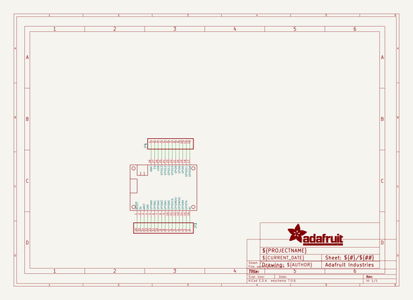
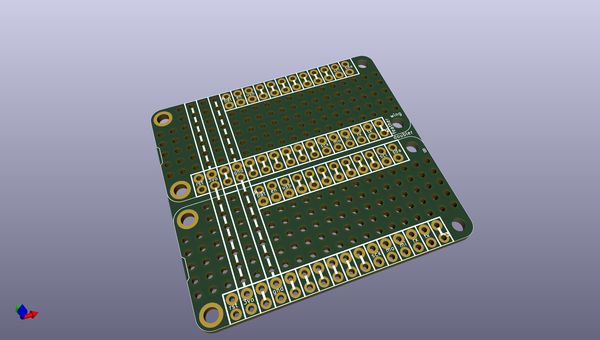
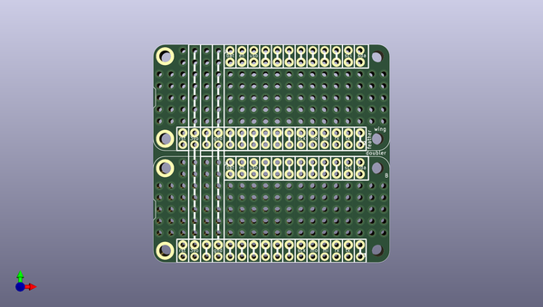
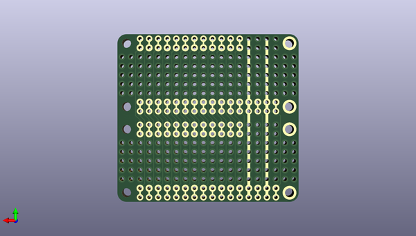

# adafruit_featherwing_proto_doubler_tripler_and_quad
 
## summary 
* id: adafruit_adafruit_featherwing_proto_doubler_tripler_and_quad_quadwing_2x2
* user: adafruit
* name: adafruit_featherwing_proto_doubler_tripler_and_quad
* board: quadwing_2x2
* repo: https://github.com/adafruit/Adafruit-FeatherWing-Proto-Doubler-Tripler-and-Quad

* src_file_repo_sch: 
* src_file_repo_sch_link: https://github.com/adafruit/Adafruit-FeatherWing-Proto-Doubler-Tripler-and-Quad/tree/master/
* full details link: https://github.com/oomlout/oomlout_oomp_project_bot_v_2/tree/main/projects/adafruit_adafruit_featherwing_proto_doubler_tripler_and_quad_quadwing_2x2/current_version/working  

## schematic  
  
[schematic (pdf)](working_schematic.pdf)  

## pcb  
 
  
  
  
[board (pdf)](working.pdf)  

## working_bom
| Id | Designator | Footprint | Quantity | Designation | Supplier and ref |  | None | 
| --- | --- | --- | --- | --- | --- | --- | --- | 
| 1 | MS2,MS1 | FEATHERWING_DIM | 2 | FEATHERWING_NODIM |  |  | [''] | 
| 2 | JP3,JP2 | 1X16_ROUND_76MIL | 2 |  |  |  | [''] | 
| 3 | JP4,JP1 | 1X12_ROUND_76MIL | 2 |  |  |  | [''] | 

## bom_schematic
| Ref | Qnty | Value | Cmp name | Footprint | Description | Vendor | DNP | 
| --- | --- | --- | --- | --- | --- | --- | --- | 
| JP1, JP4 | 2 | HEADER-1X1276MIL | HEADER-1X1276MIL | working:1X12_ROUND_76MIL |  |  |  | 
| JP2, JP3 | 2 | HEADER-1X16_76MIL | HEADER-1X16_76MIL | working:1X16_ROUND_76MIL |  |  |  | 
| MS1, MS2 | 2 | FEATHERWING_NODIM | FEATHERWING_NODIM | working:FEATHERWING_DIM |  |  |  | 

