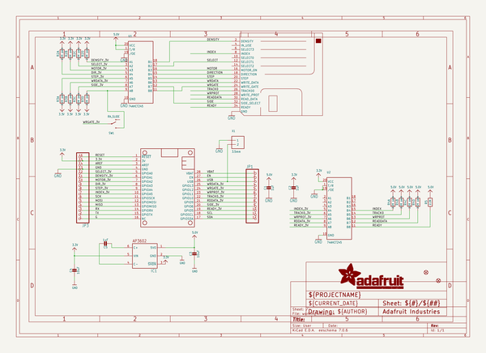

# adafruit_floppy_featherwing_pcb
 
## summary 
* id: adafruit_adafruit_floppy_featherwing_pcb_adafruit_floppy_featherwing
* user: adafruit
* name: adafruit_floppy_featherwing_pcb
* board: adafruit_floppy_featherwing
* repo: https://github.com/adafruit/Adafruit_Floppy_FeatherWing_PCB

* src_file_repo_sch: 
* src_file_repo_sch_link: https://github.com/adafruit/Adafruit_Floppy_FeatherWing_PCB/tree/main/
* full details link: https://github.com/oomlout/oomlout_oomp_project_bot_v_2/tree/main/projects/adafruit_adafruit_floppy_featherwing_pcb_adafruit_floppy_featherwing/current_version/working  

## schematic  
  
[schematic (pdf)](working_schematic.pdf)  

## pcb  
 
  
  
  
[board (pdf)](working.pdf)  

## working_bom
| Id | Designator | Footprint | Quantity | Designation | Supplier and ref |  | None | 
| --- | --- | --- | --- | --- | --- | --- | --- | 
| 1 | R4,R2,R3 | RESPACK_4X0603 | 3 | 2.2K pack |  |  | [''] | 
| 2 | PLABEL12 | PLABEL12 | 1 |  |  |  | [''] | 
| 3 | PLABEL14 | PLABEL14 | 1 |  |  |  | [''] | 
| 4 | PLABEL6 | PLABEL6 | 1 |  |  |  | [''] | 
| 5 | U$28 | ADAFRUIT_3.5MM | 1 |  |  |  | [''] | 
| 6 | PLABEL0 | PLABEL0 | 1 |  |  |  | [''] | 
| 7 | U$26 | PCBFEAT-REV-040 | 1 |  |  |  | [''] | 
| 8 | R5 | 0603-NO | 1 | 2.2K |  |  | [''] | 
| 9 | C2,C1,C5 | 0603-NO | 3 | 1uF |  |  | [''] | 
| 10 | PLABEL10 | PLABEL10 | 1 |  |  |  | [''] | 
| 11 | PLABEL4 | PLABEL4 | 1 |  |  |  | [''] | 
| 12 | U1,U2 | SSOP20 | 2 | 74AHCT245 |  |  | [''] | 
| 13 | FID2,FID1 | FIDUCIAL_1MM | 2 | FIDUCIAL_1MM |  |  | [''] | 
| 14 | SW1 | SPDT_SMT_SSSS811101 | 1 | RA_SLIDE |  |  | [''] | 
| 15 | PLABEL5 | PLABEL5 | 1 |  |  |  | [''] | 
| 16 | PLABEL3 | PLABEL3 | 1 |  |  |  | [''] | 
| 17 | C4,C3 | 0805-NO | 2 | 10uF |  |  | [''] | 
| 18 | PLABEL13 | PLABEL13 | 1 |  |  |  | [''] | 
| 19 | PLABEL11 | PLABEL11 | 1 |  |  |  | [''] | 
| 20 | PLABEL2 | PLABEL2 | 1 |  |  |  | [''] | 
| 21 | PLABEL7 | PLABEL7 | 1 |  |  |  | [''] | 
| 22 | U$27 | FEATHERLOGO_SMALL | 1 |  |  |  | [''] | 
| 23 | IC1 | SOT23-6 | 1 | AP3602 |  |  | [''] | 
| 24 | PLABEL9 | PLABEL9 | 1 |  |  |  | [''] | 
| 25 | PLABEL1 | PLABEL1 | 1 |  |  |  | [''] | 
| 26 | PLABEL8 | PLABEL8 | 1 |  |  |  | [''] | 
| 27 | PLABEL20 | PLABEL20 | 1 |  |  |  | [''] | 
| 28 | PLABEL17 | PLABEL17 | 1 |  |  |  | [''] | 
| 29 | JP3 | 1X16_ROUND | 1 |  |  |  | [''] | 
| 30 | PLABEL15 | PLABEL15 | 1 |  |  |  | [''] | 
| 31 | PLABEL25 | PLABEL25 | 1 |  |  |  | [''] | 
| 32 | PLABEL35 | PLABEL35 | 1 |  |  |  | [''] | 
| 33 | X1 | TERMBLOCK_1X2-3.5MM | 1 | 3.5mm |  |  | [''] | 
| 34 | FDD1 | 2X17_FLOPPY_SMTIDC | 1 | FLOPPY_IDC_SMT |  |  | [''] | 
| 35 | PLABEL24 | PLABEL24 | 1 |  |  |  | [''] | 
| 36 | PLABEL31 | PLABEL31 | 1 |  |  |  | [''] | 
| 37 | PLABEL22 | PLABEL22 | 1 |  |  |  | [''] | 
| 38 | PLABEL21 | PLABEL21 | 1 |  |  |  | [''] | 
| 39 | MS1 | FEATHERWING | 1 | FEATHERWING |  |  | [''] | 
| 40 | PLABEL30 | PLABEL30 | 1 |  |  |  | [''] | 
| 41 | JP1 | 1X12_ROUND | 1 |  |  |  | [''] | 
| 42 | PLABEL18 | PLABEL18 | 1 |  |  |  | [''] | 
| 43 | PLABEL23 | PLABEL23 | 1 |  |  |  | [''] | 
| 44 | PLABEL27 | PLABEL27 | 1 |  |  |  | [''] | 
| 45 | PLABEL28 | PLABEL28 | 1 |  |  |  | [''] | 
| 46 | PLABEL26 | PLABEL26 | 1 |  |  |  | [''] | 
| 47 | PLABEL16 | PLABEL16 | 1 |  |  |  | [''] | 
| 48 | PLABEL32 | PLABEL32 | 1 |  |  |  | [''] | 
| 49 | PLABEL34 | PLABEL34 | 1 |  |  |  | [''] | 
| 50 | PLABEL19 | PLABEL19 | 1 |  |  |  | [''] | 
| 51 | PLABEL33 | PLABEL33 | 1 |  |  |  | [''] | 
| 52 | PLABEL29 | PLABEL29 | 1 |  |  |  | [''] | 

## bom_schematic
| Ref | Qnty | Value | Cmp name | Footprint | Description | Vendor | DNP | 
| --- | --- | --- | --- | --- | --- | --- | --- | 
| C1, C2, C5 | 3 | 1uF | CAP_CERAMIC0603_NO | working:0603-NO |  |  |  | 
| C3, C4 | 2 | 10uF | CAP_CERAMIC0805-NOOUTLINE | working:0805-NO |  |  |  | 
| FDD1 | 1 | FLOPPY_IDC_SMT | FLOPPY_IDC_SMT | working:2X17_FLOPPY_SMTIDC |  |  |  | 
| FID1, FID2 | 2 | FIDUCIAL_1MM | FIDUCIAL_1MM | working:FIDUCIAL_1MM |  |  |  | 
| IC1 | 1 | AP3602 | AP3602 | working:SOT23-6 |  |  |  | 
| JP1 | 1 | HEADER-1X12 | HEADER-1X12 | working:1X12_ROUND |  |  |  | 
| JP3 | 1 | HEADER-1X16ROUND | HEADER-1X16ROUND | working:1X16_ROUND |  |  |  | 
| MS1 | 1 | FEATHERWING | FEATHERWING | working:FEATHERWING |  |  |  | 
| R2, R3, R4 | 3 | 2.2K pack | RESISTOR_4PACK | working:RESPACK_4X0603 |  |  |  | 
| R5 | 1 | 2.2K | RESISTOR_0603_NOOUT | working:0603-NO |  |  |  | 
| SW1 | 1 | RA_SLIDE | SWITCH_SPDT | working:SPDT_SMT_SSSS811101 |  |  |  | 
| U1, U2 | 2 | 74AHCT245 | 74LCX245_SSOP20 | working:SSOP20 |  |  |  | 
| X1 | 1 | 3.5mm | TERMBLOCK_1X2_3.5MM | working:TERMBLOCK_1X2-3.5MM |  |  |  | 

