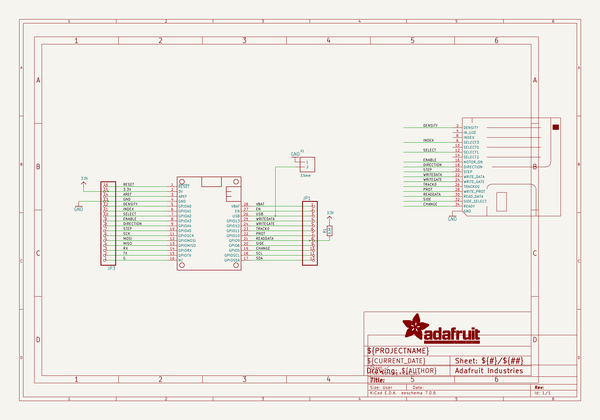
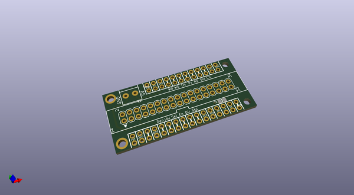
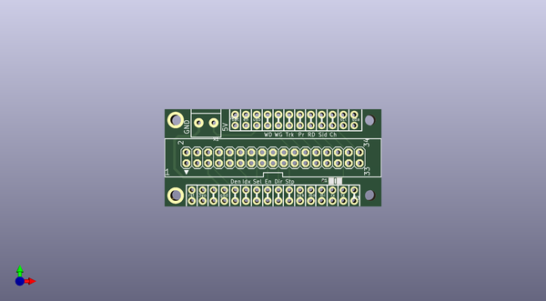
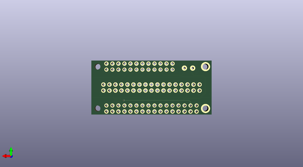

# adafruit_floppy_pcb
 
## summary 
* id: adafruit_adafruit_floppy_pcb_floppy_idc_to_smt_rev_a
* user: adafruit
* name: adafruit_floppy_pcb
* board: floppy_idc_to_smt_rev_a
* repo: https://github.com/adafruit/Adafruit_Floppy_PCB

* src_file_repo_sch: 
* src_file_repo_sch_link: https://github.com/adafruit/Adafruit_Floppy_PCB/tree/main/
* full details link: https://github.com/oomlout/oomlout_oomp_project_bot_v_2/tree/main/projects/adafruit_adafruit_floppy_pcb_floppy_idc_to_smt_rev_a/current_version/working  

## schematic  
  
[schematic (pdf)](working_schematic.pdf) 

## pcb  
 
  
  
  
[board (pdf)](working.pdf)  

## bom_schematic
| Ref | Qnty | Value | Cmp name | Footprint | Description | Vendor | DNP | 
| --- | --- | --- | --- | --- | --- | --- | --- | 
| FDD1 | 1 | FLOPPY_IDC_SHROUDED | FLOPPY_IDC_SHROUDED | working:2X17_FLOPPY_IDC |  |  |  | 
| JP1 | 1 | HEADER-1X12 | HEADER-1X12 | working:1X12_ROUND |  |  |  | 
| JP3 | 1 | HEADER-1X16ROUND | HEADER-1X16ROUND | working:1X16_ROUND |  |  |  | 
| MS1 | 1 | FEATHERWING | FEATHERWING | working:FEATHERWING |  |  |  | 
| R1 | 1 | 2.2K | RESISTOR0805_NOOUTLINE | working:0805-NO |  |  |  | 
| X1 | 1 | 3.5mm | TERMBLOCK_1X2_3.5MM | working:TERMBLOCK_1X2-3.5MM |  |  |  | 

