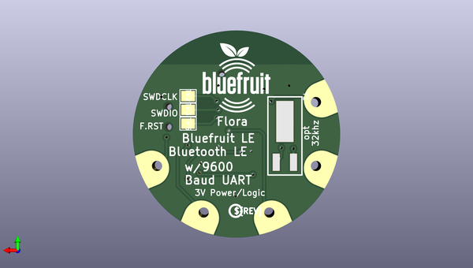

# adafruit_flora_bluefruit_le_pcb
 
## summary 
* id: adafruit_adafruit_flora_bluefruit_le_pcb_adafruit_flora_ble_friend
* user: adafruit
* name: adafruit_flora_bluefruit_le_pcb
* board: adafruit_flora_ble_friend
* repo: https://github.com/adafruit/Adafruit-Flora-Bluefruit-LE-PCB

* src_file_repo_sch: 
* src_file_repo_sch_link: https://github.com/adafruit/Adafruit-Flora-Bluefruit-LE-PCB/tree/master/
* full details link: https://github.com/oomlout/oomlout_oomp_project_bot_v_2/tree/main/projects/adafruit_adafruit_flora_bluefruit_le_pcb_adafruit_flora_ble_friend/current_version/working  

## schematic  
  
[schematic (pdf)](working_schematic.pdf) 

## pcb  
 
  
  
  
[board (pdf)](working.pdf)  

## working_bom
| Id | Designator | Footprint | Quantity | Designation | Supplier and ref |  | None | 
| --- | --- | --- | --- | --- | --- | --- | --- | 
| 1 | C2,C1 | 0805-NO | 2 | 1uF |  |  | [''] | 
| 2 | R2,R4,R1 | 0805-NO | 3 | 2K |  |  | [''] | 
| 3 | TX0,TP1,GND0,RX0,UNK3V3IN0 | SEWINGTAP_2.0 | 5 | SEWTAP-2.0IN |  |  | [''] | 
| 4 | FID2,FID1 | FIDUCIAL_1MM | 2 | FIDUCIAL" |  |  | [''] | 
| 5 | DFU0 | BTN_KMR2_4.6X2.8 | 1 | KMR2 |  |  | [''] | 
| 6 | U$6 | ADAFRUIT_5MM | 1 |  |  |  | [''] | 
| 7 | D2 | CHIPLED_0805_NOOUTLINE | 1 | BLUE |  |  | [''] | 
| 8 | U1 | BLE_MODULE_RAYTAC_MDBT40 | 1 | MBT40 |  |  | [''] | 
| 9 | SW1 | EG1390 | 1 | EG1319 |  |  | [''] | 
| 10 | D1 | CHIPLED_0805_NOOUTLINE | 1 | RED |  |  | [''] | 
| 11 | R3 | 0805-NO | 1 | 10K |  |  | [''] | 
| 12 | TP3 | PAD-1.5X2.0 | 1 | SWDIO |  |  | [''] | 
| 13 | TP2 | PAD-1.5X2.0 | 1 | SWCLK |  |  | [''] | 
| 14 | U$24 | PCBFEAT-REV-040 | 1 |  |  |  | [''] | 
| 15 | Y1 | CRYSTAL_CYL_2X6MM_SMT | 1 | 32.768kHz (535-9166-2-ND) |  |  | [''] | 
| 16 | U$23 | BLUEFRUITLOGO_100MM | 1 |  |  |  | [''] | 
| 17 | TP5 | PAD-1.5X2.0 | 1 | FCTRST |  |  | [''] | 
| 18 | U$7 | FLORASMALL | 1 |  |  |  | [''] | 

## bom_schematic
| Ref | Qnty | Value | Cmp name | Footprint | Description | Vendor | DNP | 
| --- | --- | --- | --- | --- | --- | --- | --- | 
| C1, C2 | 2 | 1uF | CAP_CERAMIC0805-NOOUTLINE | working:0805-NO |  |  |  | 
| D1 | 1 | RED | LED0805_NOOUTLINE | working:CHIPLED_0805_NOOUTLINE |  |  |  | 
| D2 | 1 | BLUE | LED0805_NOOUTLINE | working:CHIPLED_0805_NOOUTLINE |  |  |  | 
| DFU0 | 1 | KMR2 | SWITCH_TACT_SMT4.6X2.8 | working:BTN_KMR2_4.6X2.8 |  |  |  | 
| FID1, FID2 | 2 | FIDUCIAL"" | FIDUCIAL{dblquote}{dblquote} | working:FIDUCIAL_1MM |  |  |  | 
| GND0 | 1 | SEWTAP-2.0IN | SEWTAP-2.0IN | working:SEWINGTAP_2.0 |  |  |  | 
| R1, R2, R4 | 3 | 2K | RESISTOR0805_NOOUTLINE | working:0805-NO |  |  |  | 
| R3 | 1 | 10K | RESISTOR0805_NOOUTLINE | working:0805-NO |  |  |  | 
| RX0 | 1 | SEWTAP-2.0IN | SEWTAP-2.0IN | working:SEWINGTAP_2.0 |  |  |  | 
| SW1 | 1 | EG1319 | SWITCH_DPDTEG1390 | working:EG1390 |  |  |  | 
| TP1 | 1 | SEWTAP-2.0IN | SEWTAP-2.0IN | working:SEWINGTAP_2.0 |  |  |  | 
| TP2 | 1 | SWCLK | TESTPOINT1.5X2.0MM_NOCREAM | working:PAD-1.5X2.0 |  |  |  | 
| TP3 | 1 | SWDIO | TESTPOINT1.5X2.0MM_NOCREAM | working:PAD-1.5X2.0 |  |  |  | 
| TP5 | 1 | FCTRST | TESTPOINT1.5X2.0MM_NOCREAM | working:PAD-1.5X2.0 |  |  |  | 
| TX0 | 1 | SEWTAP-2.0IN | SEWTAP-2.0IN | working:SEWINGTAP_2.0 |  |  |  | 
| U1 | 1 | MBT40 | NRF51822_MODULE_MDBT40 | working:BLE_MODULE_RAYTAC_MDBT40 |  |  |  | 
| UNK3V3IN0 | 1 | SEWTAP-2.0IN | SEWTAP-2.0IN | working:SEWINGTAP_2.0 |  |  |  | 
| Y1 | 1 | 32.768kHz (535-9166-2-ND) | CRYSTAL2.0X6.0_32.768 | working:CRYSTAL_CYL_2X6MM_SMT |  |  |  | 

