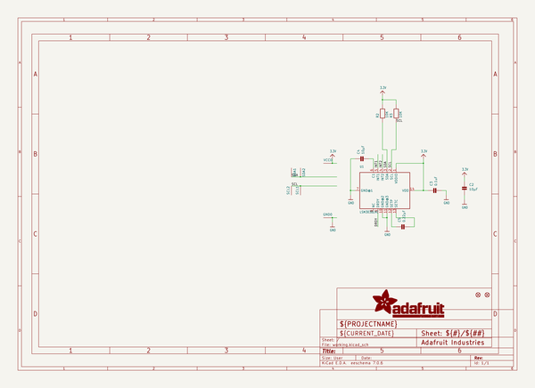
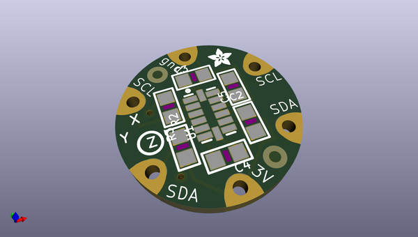
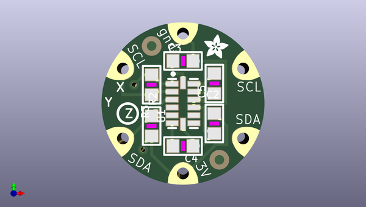
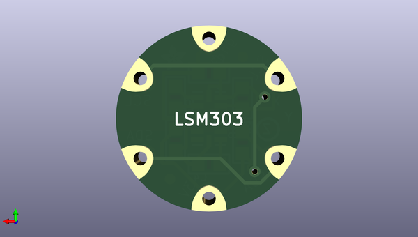

# adafruit_flora_lsm303_pcb
 
## summary 
* id: adafruit_adafruit_flora_lsm303_pcb_adafruit_flora_lsm303
* user: adafruit
* name: adafruit_flora_lsm303_pcb
* board: adafruit_flora_lsm303
* repo: https://github.com/adafruit/Adafruit-Flora-LSM303-PCB

* src_file_repo_sch: 
* src_file_repo_sch_link: https://github.com/adafruit/Adafruit-Flora-LSM303-PCB/tree/master/
* full details link: https://github.com/oomlout/oomlout_oomp_project_bot_v_2/tree/main/projects/adafruit_adafruit_flora_lsm303_pcb_adafruit_flora_lsm303/current_version/working  

## schematic  
  
[schematic (pdf)](working_schematic.pdf)  

## pcb  
 
  
  
  
[board (pdf)](working.pdf)  

## working_bom
| Id | Designator | Footprint | Quantity | Designation | Supplier and ref |  | None | 
| --- | --- | --- | --- | --- | --- | --- | --- | 
| 1 | C4,C2 | _0805 | 2 | 10µF |  |  | [''] | 
| 2 | SDA1,SCL1,GND0,SDA2,VCC0,SCL2 | SEWINGTAP_0.5 | 6 | SEWTAP0.5IN |  |  | [''] | 
| 3 | FID1,FID2 | FIDUCIAL_1MM | 2 | FIDUCIAL" |  |  | [''] | 
| 4 | R2,R3 | _0805 | 2 | 10K |  |  | [''] | 
| 5 | C3 | _0805 | 1 | 0.1uF |  |  | [''] | 
| 6 | C5 | _0805 | 1 | 0.22µF |  |  | [''] | 
| 7 | U$4 | ADAFRUIT_2.5MM | 1 |  |  |  | [''] | 
| 8 | U1 | LGA14 | 1 | LSM303DLHC |  |  | [''] | 

## bom_schematic
| Ref | Qnty | Value | Cmp name | Footprint | Description | Vendor | DNP | 
| --- | --- | --- | --- | --- | --- | --- | --- | 
| C2, C4 | 2 | 10µF | CAP_CERAMIC_0805 | working:_0805 |  |  |  | 
| C3 | 1 | 0.1uF | CAP_CERAMIC_0805 | working:_0805 |  |  |  | 
| C5 | 1 | 0.22µF | CAP_CERAMIC_0805 | working:_0805 |  |  |  | 
| FID1, FID2 | 2 | FIDUCIAL"" | FIDUCIAL{dblquote}{dblquote} | working:FIDUCIAL_1MM |  |  |  | 
| GND0 | 1 | SEWTAP0.5IN | SEWTAP0.5IN | working:SEWINGTAP_0.5 |  |  |  | 
| R2, R3 | 2 | 10K | RESISTOR_0805 | working:_0805 |  |  |  | 
| SCL1, SCL2 | 2 | SEWTAP0.5IN | SEWTAP0.5IN | working:SEWINGTAP_0.5 |  |  |  | 
| SDA1, SDA2 | 2 | SEWTAP0.5IN | SEWTAP0.5IN | working:SEWINGTAP_0.5 |  |  |  | 
| U1 | 1 | LSM303DLHC | LSM303DLHC | working:LGA14 |  |  |  | 
| VCC0 | 1 | SEWTAP0.5IN | SEWTAP0.5IN | working:SEWINGTAP_0.5 |  |  |  | 

