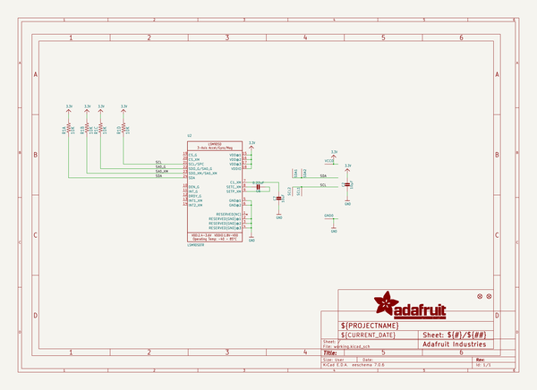
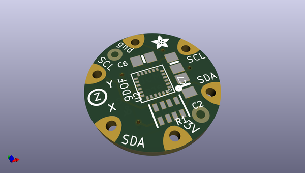
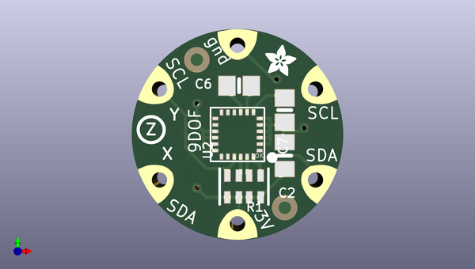
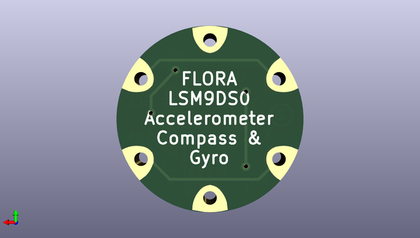

# adafruit_flora_lsm9ds0_9dof_pcb
 
## summary 
* id: adafruit_adafruit_flora_lsm9ds0_9dof_pcb_adafruit_flora_lsm9ds0_9dof
* user: adafruit
* name: adafruit_flora_lsm9ds0_9dof_pcb
* board: adafruit_flora_lsm9ds0_9dof
* repo: https://github.com/adafruit/Adafruit-Flora-LSM9DS0-9DOF-PCB

* src_file_repo_sch: 
* src_file_repo_sch_link: https://github.com/adafruit/Adafruit-Flora-LSM9DS0-9DOF-PCB/tree/master/
* full details link: https://github.com/oomlout/oomlout_oomp_project_bot_v_2/tree/main/projects/adafruit_adafruit_flora_lsm9ds0_9dof_pcb_adafruit_flora_lsm9ds0_9dof/current_version/working  

## schematic  
  
[schematic (pdf)](working_schematic.pdf)  

## pcb  
 
  
  
  
[board (pdf)](working.pdf)  

## working_bom
| Id | Designator | Footprint | Quantity | Designation | Supplier and ref |  | None | 
| --- | --- | --- | --- | --- | --- | --- | --- | 
| 1 | GND0,VCC0,SDA2,SDA1,SCL2,SCL1 | SEWINGTAP_0.5 | 6 | SEWTAP0.5IN |  |  | [''] | 
| 2 | R1 | RESPACK_4X0603 | 1 | 10K |  |  | [''] | 
| 3 | FID2,FID1 | FIDUCIAL_1MM | 2 | FIDUCIAL" |  |  | [''] | 
| 4 | U2 | LGA24_4X4MM | 1 | LSM9DS0TR |  |  | [''] | 
| 5 | C2 | 0805_10MGAP | 1 | 10µF |  |  | [''] | 
| 6 | C6 | 0805-NO | 1 | 0.22uF |  |  | [''] | 
| 7 | U$4 | ADAFRUIT_2.5MM | 1 |  |  |  | [''] | 
| 8 | C7 | 0805-NO | 1 | 10uF |  |  | [''] | 

## bom_schematic
| Ref | Qnty | Value | Cmp name | Footprint | Description | Vendor | DNP | 
| --- | --- | --- | --- | --- | --- | --- | --- | 
| C2 | 1 | 10µF | CAP_CERAMIC0805_10MGAP | working:0805_10MGAP |  |  |  | 
| C6 | 1 | 0.22uF | CAP_CERAMIC0805-NOOUTLINE | working:0805-NO |  |  |  | 
| C7 | 1 | 10uF | CAP_CERAMIC0805-NOOUTLINE | working:0805-NO |  |  |  | 
| FID1, FID2 | 2 | FIDUCIAL"" | FIDUCIAL{dblquote}{dblquote} | working:FIDUCIAL_1MM |  |  |  | 
| GND0 | 1 | SEWTAP0.5IN | SEWTAP0.5IN | working:SEWINGTAP_0.5 |  |  |  | 
| R1 | 1 | 10K | RESISTOR_4PACK_US | working:RESPACK_4X0603 |  |  |  | 
| SCL1, SCL2 | 2 | SEWTAP0.5IN | SEWTAP0.5IN | working:SEWINGTAP_0.5 |  |  |  | 
| SDA1, SDA2 | 2 | SEWTAP0.5IN | SEWTAP0.5IN | working:SEWINGTAP_0.5 |  |  |  | 
| U2 | 1 | LSM9DS0TR | LSM9DS0 | working:LGA24_4X4MM |  |  |  | 
| VCC0 | 1 | SEWTAP0.5IN | SEWTAP0.5IN | working:SEWINGTAP_0.5 |  |  |  | 

