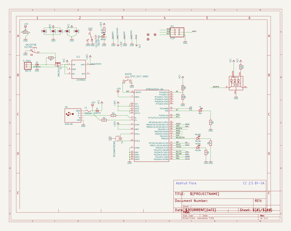
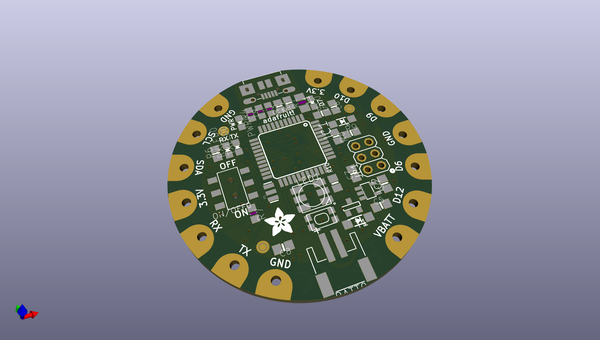
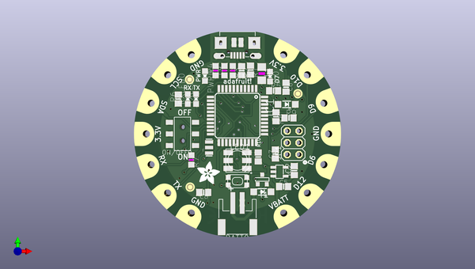
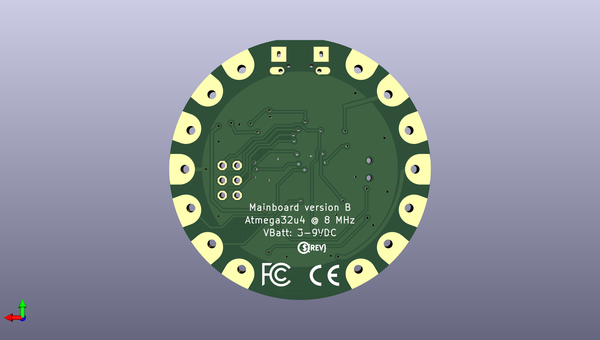

# adafruit_flora_mainboard
 
## summary 
* id: adafruit_adafruit_flora_mainboard_adafruit_flora_mainboard_2
* user: adafruit
* name: adafruit_flora_mainboard
* board: adafruit_flora_mainboard_2
* repo: https://github.com/adafruit/Adafruit-Flora-Mainboard

* src_file_repo_sch: 
* src_file_repo_sch_link: https://github.com/adafruit/Adafruit-Flora-Mainboard/tree/master/
* full details link: https://github.com/oomlout/oomlout_oomp_project_bot_v_2/tree/main/projects/adafruit_adafruit_flora_mainboard_adafruit_flora_mainboard_2/current_version/working  

## schematic  
  
[schematic (pdf)](working_schematic.pdf)  

## pcb  
 
  
  
  
[board (pdf)](working.pdf)  

## working_bom
| Id | Designator | Footprint | Quantity | Designation | Supplier and ref |  | None | 
| --- | --- | --- | --- | --- | --- | --- | --- | 
| 1 | R7 | _0805MP | 1 | 10K |  |  | [''] | 
| 2 | UNK3V3TAP2,D6,GNDTAP0,IO10,GND3TAP0,TX0,IO9,UNK3.3VTAP0,SCL0,RX0,IO12,VCC2,GNDTAP2,SDA0 | SEWINGTAP_2.0 | 14 | SEWTAP-2.0IN |  |  | [''] | 
| 3 | LED1 | WS2812 | 1 | WS2812 |  |  | [''] | 
| 4 | C4,C6,C5,C7,C8 | 0805-NO | 5 | 10uF |  |  | [''] | 
| 5 | IC1 | TQFP44 | 1 | ATMEGA32U4-AU |  |  | [''] | 
| 6 | R5,R6 | 0805-NO | 2 | 1K |  |  | [''] | 
| 7 | D2,D1 | SOD-123 | 2 | SCHOTTKY |  |  | [''] | 
| 8 | T1 | SOT-23 | 1 | DMG3415 |  |  | [''] | 
| 9 | CN1 | 4UCONN_20329 | 1 | MiniB USB |  |  | [''] | 
| 10 | IC2 | SOT23-5L | 1 | MIC5225-3.3V |  |  | [''] | 
| 11 | L0 | CHIPLED_0805_NOOUTLINE | 1 | RED |  |  | [''] | 
| 12 | U$2,U$6,U$3 | FIDUCIAL_1MM | 3 | FIDUCIAL" |  |  | [''] | 
| 13 | R1,R2 | 0805-NO | 2 | 22 |  |  | [''] | 
| 14 | R8 | 0805-NO | 1 | 150K |  |  | [''] | 
| 15 | PWR0 | CHIPLED_0805_NOOUTLINE | 1 | GREEN |  |  | [''] | 
| 16 | JP1 | 2X03 | 1 | ICSP |  |  | [''] | 
| 17 | RXLED0,TXLED0 | CHIPLED_0805_NOOUTLINE | 2 | YELLOW |  |  | [''] | 
| 18 | BATT0 | JST-PH-2-SMT-RA | 1 | 3-9VDC |  |  | [''] | 
| 19 | R3,R4 | _0805MP | 2 | 1K |  |  | [''] | 
| 20 | U$1 | ADAFRUIT_5MM | 1 |  |  |  | [''] | 
| 21 | BOOT0 | KMR2 | 1 | SPST_TACT-KMR2 |  |  | [''] | 
| 22 | R10 | 0805-NO | 1 | 2.2K |  |  | [''] | 
| 23 | C9 | _0805MP | 1 | 10uF |  |  | [''] | 
| 24 | L1 | R1206 | 1 | 500mA |  |  | [''] | 
| 25 | ON/OFF0 | EG1390 | 1 | EG1390 |  |  | [''] | 
| 26 | Y1 | RESONATOR-SMD | 1 | 8MHz |  |  | [''] | 
| 27 | R9 | 0805-NO | 1 | 10K |  |  | [''] | 
| 28 | U$4 | FLORAMED | 1 |  |  |  | [''] | 
| 29 | U$7 | SYMBOL_FCC_5MM | 1 |  |  |  | [''] | 
| 30 | U$5 | PCBFEAT-REV-040 | 1 |  |  |  | [''] | 
| 31 | U$8 | SYMBOL_CE_5MM | 1 |  |  |  | [''] | 

## bom_schematic
| Ref | Qnty | Value | Cmp name | Footprint | Description | Vendor | DNP | 
| --- | --- | --- | --- | --- | --- | --- | --- | 
| BATT0 | 1 | 3-9VDC | JST_2PIN-SMT-RA | working:JST-PH-2-SMT-RA |  |  |  | 
| BOOT0 | 1 | SPST_TACT-KMR2 | SPST_TACT-KMR2 | working:KMR2 |  |  |  | 
| C4, C5, C6, C7, C8 | 5 | 10uF | CAP_CERAMIC0805-NOOUTLINE | working:0805-NO |  |  |  | 
| C9 | 1 | 10uF | RESISTOR_0805MP | working:_0805MP |  |  |  | 
| CN1 | 1 | MiniB USB | USBMICRO_20329 | working:4UCONN_20329 |  |  |  | 
| D1, D2 | 2 | SCHOTTKY | DIODESOD-123 | working:SOD-123 |  |  |  | 
| D6 | 1 | SEWTAP-2.0IN | SEWTAP-2.0IN | working:SEWINGTAP_2.0 |  |  |  | 
| GND3TAP0 | 1 | SEWTAP-2.0IN | SEWTAP-2.0IN | working:SEWINGTAP_2.0 |  |  |  | 
| GNDTAP0, GNDTAP2 | 2 | SEWTAP-2.0IN | SEWTAP-2.0IN | working:SEWINGTAP_2.0 |  |  |  | 
| IC1 | 1 | ATMEGA32U4-AU | ATMEGA32U4-AU | working:TQFP44 |  |  |  | 
| IC2 | 1 | LP298XS | LP298XS | working:SOT23-5L |  |  |  | 
| IO9, IO10, IO12 | 3 | SEWTAP-2.0IN | SEWTAP-2.0IN | working:SEWINGTAP_2.0 |  |  |  | 
| JP1 | 1 | ICSP | PINHD-2X3 | working:2X03 |  |  |  | 
| L0 | 1 | RED | LED0805_NOOUTLINE | working:CHIPLED_0805_NOOUTLINE |  |  |  | 
| L1 | 1 | 500mA | PTCFUSE-1206 | working:R1206 |  |  |  | 
| LED1 | 1 | WS2812 | WS2812 | working:WS2812 |  |  |  | 
| ON/OFF0 | 1 | EG1390 | DPDT-EG1390 | working:EG1390 |  |  |  | 
| PWR0 | 1 | GREEN | LED0805_NOOUTLINE | working:CHIPLED_0805_NOOUTLINE |  |  |  | 
| R1, R2 | 2 | 22 | RESISTOR0805_NOOUTLINE | working:0805-NO |  |  |  | 
| R3, R4 | 2 | 1K | RESISTOR_0805MP | working:_0805MP |  |  |  | 
| R5, R6 | 2 | 1K | RESISTOR0805_NOOUTLINE | working:0805-NO |  |  |  | 
| R7 | 1 | 10K | RESISTOR_0805MP | working:_0805MP |  |  |  | 
| R8 | 1 | 150K | RESISTOR0805_NOOUTLINE | working:0805-NO |  |  |  | 
| R9 | 1 | 10K | RESISTOR0805_NOOUTLINE | working:0805-NO |  |  |  | 
| R10 | 1 | 2.2K | RESISTOR0805_NOOUTLINE | working:0805-NO |  |  |  | 
| RX0 | 1 | SEWTAP-2.0IN | SEWTAP-2.0IN | working:SEWINGTAP_2.0 |  |  |  | 
| RXLED0 | 1 | YELLOW | LED0805_NOOUTLINE | working:CHIPLED_0805_NOOUTLINE |  |  |  | 
| SCL0 | 1 | SEWTAP-2.0IN | SEWTAP-2.0IN | working:SEWINGTAP_2.0 |  |  |  | 
| SDA0 | 1 | SEWTAP-2.0IN | SEWTAP-2.0IN | working:SEWINGTAP_2.0 |  |  |  | 
| T1 | 1 | DMG3415 | PMOSSOT23 | working:SOT-23 |  |  |  | 
| TX0 | 1 | SEWTAP-2.0IN | SEWTAP-2.0IN | working:SEWINGTAP_2.0 |  |  |  | 
| TXLED0 | 1 | YELLOW | LED0805_NOOUTLINE | working:CHIPLED_0805_NOOUTLINE |  |  |  | 
| U$2, U$3, U$6 | 3 | FIDUCIAL"" | FIDUCIAL{dblquote}{dblquote} | working:FIDUCIAL_1MM |  |  |  | 
| UNK3.3VTAP0 | 1 | SEWTAP-2.0IN | SEWTAP-2.0IN | working:SEWINGTAP_2.0 |  |  |  | 
| UNK3V3TAP2 | 1 | SEWTAP-2.0IN | SEWTAP-2.0IN | working:SEWINGTAP_2.0 |  |  |  | 
| VCC2 | 1 | SEWTAP-2.0IN | SEWTAP-2.0IN | working:SEWINGTAP_2.0 |  |  |  | 
| Y1 | 1 | RESONATORSMD | RESONATORSMD | working:RESONATOR-SMD |  |  |  | 

