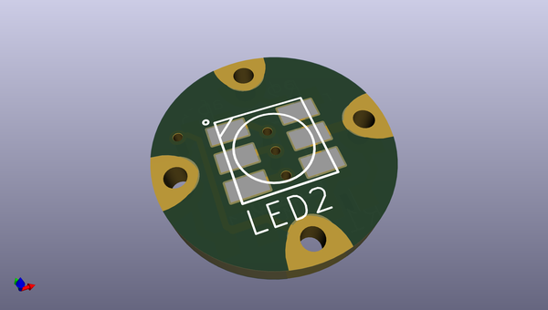
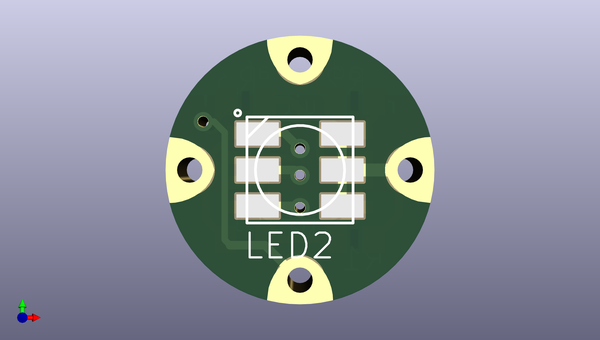
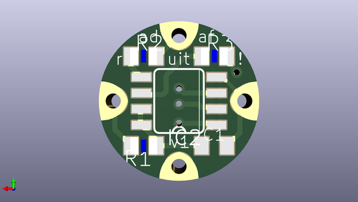

# adafruit_flora_smart_neopixel
 
## summary 
* id: adafruit_adafruit_flora_smart_neopixel_adafruit_flora_neopixel
* user: adafruit
* name: adafruit_flora_smart_neopixel
* board: adafruit_flora_neopixel
* repo: https://github.com/adafruit/Adafruit-Flora-Smart-NeoPixel

* src_file_repo_sch: 
* src_file_repo_sch_link: https://github.com/adafruit/Adafruit-Flora-Smart-NeoPixel/tree/master/
* full details link: https://github.com/oomlout/oomlout_oomp_project_bot_v_2/tree/main/projects/adafruit_adafruit_flora_smart_neopixel_adafruit_flora_neopixel/current_version/working  

## pcb  
 
  
  
  
[board (pdf)](working.pdf)  

## working_bom
| Id | Designator | Footprint | Quantity | Designation | Supplier and ref |  | None | 
| --- | --- | --- | --- | --- | --- | --- | --- | 
| 1 | LED2 | RGBLED5050 | 1 | RGBLED5050 |  |  | [''] | 
| 2 | GND0,DATA_OUTPUT0,DATA_INPUT0,VDD0 | SEWINGTAP_0.5 | 4 | SEWTAP0.5IN |  |  | [''] | 
| 3 | R2,R3 | R0805 | 2 | 22 |  |  | [''] | 
| 4 | R1 | R0805 | 1 | 1.0K |  |  | [''] | 
| 5 | C1 | C0805K | 1 | 1uF |  |  | [''] | 
| 6 | IC2 | SO08-SKINNYPADS | 1 | WS2811-SOP8 |  |  | [''] | 

