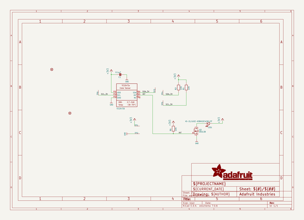
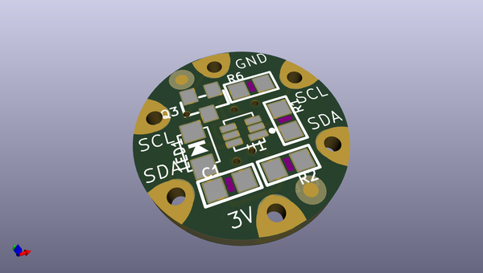
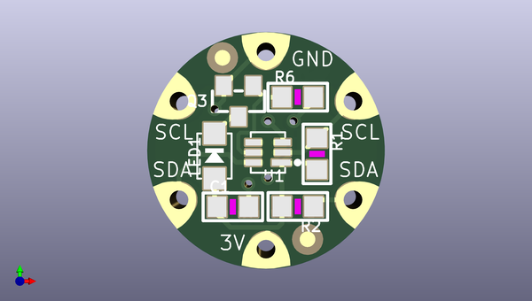
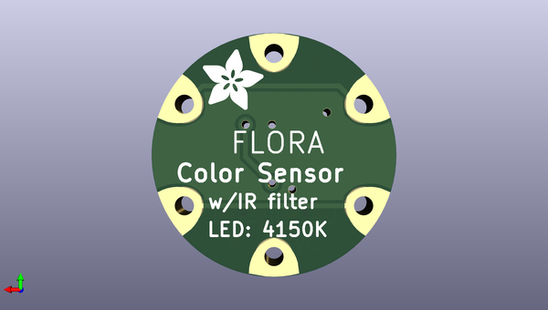

# adafruit_flora_tcs34725_color_sensor_pcb
 
## summary 
* id: adafruit_adafruit_flora_tcs34725_color_sensor_pcb_adafruit_flora_tcs34725
* user: adafruit
* name: adafruit_flora_tcs34725_color_sensor_pcb
* board: adafruit_flora_tcs34725
* repo: https://github.com/adafruit/Adafruit-Flora-TCS34725-Color-Sensor-PCB

* src_file_repo_sch: 
* src_file_repo_sch_link: https://github.com/adafruit/Adafruit-Flora-TCS34725-Color-Sensor-PCB/tree/master/
* full details link: https://github.com/oomlout/oomlout_oomp_project_bot_v_2/tree/main/projects/adafruit_adafruit_flora_tcs34725_color_sensor_pcb_adafruit_flora_tcs34725/current_version/working  

## schematic  
  
[schematic (pdf)](working_schematic.pdf)  

## pcb  
 
  
  
  
[board (pdf)](working.pdf)  

## working_bom
| Id | Designator | Footprint | Quantity | Designation | Supplier and ref |  | None | 
| --- | --- | --- | --- | --- | --- | --- | --- | 
| 1 | Q3 | SOT23-WIDE | 1 | BSS138 |  |  | [''] | 
| 2 | TP3,TP1,TP2,TP4,TP5,TP6 | SEWINGTAP_0.5 | 6 | SEWTAP0.5IN |  |  | [''] | 
| 3 | U1 | TCS3472_FN6 | 1 | TCS34725 |  |  | [''] | 
| 4 | R1,R6,R2 | _0805 | 3 | 10K |  |  | [''] | 
| 5 | FID1,FID2 | FIDUCIAL_1MM | 2 | FIDUCIAL" |  |  | [''] | 
| 6 | LED1 | EVERLIGHT_45-21 | 1 | 45-21/LK2C-B38452C4CB2/2T |  |  | [''] | 
| 7 | C1 | _0805 | 1 | 0.1µF |  |  | [''] | 
| 8 | U$8 | ADAFRUIT_3.5MM | 1 |  |  |  | [''] | 

## bom_schematic
| Ref | Qnty | Value | Cmp name | Footprint | Description | Vendor | DNP | 
| --- | --- | --- | --- | --- | --- | --- | --- | 
| C1 | 1 | 0.1µF | CAP_CERAMIC_0805 | working:_0805 |  |  |  | 
| FID1, FID2 | 2 | FIDUCIAL"" | FIDUCIAL{dblquote}{dblquote} | working:FIDUCIAL_1MM |  |  |  | 
| LED1 | 1 | 45-21/LK2C-B38452C4CB2/2T | LEDEV45-21 | working:EVERLIGHT_45-21 |  |  |  | 
| Q3 | 1 | BSS138 | MOSFET-NWIDE | working:SOT23-WIDE |  |  |  | 
| R1, R2, R6 | 3 | 10K | RESISTOR_0805 | working:_0805 |  |  |  | 
| TP1, TP2, TP3, TP4, TP5, TP6 | 6 | SEWTAP0.5IN | SEWTAP0.5IN | working:SEWINGTAP_0.5 |  |  |  | 
| U1 | 1 | TCS34725 | LIGHT_TCS3472 | working:TCS3472_FN6 |  |  |  | 

