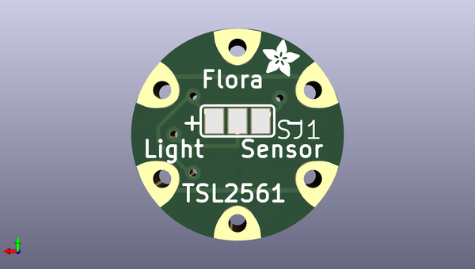

# adafruit_flora_tsl2561_lux_sensor_pcb
 
## summary 
* id: adafruit_adafruit_flora_tsl2561_lux_sensor_pcb_adafruit_flora_tsl2561_lux
* user: adafruit
* name: adafruit_flora_tsl2561_lux_sensor_pcb
* board: adafruit_flora_tsl2561_lux
* repo: https://github.com/adafruit/Adafruit-Flora-TSL2561-Lux-Sensor-PCB

* src_file_repo_sch: 
* src_file_repo_sch_link: https://github.com/adafruit/Adafruit-Flora-TSL2561-Lux-Sensor-PCB/tree/master/
* full details link: https://github.com/oomlout/oomlout_oomp_project_bot_v_2/tree/main/projects/adafruit_adafruit_flora_tsl2561_lux_sensor_pcb_adafruit_flora_tsl2561_lux/current_version/working  

## schematic  
  
[schematic (pdf)](working_schematic.pdf) 

## pcb  
 
  
  
  
[board (pdf)](working.pdf)  

## working_bom
| Id | Designator | Footprint | Quantity | Designation | Supplier and ref |  | None | 
| --- | --- | --- | --- | --- | --- | --- | --- | 
| 1 | SDA1,SCL1,SCL2,SDA2,VCC0,GND0 | SEWINGTAP_0.5 | 6 | SEWTAP0.5IN |  |  | [''] | 
| 2 | R3,R2 | _0805 | 2 | 10K |  |  | [''] | 
| 3 | U$4,U$3 | ADAFRUIT_2.5MM | 2 |  |  |  | [''] | 
| 4 | U2 | TSL2561_FN | 1 | TSL2561 |  |  | [''] | 
| 5 | FID2,FID1 | FIDUCIAL_1MM | 2 | FIDUCIAL" |  |  | [''] | 
| 6 | C1 | C0805K | 1 | 0.1uF |  |  | [''] | 
| 7 | SJ1 | SJ_2 | 1 |  |  |  | [''] | 

## bom_schematic
| Ref | Qnty | Value | Cmp name | Footprint | Description | Vendor | DNP | 
| --- | --- | --- | --- | --- | --- | --- | --- | 
| C1 | 1 | 0.1uF | C-USC0805K | working:C0805K |  |  |  | 
| FID1, FID2 | 2 | FIDUCIAL"" | FIDUCIAL{dblquote}{dblquote} | working:FIDUCIAL_1MM |  |  |  | 
| GND0 | 1 | SEWTAP0.5IN | SEWTAP0.5IN | working:SEWINGTAP_0.5 |  |  |  | 
| R2, R3 | 2 | 10K | RESISTOR_0805 | working:_0805 |  |  |  | 
| SCL1, SCL2 | 2 | SEWTAP0.5IN | SEWTAP0.5IN | working:SEWINGTAP_0.5 |  |  |  | 
| SDA1, SDA2 | 2 | SEWTAP0.5IN | SEWTAP0.5IN | working:SEWINGTAP_0.5 |  |  |  | 
| SJ1 | 1 | SJ2W | SJ2W | working:SJ_2 |  |  |  | 
| U2 | 1 | TSL2561 | TSL2561 | working:TSL2561_FN |  |  |  | 
| VCC0 | 1 | SEWTAP0.5IN | SEWTAP0.5IN | working:SEWINGTAP_0.5 |  |  |  | 

