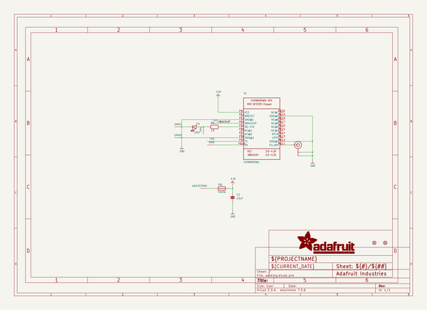
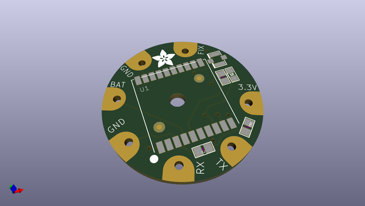
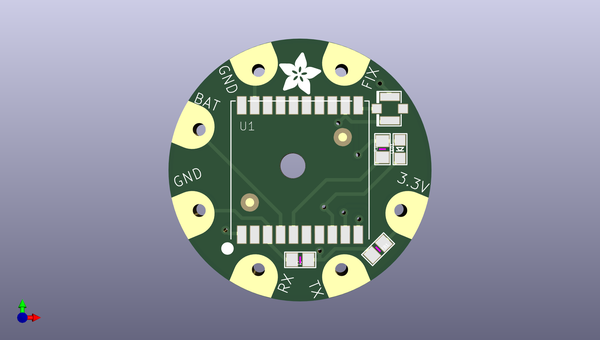
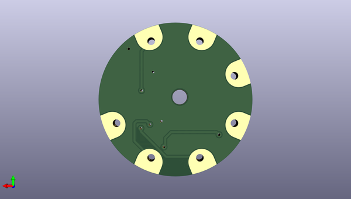

# adafruit_flora_ultimate_gps
 
## summary 
* id: adafruit_adafruit_flora_ultimate_gps_adafruit_flora_gps
* user: adafruit
* name: adafruit_flora_ultimate_gps
* board: adafruit_flora_gps
* repo: https://github.com/adafruit/Adafruit-Flora-Ultimate-GPS

* src_file_repo_sch: 
* src_file_repo_sch_link: https://github.com/adafruit/Adafruit-Flora-Ultimate-GPS/tree/master/
* full details link: https://github.com/oomlout/oomlout_oomp_project_bot_v_2/tree/main/projects/adafruit_adafruit_flora_ultimate_gps_adafruit_flora_gps/current_version/working  

## schematic  
  
[schematic (pdf)](working_schematic.pdf)  

## pcb  
 
  
  
  
[board (pdf)](working.pdf)  

## working_bom
| Id | Designator | Footprint | Quantity | Designation | Supplier and ref |  | None | 
| --- | --- | --- | --- | --- | --- | --- | --- | 
| 1 | FID2,FID1 | FIDUCIAL_1MM | 2 | FIDUCIAL" |  |  | [''] | 
| 2 | C2 | 0805 | 1 | 10uF |  |  | [''] | 
| 3 | TX0,TP4,UNK3V3IN0,GND0,RX0,TP1,GND1 | SEWINGTAP_2.0 | 7 | SEWTAP-2.0IN |  |  | [''] | 
| 4 | U$6 | ADAFRUIT_5MM | 1 |  |  |  | [''] | 
| 5 | R1 | 0805 | 1 | 1K |  |  | [''] | 
| 6 | LED1 | CHIPLED_0805 | 1 | FIX |  |  | [''] | 
| 7 | U1 | FGPMMOPA6H | 1 | FGPMMOPA6H |  |  | [''] | 
| 8 | FB1 | 0805 | 1 | Ferrite |  |  | [''] | 
| 9 | U$20 | U.FL | 1 | U.FL |  |  | [''] | 
| 10 | U$7 | FLORASMALL | 1 |  |  |  | [''] | 

## bom_schematic
| Ref | Qnty | Value | Cmp name | Footprint | Description | Vendor | DNP | 
| --- | --- | --- | --- | --- | --- | --- | --- | 
| C2 | 1 | 10uF | CAP_CERAMIC0805 | working:0805 |  |  |  | 
| FB1 | 1 | Ferrite | FERRITE0805 | working:0805 |  |  |  | 
| FID1, FID2 | 2 | FIDUCIAL"" | FIDUCIAL{dblquote}{dblquote} | working:FIDUCIAL_1MM |  |  |  | 
| GND0, GND1 | 2 | SEWTAP-2.0IN | SEWTAP-2.0IN | working:SEWINGTAP_2.0 |  |  |  | 
| LED1 | 1 | FIX | LED0805 | working:CHIPLED_0805 |  |  |  | 
| R1 | 1 | 1K | RESISTOR0805 | working:0805 |  |  |  | 
| RX0 | 1 | SEWTAP-2.0IN | SEWTAP-2.0IN | working:SEWINGTAP_2.0 |  |  |  | 
| TP1, TP4 | 2 | SEWTAP-2.0IN | SEWTAP-2.0IN | working:SEWINGTAP_2.0 |  |  |  | 
| TX0 | 1 | SEWTAP-2.0IN | SEWTAP-2.0IN | working:SEWINGTAP_2.0 |  |  |  | 
| U1 | 1 | FGPMMOPA6H | GPS_FGPMMOPA6H | working:FGPMMOPA6H |  |  |  | 
| U$20 | 1 | U.FL | U.FL | working:U.FL |  |  |  | 
| UNK3V3IN0 | 1 | SEWTAP-2.0IN | SEWTAP-2.0IN | working:SEWINGTAP_2.0 |  |  |  | 

