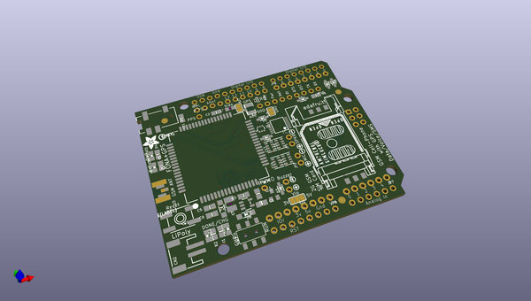

# adafruit_fona808_shield_pcb
 
## summary 
* id: adafruit_adafruit_fona808_shield_pcb_adafruit_sim808_shield
* user: adafruit
* name: adafruit_fona808_shield_pcb
* board: adafruit_sim808_shield
* repo: https://github.com/adafruit/Adafruit-FONA808-Shield-PCB

* src_file_repo_sch: 
* src_file_repo_sch_link: https://github.com/adafruit/Adafruit-FONA808-Shield-PCB/tree/master/
* full details link: https://github.com/oomlout/oomlout_oomp_project_bot_v_2/tree/main/projects/adafruit_adafruit_fona808_shield_pcb_adafruit_sim808_shield/current_version/working  

## schematic  
  
[schematic (pdf)](working_schematic.pdf)  

## pcb  
 
  
  
  
[board (pdf)](working.pdf)  

## working_bom
| Id | Designator | Footprint | Quantity | Designation | Supplier and ref |  | None | 
| --- | --- | --- | --- | --- | --- | --- | --- | 
| 1 | D4,D7,D3,D6,D9,D5 | SOD-323 | 6 | 1N4148 |  |  | [''] | 
| 2 | M1 | ARDUINOR3_ICSP_NODIM | 1 | ARDUINO_R3_ICSP_NODIM |  |  | [''] | 
| 3 | X3 | U.FL | 1 | uFL |  |  | [''] | 
| 4 | PWRSTAT0,DONE0 | CHIPLED_0805_NOOUTLINE | 2 | GREEN |  |  | [''] | 
| 5 | JP6,JP5 | 1X08_ROUND_76 | 2 |  |  |  | [''] | 
| 6 | U$64 | PCBFEAT-REV-040 | 1 |  |  |  | [''] | 
| 7 | U2 | SOT23-5 | 1 | MCP73831T-2ACI/OT |  |  | [''] | 
| 8 | R4,R5,R2 | 0805-NO | 3 | 1K |  |  | [''] | 
| 9 | C9,C11 | 0805-NO | 2 | 10uF |  |  | [''] | 
| 10 | U$41,U$33,U$34 | SYMBOL_MINUS | 3 |  |  |  | [''] | 
| 11 | R3 | 0805-NO | 1 | 2K |  |  | [''] | 
| 12 | U$35,U$20,U$2 | SYMBOL_PLUS | 3 |  |  |  | [''] | 
| 13 | X6 | C707_10M006_512_2 | 1 | SIM_LOCKAMPHENOL |  |  | [''] | 
| 14 | JP10 | 1X08_ROUND_70 | 1 |  |  |  | [''] | 
| 15 | C6,C2 | 0805-NO | 2 | 33pF |  |  | [''] | 
| 16 | SJ1 | SOLDERJUMPER_2WAY_OPEN_NOPASTE | 1 |  |  |  | [''] | 
| 17 | SW2 | EG1390 | 1 | EG1390 |  |  | [''] | 
| 18 | @HOLE3,@HOLE0,@HOLE2,@HOLE1 |  | 4 |  |  |  | [''] | 
| 19 | SW1 | EVQ-Q2 | 1 | EVQQ2 |  |  | [''] | 
| 20 | CN2 | JSTPH2 | 1 | JSTPH |  |  | [''] | 
| 21 | FID1,FID3,FID2 | FIDUCIAL_1MM | 3 | FIDUCIAL" |  |  | [''] | 
| 22 | JP4 | 1X10_ROUND70 | 1 |  |  |  | [''] | 
| 23 | U3 | SIM900_SMT | 1 | SIM808 |  |  | [''] | 
| 24 | C14,C16 | RESPACK_4X0603 | 2 | 33pF |  |  | [''] | 
| 25 | U$36 | ADAFRUIT_5MM | 1 |  |  |  | [''] | 
| 26 | SJ7 | SOLDERJUMPER_ARROW_NOPASTE | 1 |  |  |  | [''] | 
| 27 | D1 | SOD-123 | 1 | MMSZ5231BT1G |  |  | [''] | 
| 28 | JP1,JP2 | 1X02_ROUND | 2 |  |  |  | [''] | 
| 29 | SJ6,SJ2,SJ5,SJ3,SJ4 | SOLDERJUMPER_CLOSEDWIRE | 5 |  |  |  | [''] | 
| 30 | C1 | 0805-NO | 1 | 10µF |  |  | [''] | 
| 31 | D8 | SOD-123 | 1 | MBR120 |  |  | [''] | 
| 32 | JP3 | 1X02_ROUND | 1 | BUZZ |  |  | [''] | 
| 33 | C15,C17 | RESPACK_4X0603 | 2 | 10pF |  |  | [''] | 
| 34 | L2 | _0805MP | 1 | 33nH |  |  | [''] | 
| 35 | Q1 | SC59-BEC | 1 | DTC143ZUAT106 |  |  | [''] | 
| 36 | D2 | SOT363 | 1 | SMF05C |  |  | [''] | 
| 37 | PPS0,PWM0,DTR0 | 1X01-CLEANBIG | 3 |  |  |  | [''] | 
| 38 | CHRG0 | CHIPLED_0805_NOOUTLINE | 1 | ORANGE |  |  | [''] | 
| 39 | NETSTAT0 | CHIPLED_0805_NOOUTLINE | 1 | BLUE |  |  | [''] | 
| 40 | R6 | 0805-NO | 1 | 10K |  |  | [''] | 
| 41 | R1 | 0805-NO | 1 | 470 |  |  | [''] | 
| 42 | X1 | SMA_EDGELAUNCH_UFL | 1 | uFL |  |  | [''] | 
| 43 | C7 | C1210 | 1 | 100uF |  |  | [''] | 
| 44 | X4 | 4UCONN_18510 | 1 | 4UCONN_18510 |  |  | [''] | 
| 45 | IC1 | TSSOP14 | 1 | 74VHCT125PW |  |  | [''] | 
| 46 | C5 | 0805-NO | 1 | 10pF |  |  | [''] | 
| 47 | JP7 | 1X06_ROUND_76 | 1 |  |  |  | [''] | 
| 48 | TP1 | TP11R | 1 | TPTP11R |  |  | [''] | 
| 49 | U$25 | ADAFRUIT_TEXT_30MM | 1 |  |  |  | [''] | 
| 50 | U$26 | FONA_LOGO | 1 |  |  |  | [''] | 

## bom_schematic
| Ref | Qnty | Value | Cmp name | Footprint | Description | Vendor | DNP | 
| --- | --- | --- | --- | --- | --- | --- | --- | 
| C1 | 1 | 10µF | CAP_CERAMIC0805-NOOUTLINE | working:0805-NO |  |  |  | 
| C2, C6 | 2 | 33pF | CAP_CERAMIC0805-NOOUTLINE | working:0805-NO |  |  |  | 
| C5 | 1 | 10pF | CAP_CERAMIC0805-NOOUTLINE | working:0805-NO |  |  |  | 
| C7 | 1 | 100uF | C-USC1210 | working:C1210 |  |  |  | 
| C9, C11 | 2 | 10uF | CAP_CERAMIC0805-NOOUTLINE | working:0805-NO |  |  |  | 
| C14, C16 | 2 | 33pF | CAP_4PACK1206 | working:RESPACK_4X0603 |  |  |  | 
| C15, C17 | 2 | 10pF | CAP_4PACK1206 | working:RESPACK_4X0603 |  |  |  | 
| CHRG0 | 1 | ORANGE | LED0805_NOOUTLINE | working:CHIPLED_0805_NOOUTLINE |  |  |  | 
| CN2 | 1 | JSTPH | JST_2PIN | working:JSTPH2 |  |  |  | 
| D1 | 1 | MMSZ5231BT1G | DIODE-ZENERSOD123 | working:SOD-123 |  |  |  | 
| D2 | 1 | SMF05C | TVSARRAY_5LANE | working:SOT363 |  |  |  | 
| D3, D4, D5, D6, D7, D9 | 6 | 1N4148 | DIODESOD-323 | working:SOD-323 |  |  |  | 
| D8 | 1 | MBR120 | DIODE-SCHOTTKYSOD-123 | working:SOD-123 |  |  |  | 
| DONE0 | 1 | GREEN | LED0805_NOOUTLINE | working:CHIPLED_0805_NOOUTLINE |  |  |  | 
| DTR0 | 1 | PINHD-1X1CB | PINHD-1X1CB | working:1X01-CLEANBIG |  |  |  | 
| FID1, FID2, FID3 | 3 | FIDUCIAL"" | FIDUCIAL{dblquote}{dblquote} | working:FIDUCIAL_1MM |  |  |  | 
| IC1 | 1 | 74125PW | 74125PW | working:TSSOP14 |  |  |  | 
| JP1, JP2 | 2 | HEADER-1X2ROUND | HEADER-1X2ROUND | working:1X02_ROUND |  |  |  | 
| JP3 | 1 | BUZZ | HEADER-1X2ROUND | working:1X02_ROUND |  |  |  | 
| JP4 | 1 | HEADER-1X1070MIL | HEADER-1X1070MIL | working:1X10_ROUND70 |  |  |  | 
| JP5, JP6 | 2 | HEADER-1X876MIL | HEADER-1X876MIL | working:1X08_ROUND_76 |  |  |  | 
| JP7 | 1 | HEADER-1X676MIL | HEADER-1X676MIL | working:1X06_ROUND_76 |  |  |  | 
| JP10 | 1 | HEADER-1X870MIL | HEADER-1X870MIL | working:1X08_ROUND_70 |  |  |  | 
| L2 | 1 | 33nH | INDUCTOR_0805MP | working:_0805MP |  |  |  | 
| M1 | 1 | ARDUINO_R3_ICSP_NODIM | ARDUINO_R3_ICSP_NODIM | working:ARDUINOR3_ICSP_NODIM |  |  |  | 
| NETSTAT0 | 1 | BLUE | LED0805_NOOUTLINE | working:CHIPLED_0805_NOOUTLINE |  |  |  | 
| PPS0 | 1 | PINHD-1X1CB | PINHD-1X1CB | working:1X01-CLEANBIG |  |  |  | 
| PWM0 | 1 | PINHD-1X1CB | PINHD-1X1CB | working:1X01-CLEANBIG |  |  |  | 
| PWRSTAT0 | 1 | GREEN | LED0805_NOOUTLINE | working:CHIPLED_0805_NOOUTLINE |  |  |  | 
| Q1 | 1 | DTC143ZUAT106 | -NPN_DRIVER-SC59-BEC | working:SC59-BEC |  |  |  | 
| R1 | 1 | 470 | RESISTOR0805_NOOUTLINE | working:0805-NO |  |  |  | 
| R2, R4, R5 | 3 | 1K | RESISTOR0805_NOOUTLINE | working:0805-NO |  |  |  | 
| R3 | 1 | 2K | RESISTOR0805_NOOUTLINE | working:0805-NO |  |  |  | 
| R6 | 1 | 10K | RESISTOR0805_NOOUTLINE | working:0805-NO |  |  |  | 
| SJ1 | 1 | SOLDERJUMPER_2WAY | SOLDERJUMPER_2WAY | working:SOLDERJUMPER_2WAY_OPEN_NOPASTE |  |  |  | 
| SJ2, SJ3, SJ4, SJ5, SJ6 | 5 | SOLDERJUMPER_CLOSED | SOLDERJUMPER_CLOSED | working:SOLDERJUMPER_CLOSEDWIRE |  |  |  | 
| SJ7 | 1 | SOLDERJUMPER | SOLDERJUMPER | working:SOLDERJUMPER_ARROW_NOPASTE |  |  |  | 
| SW1 | 1 | EVQQ2 | SWITCH_TACT_SMT | working:EVQ-Q2 |  |  |  | 
| SW2 | 1 | EG1390 | SWITCH_DPDTEG1390 | working:EG1390 |  |  |  | 
| TP1 | 1 | TPTP11R | TPTP11R | working:TP11R |  |  |  | 
| U2 | 1 | MCP73831T-2ACI/OT | MCP73831/2 | working:SOT23-5 |  |  |  | 
| U3 | 1 | SIM808 | GSM_SIM808_LITERAL | working:SIM900_SMT |  |  |  | 
| X1 | 1 | uFL | SMACONNECTOR_EDGE_UFL | working:SMA_EDGELAUNCH_UFL |  |  |  | 
| X3 | 1 | uFL | ANTENNA_U.FL | working:U.FL |  |  |  | 
| X4 | 1 | 4UCONN_18510 | AUDIO_3.5MMJACK_4POL | working:4UCONN_18510 |  |  |  | 
| X6 | 1 | SIM_LOCKAMPHENOL | SIM_LOCKAMPHENOL | working:C707_10M006_512_2 |  |  |  | 

