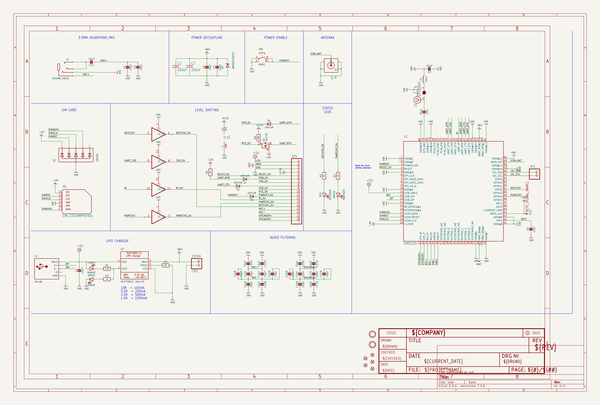
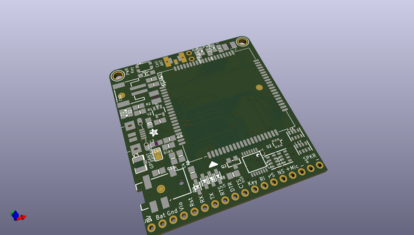
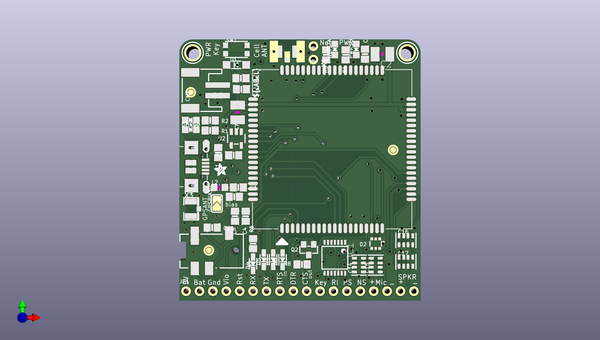
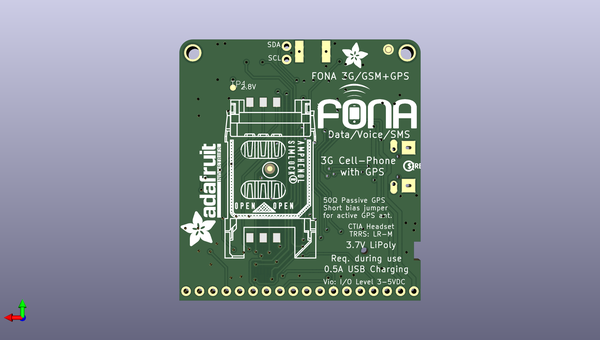

# adafruit_fona_simcom_3g_breakout_pcb
 
## summary 
* id: adafruit_adafruit_fona_simcom_3g_breakout_pcb_adafruit_fona_sim5320_3g_breakout
* user: adafruit
* name: adafruit_fona_simcom_3g_breakout_pcb
* board: adafruit_fona_sim5320_3g_breakout
* repo: https://github.com/adafruit/Adafruit-FONA-SIMCOM-3G-Breakout-PCB

* src_file_repo_sch: 
* src_file_repo_sch_link: https://github.com/adafruit/Adafruit-FONA-SIMCOM-3G-Breakout-PCB/tree/master/
* full details link: https://github.com/oomlout/oomlout_oomp_project_bot_v_2/tree/main/projects/adafruit_adafruit_fona_simcom_3g_breakout_pcb_adafruit_fona_sim5320_3g_breakout/current_version/working  

## schematic  
  
[schematic (pdf)](working_schematic.pdf)  

## pcb  
 
  
  
  
[board (pdf)](working.pdf)  

## working_bom
| Id | Designator | Footprint | Quantity | Designation | Supplier and ref |  | None | 
| --- | --- | --- | --- | --- | --- | --- | --- | 
| 1 | R2,R4,R5 | 0805-NO | 3 | 1K |  |  | [''] | 
| 2 | C15,C17 | RESPACK_4X0603 | 2 | 10pF |  |  | [''] | 
| 3 | IC1 | TSSOP14 | 1 | 74VHCT125PW |  |  | [''] | 
| 4 | D2 | SOT363 | 1 | SMF05C |  |  | [''] | 
| 5 | FID1,FID2,FID3,FID4,FID5 | FIDUCIAL_1MM | 5 | FIDUCIAL" |  |  | [''] | 
| 6 | U2 | SOT23-5 | 1 | MCP73831T-2ACI/OT |  |  | [''] | 
| 7 | Q2 | SOT23-WIDE | 1 | bss138 |  |  | [''] | 
| 8 | C14,C16 | RESPACK_4X0603 | 2 | 33pF |  |  | [''] | 
| 9 | D4,D5,D6,D3 | SOD-323 | 4 | 1N4148 |  |  | [''] | 
| 10 | C9,C11 | 0805-NO | 2 | 10uF |  |  | [''] | 
| 11 | R6,R3 | 0805-NO | 2 | 2K |  |  | [''] | 
| 12 | CHRG0 | CHIPLED_0805_NOOUTLINE | 1 | ORANGE |  |  | [''] | 
| 13 | JP1 | 1X18_ROUND70 | 1 |  |  |  | [''] | 
| 14 | GPSBIAS0 | SOLDERJUMPER_ARROW_NOPASTE | 1 |  |  |  | [''] | 
| 15 | CN2 | JSTPH2 | 1 | JSTPH |  |  | [''] | 
| 16 | C6,C4,C10,C3 | 0805-NO | 4 | 33pF |  |  | [''] | 
| 17 | C1 | 0805-NO | 1 | 10µF |  |  | [''] | 
| 18 | C8,C5 | 0805-NO | 2 | 10pF |  |  | [''] | 
| 19 | X1 | SMA_EDGELAUNCH_UFL | 1 | uFL |  |  | [''] | 
| 20 | U$33,U$34 | MOUNTINGHOLE_2.5_PLATED | 2 | MOUNTINGHOLE2.5 |  |  | [''] | 
| 21 | U$21 | ADAFRUIT_2.5MM | 1 |  |  |  | [''] | 
| 22 | R1 | 0805-NO | 1 | 470 |  |  | [''] | 
| 23 | C2,C7 | C1210 | 2 | 100uF |  |  | [''] | 
| 24 | PWRSTAT0,DONE0 | CHIPLED_0805_NOOUTLINE | 2 | GREEN |  |  | [''] | 
| 25 | U1 | SIM5320 | 1 | SIM5320 |  |  | [''] | 
| 26 | X2 | 4UCONN_20329 | 1 | MicroB |  |  | [''] | 
| 27 | R8 | 0805-NO | 1 | 10K |  |  | [''] | 
| 28 | L2 | _0805MP | 1 | 33nH |  |  | [''] | 
| 29 | X3 | U.FL | 1 | uFL |  |  | [''] | 
| 30 | NETSTAT0 | CHIPLED_0805_NOOUTLINE | 1 | RED |  |  | [''] | 
| 31 | JP2 | 1X02_ROUND | 1 |  |  |  | [''] | 
| 32 | X4 | 4UCONN_18510 | 1 | 4UCONN_18510 |  |  | [''] | 
| 33 | D1 | SOD-123 | 1 | MMSZ5231BT1G |  |  | [''] | 
| 34 | SW1 | BTN_KMR2_4.6X2.8 | 1 | KMR2 |  |  | [''] | 
| 35 | U$42 | ADAFRUIT_TEXT_20MM | 1 |  |  |  | [''] | 
| 36 | U$25 | PCBFEAT-REV-040 | 1 |  |  |  | [''] | 
| 37 | TP1 | TP11R | 1 | TPTP11R |  |  | [''] | 
| 38 | U$36 | ADAFRUIT_5MM | 1 |  |  |  | [''] | 
| 39 | X6 | C707_10M006_512_2 | 1 | SIM_LOCKAMPHENOL |  |  | [''] | 
| 40 | U$26 | FONA_LOGO | 1 |  |  |  | [''] | 

## bom_schematic
| Ref | Qnty | Value | Cmp name | Footprint | Description | Vendor | DNP | 
| --- | --- | --- | --- | --- | --- | --- | --- | 
| C1 | 1 | 10µF | CAP_CERAMIC0805-NOOUTLINE | working:0805-NO |  |  |  | 
| C2, C7 | 2 | 100uF | C-USC1210 | working:C1210 |  |  |  | 
| C3, C4, C6, C10 | 4 | 33pF | CAP_CERAMIC0805-NOOUTLINE | working:0805-NO |  |  |  | 
| C5, C8 | 2 | 10pF | CAP_CERAMIC0805-NOOUTLINE | working:0805-NO |  |  |  | 
| C9, C11 | 2 | 10uF | CAP_CERAMIC0805-NOOUTLINE | working:0805-NO |  |  |  | 
| C14, C16 | 2 | 33pF | CAP_4PACK1206 | working:RESPACK_4X0603 |  |  |  | 
| C15, C17 | 2 | 10pF | CAP_4PACK1206 | working:RESPACK_4X0603 |  |  |  | 
| CHRG0 | 1 | ORANGE | LED0805_NOOUTLINE | working:CHIPLED_0805_NOOUTLINE |  |  |  | 
| CN2 | 1 | JSTPH | JST_2PIN | working:JSTPH2 |  |  |  | 
| D1 | 1 | MMSZ5231BT1G | DIODE-ZENERSOD123 | working:SOD-123 |  |  |  | 
| D2 | 1 | SMF05C | TVSARRAY_5LANE | working:SOT363 |  |  |  | 
| D3, D4, D5, D6 | 4 | 1N4148 | DIODESOD-323 | working:SOD-323 |  |  |  | 
| DONE0 | 1 | GREEN | LED0805_NOOUTLINE | working:CHIPLED_0805_NOOUTLINE |  |  |  | 
| FID1, FID2, FID3, FID4, FID5 | 5 | FIDUCIAL"" | FIDUCIAL{dblquote}{dblquote} | working:FIDUCIAL_1MM |  |  |  | 
| GPSBIAS0 | 1 | SOLDERJUMPER | SOLDERJUMPER | working:SOLDERJUMPER_ARROW_NOPASTE |  |  |  | 
| IC1 | 1 | 74125PW | 74125PW | working:TSSOP14 |  |  |  | 
| JP1 | 1 | HEADER-1X18 | HEADER-1X18 | working:1X18_ROUND70 |  |  |  | 
| JP2 | 1 | HEADER-1X2ROUND | HEADER-1X2ROUND | working:1X02_ROUND |  |  |  | 
| L2 | 1 | 33nH | INDUCTOR_0805MP | working:_0805MP |  |  |  | 
| NETSTAT0 | 1 | RED | LED0805_NOOUTLINE | working:CHIPLED_0805_NOOUTLINE |  |  |  | 
| PWRSTAT0 | 1 | GREEN | LED0805_NOOUTLINE | working:CHIPLED_0805_NOOUTLINE |  |  |  | 
| Q2 | 1 | bss138 | MOSFET-NWIDE | working:SOT23-WIDE |  |  |  | 
| R1 | 1 | 470 | RESISTOR0805_NOOUTLINE | working:0805-NO |  |  |  | 
| R2, R4, R5 | 3 | 1K | RESISTOR0805_NOOUTLINE | working:0805-NO |  |  |  | 
| R3, R6 | 2 | 2K | RESISTOR0805_NOOUTLINE | working:0805-NO |  |  |  | 
| R8 | 1 | 10K | RESISTOR0805_NOOUTLINE | working:0805-NO |  |  |  | 
| SW1 | 1 | KMR2 | SWITCH_TACT_SMT4.6X2.8 | working:BTN_KMR2_4.6X2.8 |  |  |  | 
| TP1 | 1 | TPTP11R | TPTP11R | working:TP11R |  |  |  | 
| U1 | 1 | SIM5320 | GSM_SIM5320_LITERAL | working:SIM5320 |  |  |  | 
| U2 | 1 | MCP73831T-2ACI/OT | MCP73831/2 | working:SOT23-5 |  |  |  | 
| U$33, U$34 | 2 | MOUNTINGHOLE2.5 | MOUNTINGHOLE2.5 | working:MOUNTINGHOLE_2.5_PLATED |  |  |  | 
| X1 | 1 | uFL | SMACONNECTOR_EDGE_UFL | working:SMA_EDGELAUNCH_UFL |  |  |  | 
| X2 | 1 | MicroB | USBMICRO_20329 | working:4UCONN_20329 |  |  |  | 
| X3 | 1 | uFL | ANTENNA_U.FL | working:U.FL |  |  |  | 
| X4 | 1 | 4UCONN_18510 | AUDIO_3.5MMJACK_4POL | working:4UCONN_18510 |  |  |  | 
| X6 | 1 | SIM_LOCKAMPHENOL | SIM_LOCKAMPHENOL | working:C707_10M006_512_2 |  |  |  | 

## mounting_holes
| x | y | package | value | ref | size | 
| --- | --- | --- | --- | --- | --- | 
| 40.640000000000015 | 0.0 | MOUNTINGHOLE_2.5_PLATED | MOUNTINGHOLE2.5 | U$33 | m3 | 
| 0.0 | 0.0 | MOUNTINGHOLE_2.5_PLATED | MOUNTINGHOLE2.5 | U$34 | m3 | 

