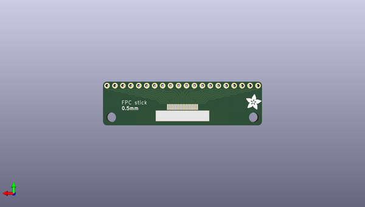

# adafruit_fpc_smt_adapter_pcbs
 
## summary 
* id: adafruit_adafruit_fpc_smt_adapter_pcbs_super_lucky_multi_fpc
* user: adafruit
* name: adafruit_fpc_smt_adapter_pcbs
* board: super_lucky_multi_fpc
* repo: https://github.com/adafruit/Adafruit-FPC-SMT-Adapter-PCBs

* src_file_repo_sch: 
* src_file_repo_sch_link: https://github.com/adafruit/Adafruit-FPC-SMT-Adapter-PCBs/tree/master/
* full details link: https://github.com/oomlout/oomlout_oomp_project_bot_v_2/tree/main/projects/adafruit_adafruit_fpc_smt_adapter_pcbs_super_lucky_multi_fpc/current_version/working  

## schematic  
  
[schematic (pdf)](working_schematic.pdf) 

## pcb  
 
  
  
  
[board (pdf)](working.pdf)  

## working_bom
| Id | Designator | Footprint | Quantity | Designation | Supplier and ref |  | None | 
| --- | --- | --- | --- | --- | --- | --- | --- | 
| 1 | JP2 | 1X20_ROUND | 1 |  |  |  | [''] | 
| 2 | JP1 | FPC_GENERIC_1.0MM_20PIN | 1 |  |  |  | [''] | 
| 3 | @HOLE0,@HOLE1 |  | 2 |  |  |  | [''] | 
| 4 | U$2,U$3 | ADAFRUIT_5MM | 2 |  |  |  | [''] | 
| 5 | JP3 | FPC_GENERIC_0.5MM_20PIN | 1 |  |  |  | [''] | 

## bom_schematic
| Ref | Qnty | Value | Cmp name | Footprint | Description | Vendor | DNP | 
| --- | --- | --- | --- | --- | --- | --- | --- | 
| JP1 | 1 | HEADER-1X20FPC_1.0MM | HEADER-1X20FPC_1.0MM | working:FPC_GENERIC_1.0MM_20PIN |  |  |  | 
| JP2 | 1 | HEADER-1X20ROUND | HEADER-1X20ROUND | working:1X20_ROUND |  |  |  | 
| JP3 | 1 | HEADER-1X20FPC_0.5MM | HEADER-1X20FPC_0.5MM | working:FPC_GENERIC_0.5MM_20PIN |  |  |  | 

