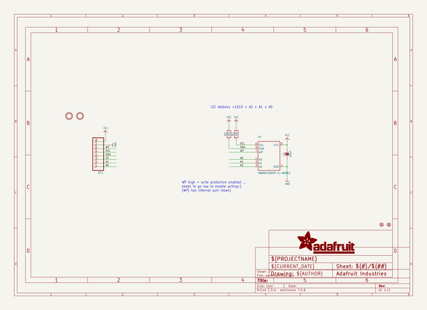
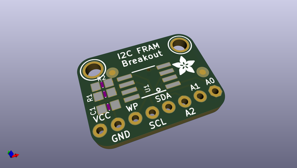
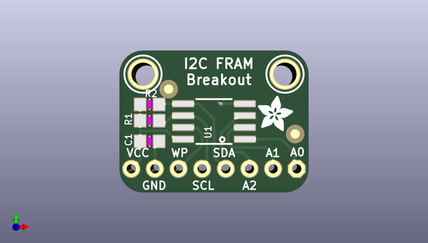
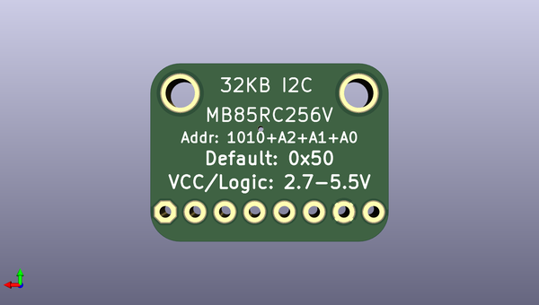

# adafruit_fram_breakout_pcb
 
## summary 
* id: adafruit_adafruit_fram_breakout_pcb_spi_fram_2_and_4_mbit
* user: adafruit
* name: adafruit_fram_breakout_pcb
* board: spi_fram_2_and_4_mbit
* repo: https://github.com/adafruit/Adafruit-FRAM-Breakout-PCB

* src_file_repo_sch: 
* src_file_repo_sch_link: https://github.com/adafruit/Adafruit-FRAM-Breakout-PCB/tree/master/
* full details link: https://github.com/oomlout/oomlout_oomp_project_bot_v_2/tree/main/projects/adafruit_adafruit_fram_breakout_pcb_spi_fram_2_and_4_mbit/current_version/working  

## schematic  
  
[schematic (pdf)](working_schematic.pdf) 

## pcb  
 
  
  
  
[board (pdf)](working.pdf)  

## working_bom
| Id | Designator | Footprint | Quantity | Designation | Supplier and ref |  | None | 
| --- | --- | --- | --- | --- | --- | --- | --- | 
| 1 | U$4 | ADAFRUIT_3.5MM | 1 |  |  |  | [''] | 
| 2 | FID1,FID2 | FIDUCIAL_1MM | 2 | FIDUCIAL" |  |  | [''] | 
| 3 | C1 | _0805MP | 1 | 10uF |  |  | [''] | 
| 4 | JP1 | 1X08_ROUND_70 | 1 |  |  |  | [''] | 
| 5 | R2,R1 | _0805MP | 2 | 10K |  |  | [''] | 
| 6 | U$5,U$6 | MOUNTINGHOLE_2.5_PLATED | 2 | MOUNTINGHOLE2.5 |  |  | [''] | 
| 7 | U1 | SOIC8_208MIL | 1 | MB85RC256VPF-G-JNERE2 |  |  | [''] | 

## bom_schematic
| Ref | Qnty | Value | Cmp name | Footprint | Description | Vendor | DNP | 
| --- | --- | --- | --- | --- | --- | --- | --- | 
| C1 | 1 | 10uF | CAP_CERAMIC_0805MP | working:_0805MP |  |  |  | 
| FID1, FID2 | 2 | FIDUCIAL"" | FIDUCIAL{dblquote}{dblquote} | working:FIDUCIAL_1MM |  |  |  | 
| JP1 | 1 | HEADER-1X870MIL | HEADER-1X870MIL | working:1X08_ROUND_70 |  |  |  | 
| R1, R2 | 2 | 10K | RESISTOR_0805MP | working:_0805MP |  |  |  | 
| U1 | 1 | MB85RC256VPF-G-JNERE2 | FRAM_SOIC8_I2C | working:SOIC8_208MIL |  |  |  | 
| U$5, U$6 | 2 | MOUNTINGHOLE2.5 | MOUNTINGHOLE2.5 | working:MOUNTINGHOLE_2.5_PLATED |  |  |  | 

## mounting_holes
| x | y | package | value | ref | size | 
| --- | --- | --- | --- | --- | --- | 
| 0.0 | 0.0 | MOUNTINGHOLE_2.5_PLATED | MOUNTINGHOLE2.5 | U$5 | m3 | 
| 15.24 | 0.0 | MOUNTINGHOLE_2.5_PLATED | MOUNTINGHOLE2.5 | U$6 | m3 | 

