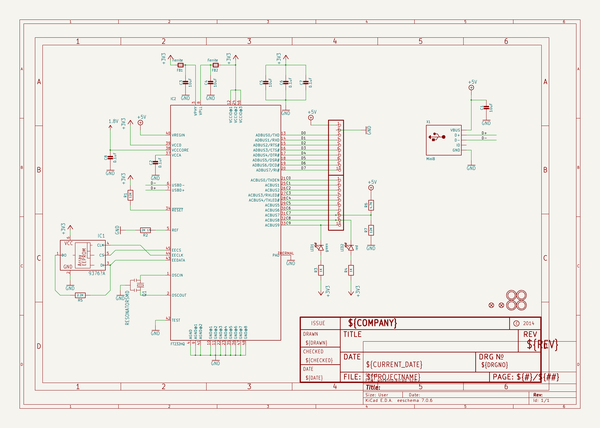
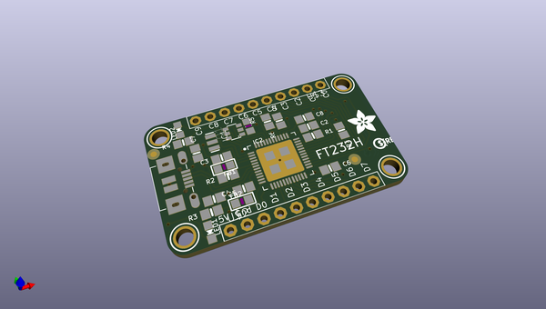
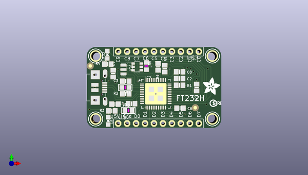
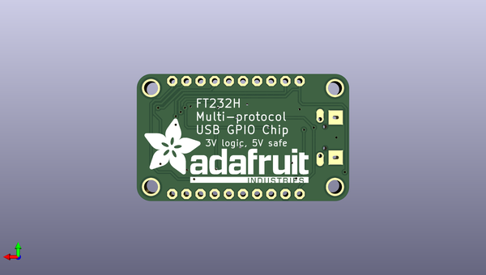

# adafruit_ft232h_breakout_pcb
 
## summary 
* id: adafruit_adafruit_ft232h_breakout_pcb_adafruit_ft232h
* user: adafruit
* name: adafruit_ft232h_breakout_pcb
* board: adafruit_ft232h
* repo: https://github.com/adafruit/Adafruit-FT232H-Breakout-PCB

* src_file_repo_sch: 
* src_file_repo_sch_link: https://github.com/adafruit/Adafruit-FT232H-Breakout-PCB/tree/master/
* full details link: https://github.com/oomlout/oomlout_oomp_project_bot_v_2/tree/main/projects/adafruit_adafruit_ft232h_breakout_pcb_adafruit_ft232h/current_version/working  

## schematic  
  
[schematic (pdf)](working_schematic.pdf)  

## pcb  
 
  
  
  
[board (pdf)](working.pdf)  

## working_bom
| Id | Designator | Footprint | Quantity | Designation | Supplier and ref |  | None | 
| --- | --- | --- | --- | --- | --- | --- | --- | 
| 1 | R2 | 0805-NO | 1 | 12K 1% |  |  | [''] | 
| 2 | R4,R3 | 0805-NO | 2 | 1K |  |  | [''] | 
| 3 | LED1 | CHIPLED_0805_NOOUTLINE | 1 | green |  |  | [''] | 
| 4 | U$8 | ADAFRUIT_5MM | 1 |  |  |  | [''] | 
| 5 | U$11 | PCBFEAT-REV-040 | 1 |  |  |  | [''] | 
| 6 | X1 | 4UCONN_20329 | 1 | MiniB |  |  | [''] | 
| 7 | U$6,U$4,U$7,U$5 | MOUNTINGHOLE_2.5_PLATED | 4 | MOUNTINGHOLE2.5 |  |  | [''] | 
| 8 | IC1 | SOT23-6 | 1 | 93LC56B |  |  | [''] | 
| 9 | C8,C7,C6,C2 | 0805-NO | 4 | 0.1uF |  |  | [''] | 
| 10 | FID1,FID2 | FIDUCIAL_1MM | 2 | FIDUCIAL" |  |  | [''] | 
| 11 | FB2,FB1 | _0805 | 2 | Ferrite |  |  | [''] | 
| 12 | R5 | _0805MP | 1 | 2.2K |  |  | [''] | 
| 13 | C4,C1,C3,C5 | 0805-NO | 4 | 10uF |  |  | [''] | 
| 14 | R6 | 0805-NO | 1 | 4.7K |  |  | [''] | 
| 15 | IC2 | QFN48_8MM | 1 | FT232HQ |  |  | [''] | 
| 16 | LED2 | CHIPLED_0805_NOOUTLINE | 1 | red |  |  | [''] | 
| 17 | R7,R1 | 0805-NO | 2 | 12K |  |  | [''] | 
| 18 | U$2,U$3 | 1X10-BIG | 2 | PINHD-1X10 |  |  | [''] | 
| 19 | Q1 | RESONATOR-SMD | 1 | CSTCR 12MHz |  |  | [''] | 
| 20 | U$9 | ADAFRUIT_TEXT_30MM | 1 |  |  |  | [''] | 

## bom_schematic
| Ref | Qnty | Value | Cmp name | Footprint | Description | Vendor | DNP | 
| --- | --- | --- | --- | --- | --- | --- | --- | 
| C1, C3, C4, C5 | 4 | 10uF | CAP_CERAMIC0805-NOOUTLINE | working:0805-NO |  |  |  | 
| C2, C6, C7, C8 | 4 | 0.1uF | CAP_CERAMIC0805-NOOUTLINE | working:0805-NO |  |  |  | 
| FB1, FB2 | 2 | Ferrite | FERRITE_0805 | working:_0805 |  |  |  | 
| FID1, FID2 | 2 | FIDUCIAL"" | FIDUCIAL{dblquote}{dblquote} | working:FIDUCIAL_1MM |  |  |  | 
| IC1 | 1 | 9376?A | 9376?A | working:SOT23-6 |  |  |  | 
| IC2 | 1 | FT232HQ | FT232HQ | working:QFN48_8MM |  |  |  | 
| LED1 | 1 | green | LED0805_NOOUTLINE | working:CHIPLED_0805_NOOUTLINE |  |  |  | 
| LED2 | 1 | red | LED0805_NOOUTLINE | working:CHIPLED_0805_NOOUTLINE |  |  |  | 
| Q1 | 1 | RESONATORSMD | RESONATORSMD | working:RESONATOR-SMD |  |  |  | 
| R1, R7 | 2 | 12K | RESISTOR0805_NOOUTLINE | working:0805-NO |  |  |  | 
| R2 | 1 | 12K 1% | RESISTOR0805_NOOUTLINE | working:0805-NO |  |  |  | 
| R3, R4 | 2 | 1K | RESISTOR0805_NOOUTLINE | working:0805-NO |  |  |  | 
| R5 | 1 | 2.2K | RESISTOR_0805MP | working:_0805MP |  |  |  | 
| R6 | 1 | 4.7K | RESISTOR0805_NOOUTLINE | working:0805-NO |  |  |  | 
| U$2, U$3 | 2 | PINHD-1X10 | PINHD-1X10 | working:1X10-BIG |  |  |  | 
| U$4, U$5, U$6, U$7 | 4 | MOUNTINGHOLE2.5 | MOUNTINGHOLE2.5 | working:MOUNTINGHOLE_2.5_PLATED |  |  |  | 
| X1 | 1 | MiniB | USBMICRO_20329 | working:4UCONN_20329 |  |  |  | 

## mounting_holes
| x | y | package | value | ref | size | 
| --- | --- | --- | --- | --- | --- | 
| 0.0 | 17.78 | MOUNTINGHOLE_2.5_PLATED | MOUNTINGHOLE2.5 | U$4 | m3 | 
| 0.0 | 0.0 | MOUNTINGHOLE_2.5_PLATED | MOUNTINGHOLE2.5 | U$5 | m3 | 
| 33.02000000000001 | 17.78 | MOUNTINGHOLE_2.5_PLATED | MOUNTINGHOLE2.5 | U$6 | m3 | 
| 33.02000000000001 | 0.0 | MOUNTINGHOLE_2.5_PLATED | MOUNTINGHOLE2.5 | U$7 | m3 | 

