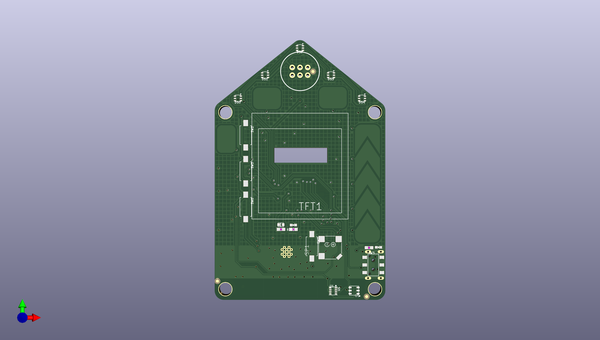

# adafruit_funhouse_pcb
 
## summary 
* id: adafruit_adafruit_funhouse_pcb_adafruit_funhouse
* user: adafruit
* name: adafruit_funhouse_pcb
* board: adafruit_funhouse
* repo: https://github.com/adafruit/Adafruit-FunHouse-PCB

* src_file_repo_sch: 
* src_file_repo_sch_link: https://github.com/adafruit/Adafruit-FunHouse-PCB/tree/main/
* full details link: https://github.com/oomlout/oomlout_oomp_project_bot_v_2/tree/main/projects/adafruit_adafruit_funhouse_pcb_adafruit_funhouse/current_version/working  

## schematic  
  
[schematic (pdf)](working_schematic.pdf)  

## pcb  
 
  
  
  
[board (pdf)](working.pdf)  

## working_bom
| Id | Designator | Footprint | Quantity | Designation | Supplier and ref |  | None | 
| --- | --- | --- | --- | --- | --- | --- | --- | 
| 1 | R9,R20,R5,R1,R13,R10,R7,R4,R12 | 0603-NO | 9 | 10K |  |  | [''] | 
| 2 | X1 | CAPTOUCH_6X9MM | 1 | CAPTOUCH_10MM |  |  | [''] | 
| 3 | U5 | SNR6-1.0-3X3X1MM | 1 | AHT20 |  |  | [''] | 
| 4 | X6 | CAPTOUCH_5SLIDER | 1 | CAPTOUCH_5SLIDER_10MM |  |  | [''] | 
| 5 | SW5,SW2,SW6,SW7 | TACTILE_3X6MM | 4 | FSM2JMTR |  |  | [''] | 
| 6 | TFT1 | TFT_1.54IN_240X240_22PIN | 1 | DISP_TFT_1.54IN_240X240_22P |  |  | [''] | 
| 7 | U$45 | FUNHOUSE_FRONT | 1 |  |  |  | [''] | 
| 8 | ON0 | CHIPLED_0603_NOOUTLINE | 1 | GREEN |  |  | [''] | 
| 9 | DS4,DS1,DS3,DS2,DS0 | APA102_2020 | 5 | APA102-2020 |  |  | [''] | 
| 10 | FID2,FID1,FID3,FID4,FID5,FID6 | FIDUCIAL_1MM | 6 | FIDUCIAL_1MM |  |  | [''] | 
| 11 | U1 | BMX280_COMBO | 1 | DPS3 |  |  | [''] | 
| 12 | U2 | ALS-PT19-315C | 1 | ALS-PT19 |  |  | [''] | 
| 13 | L0 | CHIPLED_0603_NOOUTLINE | 1 | RED |  |  | [''] | 
| 14 | X3,X5 | CAPTOUCH_7X9MM | 2 | CAPTOUCH_10MM |  |  | [''] | 
| 15 | SP1 | BUZZER_SMT_7.5MM | 1 | 7.5mm SPK |  |  | [''] | 
| 16 | R6 | 0603-NO | 1 | 47K |  |  | [''] | 
| 17 | SW3 | EG1390 | 1 | EG1390 |  |  | [''] | 
| 18 | C12,C14,C6 | 0603-NO | 3 | 1uF |  |  | [''] | 
| 19 | C3,C10,C7,C4,C13,C11,C17 | 0805-NO | 7 | 10µF |  |  | [''] | 
| 20 | TP8,TP7,TP5,TP4 | SMT_NUT_3MM | 4 | SEWTAP_SMTNUTM3 |  |  | [''] | 
| 21 | SW4 | KMR2 | 1 | SPST_TACT-KMR2 |  |  | [''] | 
| 22 | D6,D1,D2 | SOD-323 | 3 | 3.6V |  |  | [''] | 
| 23 | R18,R16,R2 | 0603-NO | 3 | 1K |  |  | [''] | 
| 24 | Q3 | SOT23-R | 1 | DMG3415U-7 |  |  | [''] | 
| 25 | SJ2 | SOLDERJUMPER_2WAY_OPEN_NOPASTE | 1 |  |  |  | [''] | 
| 26 | TP2,TP6,TP3,TP1 | TESTPOINT_ROUND_1.5MM_NO | 4 |  |  |  | [''] | 
| 27 | CONN1 | JST_SH4 | 1 | STEMMA_I2C_QT |  |  | [''] | 
| 28 | C2,C15,C5 | 0603-NO | 3 | 0.1uF |  |  | [''] | 
| 29 | C20,C1 | 0805-NO | 2 | 10uF |  |  | [''] | 
| 30 | Q1 | SOT23-WIDE | 1 | BSS138 |  |  | [''] | 
| 31 | SENSE1,SENSE3,SENSE0 | JSTPH3 | 3 | JST PH 3 |  |  | [''] | 
| 32 | R11 | 0603-NO | 1 | 100 |  |  | [''] | 
| 33 | SJ1 | SOLDERJUMPER_CLOSEDWIRE | 1 |  |  |  | [''] | 
| 34 | C9 | 0805_10MGAP | 1 | 10uF/10V+ |  |  | [''] | 
| 35 | R14,R17 | 0603-NO | 2 | 1Meg |  |  | [''] | 
| 36 | R3,R8 | 0603-NO | 2 | 5.1K |  |  | [''] | 
| 37 | X4 | USB_C_CUSB31-CFM2AX-01-X | 1 | USB C |  |  | [''] | 
| 38 | U$41 | PCBFEAT-REV-040 | 1 |  |  |  | [''] | 
| 39 | JP2 | 2X03_SMTTHM | 1 |  |  |  | [''] | 
| 40 | U4 | SOT23-5 | 1 | AP2112K-3.3 |  |  | [''] | 
| 41 | D3 | SOD-323F | 1 | 1N4148 |  |  | [''] | 
| 42 | Q4 | SOT23-R | 1 | BSS138 |  |  | [''] | 
| 43 | JP1 | 2X03_SMT_4UCON_14113 | 1 | 2x3 SMT |  |  | [''] | 
| 44 | U3 | MODULE_ESP32-S2-WROVER | 1 | ESP32-S2-MODULE_WROVER |  |  | [''] | 
| 45 | U$69 | FUNHOUSE_BACK | 1 |  |  |  | [''] | 

## bom_schematic
| Ref | Qnty | Value | Cmp name | Footprint | Description | Vendor | DNP | 
| --- | --- | --- | --- | --- | --- | --- | --- | 
| C1, C20 | 2 | 10uF | CAP_CERAMIC0805-NOOUTLINE | working:0805-NO |  |  |  | 
| C2, C5, C15 | 3 | 0.1uF | CAP_CERAMIC0603_NO | working:0603-NO |  |  |  | 
| C3, C4, C7, C10, C11, C13, C17 | 7 | 10µF | CAP_CERAMIC0805-NOOUTLINE | working:0805-NO |  |  |  | 
| C6, C12, C14 | 3 | 1uF | CAP_CERAMIC0603_NO | working:0603-NO |  |  |  | 
| C9 | 1 | 10uF/10V+ | CAP_CERAMIC0805_10MGAP | working:0805_10MGAP |  |  |  | 
| CONN1 | 1 | STEMMA_I2C_QT | STEMMA_I2C_QT | working:JST_SH4 |  |  |  | 
| D1, D2, D6 | 3 | 3.6V | DIODE-ZENERSOD323 | working:SOD-323 |  |  |  | 
| D3 | 1 | 1N4148 | DIODESOD-323F | working:SOD-323F |  |  |  | 
| DS0, DS1, DS2, DS3, DS4 | 5 | APA102-2020 | APA1022020 | working:APA102_2020 |  |  |  | 
| FID1, FID2, FID3, FID4, FID5, FID6 | 6 | FIDUCIAL_1MM | FIDUCIAL_1MM | working:FIDUCIAL_1MM |  |  |  | 
| JP1 | 1 | 2x3 SMT | HEADER-2X314113 | working:2X03_SMT_4UCON_14113 |  |  |  | 
| JP2 | 1 | HEADER-2X3_SMTTHM | HEADER-2X3_SMTTHM | working:2X03_SMTTHM |  |  |  | 
| L0 | 1 | RED | LED0603_NOOUTLINE | working:CHIPLED_0603_NOOUTLINE |  |  |  | 
| ON0 | 1 | GREEN | LED0603_NOOUTLINE | working:CHIPLED_0603_NOOUTLINE |  |  |  | 
| Q1 | 1 | BSS138 | MOSFET-NWIDE | working:SOT23-WIDE |  |  |  | 
| Q3 | 1 | DMG3415U-7 | MOSFET-P | working:SOT23-R |  |  |  | 
| Q4 | 1 | BSS138 | MOSFET-NREFLOW | working:SOT23-R |  |  |  | 
| R1, R4, R5, R7, R9, R10, R12, R13, R20 | 9 | 10K | RESISTOR_0603_NOOUT | working:0603-NO |  |  |  | 
| R2, R16, R18 | 3 | 1K | RESISTOR_0603_NOOUT | working:0603-NO |  |  |  | 
| R3, R8 | 2 | 5.1K | RESISTOR_0603_NOOUT | working:0603-NO |  |  |  | 
| R6 | 1 | 47K | RESISTOR_0603_NOOUT | working:0603-NO |  |  |  | 
| R11 | 1 | 100 | RESISTOR_0603_NOOUT | working:0603-NO |  |  |  | 
| R14, R17 | 2 | 1Meg | RESISTOR_0603_NOOUT | working:0603-NO |  |  |  | 
| SENSE0, SENSE1, SENSE3 | 3 | JST PH 3 | CON_JST_PH_3PIN | working:JSTPH3 |  |  |  | 
| SJ1 | 1 | SOLDERJUMPERCLOSED | SOLDERJUMPERCLOSED | working:SOLDERJUMPER_CLOSEDWIRE |  |  |  | 
| SJ2 | 1 | SOLDERJUMPER_2WAY | SOLDERJUMPER_2WAY | working:SOLDERJUMPER_2WAY_OPEN_NOPASTE |  |  |  | 
| SP1 | 1 | SPEAKER_7.5MM | SPEAKER_7.5MM | working:BUZZER_SMT_7.5MM |  |  |  | 
| SW2, SW5, SW6, SW7 | 4 | FSM2JMTR | SWITCH_PUSHBUTTON_3.5X6MM | working:TACTILE_3X6MM |  |  |  | 
| SW3 | 1 | EG1390 | SWITCH_DPDTEG1390 | working:EG1390 |  |  |  | 
| SW4 | 1 | SPST_TACT-KMR2 | SPST_TACT-KMR2 | working:KMR2 |  |  |  | 
| TFT1 | 1 | DISP_TFT_1.54IN_240X240_22P | DISP_TFT_1.54IN_240X240_22P | working:TFT_1.54IN_240X240_22PIN |  |  |  | 
| TP1, TP2, TP3, TP6 | 4 | TESTPOINTROUND1.5MMNO | TESTPOINTROUND1.5MMNO | working:TESTPOINT_ROUND_1.5MM_NO |  |  |  | 
| TP4, TP5, TP7, TP8 | 4 | SEWTAP_SMTNUTM3 | SEWTAP_SMTNUTM3 | working:SMT_NUT_3MM |  |  |  | 
| U1 | 1 | DPS3 | BMP280_COMBO | working:BMX280_COMBO |  |  |  | 
| U2 | 1 | ALS-PT19 | PHOTOTRANSISTOR_PT19-315C | working:ALS-PT19-315C |  |  |  | 
| U3 | 1 | ESP32-S2-MODULE_WROVER | ESP32-S2-MODULE_WROVER | working:MODULE_ESP32-S2-WROVER |  |  |  | 
| U4 | 1 | AP2112K-3.3 | VREG_SOT23-5 | working:SOT23-5 |  |  |  | 
| U5 | 1 | AHT20 | SENSOR-AHT20 | working:SNR6-1.0-3X3X1MM |  |  |  | 
| X1 | 1 | CAPTOUCH_MONOPAD_6X9 | CAPTOUCH_MONOPAD_6X9 | working:CAPTOUCH_6X9MM |  |  |  | 
| X3, X5 | 2 | CAPTOUCH_MONOPAD_7X9 | CAPTOUCH_MONOPAD_7X9 | working:CAPTOUCH_7X9MM |  |  |  | 
| X4 | 1 | USB C | USB_C | working:USB_C_CUSB31-CFM2AX-01-X |  |  |  | 
| X6 | 1 | CAPTOUCH_5SLIDER_10MM | CAPTOUCH_5SLIDER_10MM | working:CAPTOUCH_5SLIDER |  |  |  | 

