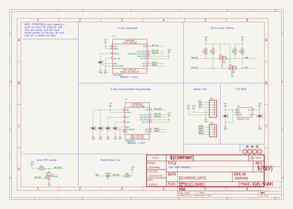
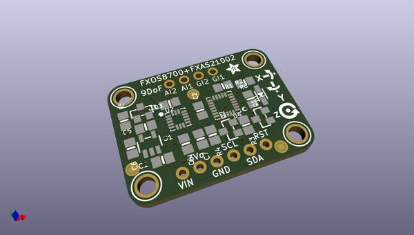
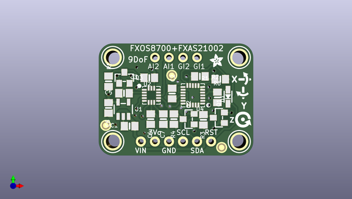
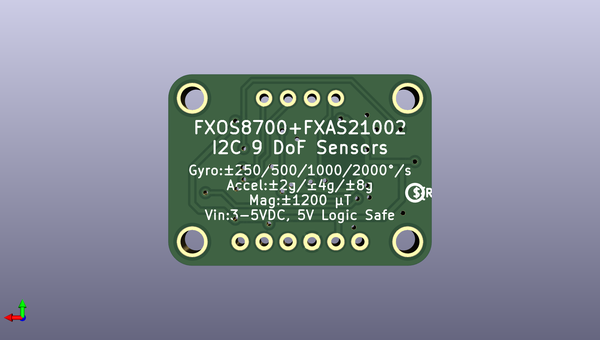

# adafruit_fxos8700_fxas21002_9_dof_breakout_pcb
 
## summary 
* id: adafruit_adafruit_fxos8700_fxas21002_9_dof_breakout_pcb_adafruit_fxos8700_fxas21002_9_dof_breakout
* user: adafruit
* name: adafruit_fxos8700_fxas21002_9_dof_breakout_pcb
* board: adafruit_fxos8700_fxas21002_9_dof_breakout
* repo: https://github.com/adafruit/Adafruit-FXOS8700-FXAS21002-9-DoF-Breakout-PCB

* src_file_repo_sch: 
* src_file_repo_sch_link: https://github.com/adafruit/Adafruit-FXOS8700-FXAS21002-9-DoF-Breakout-PCB/tree/master/
* full details link: https://github.com/oomlout/oomlout_oomp_project_bot_v_2/tree/main/projects/adafruit_adafruit_fxos8700_fxas21002_9_dof_breakout_pcb_adafruit_fxos8700_fxas21002_9_dof_breakout/current_version/working  

## schematic  
  
[schematic (pdf)](working_schematic.pdf) 

## pcb  
 
  
  
  
[board (pdf)](working.pdf)  

## working_bom
| Id | Designator | Footprint | Quantity | Designation | Supplier and ref |  | None | 
| --- | --- | --- | --- | --- | --- | --- | --- | 
| 1 | U$28 | SYMBOL_GYRO_CLOCKWISE | 1 |  |  |  | [''] | 
| 2 | U$27 | SYMBOL_GYRO_CCLOCKWISE | 1 |  |  |  | [''] | 
| 3 | U$1,U$3,U$4,U$2 | MOUNTINGHOLE_2.5_PLATED | 4 | MOUNTINGHOLE2.5 |  |  | [''] | 
| 4 | U1 | SOT23-5 | 1 | MIC5225-3.3V |  |  | [''] | 
| 5 | JP2 | 1X04_ROUND | 1 |  |  |  | [''] | 
| 6 | C2,C3,C7,C5 | 0805-NO | 4 | 0.1uF |  |  | [''] | 
| 7 | C4 | 0805-NO | 1 | 10uF |  |  | [''] | 
| 8 | FID3,FID2,FID1 | FIDUCIAL_1MM | 3 | FIDUCIAL_1MM |  |  | [''] | 
| 9 | JP1 | 1X06_ROUND_70 | 1 |  |  |  | [''] | 
| 10 | R6,R1,R5,R2,R3,R4 | 0805-NO | 6 | 10K |  |  | [''] | 
| 11 | D1 | SOD-323 | 1 | 1N4148 |  |  | [''] | 
| 12 | Q3,Q2,Q1 | SOT23-WIDE | 3 | BSS138 |  |  | [''] | 
| 13 | U$26 | ADAFRUIT_2.5MM | 1 |  |  |  | [''] | 
| 14 | C6,C1 | 0805-NO | 2 | 10µF |  |  | [''] | 
| 15 | U$31 | SYMBOL_GYRO_Z | 1 |  |  |  | [''] | 
| 16 | U2 | QFN16_3MM_FREESCALE_5X3 | 1 | FXOS8700CQ |  |  | [''] | 
| 17 | U4 | QFN24_4MM_FREESCALE_7X5 | 1 | FXAS21002C |  |  | [''] | 
| 18 | U$32 | PCBFEAT-REV-040 | 1 |  |  |  | [''] | 

## bom_schematic
| Ref | Qnty | Value | Cmp name | Footprint | Description | Vendor | DNP | 
| --- | --- | --- | --- | --- | --- | --- | --- | 
| C1, C6 | 2 | 10µF | CAP_CERAMIC0805-NOOUTLINE | working:0805-NO |  |  |  | 
| C2, C3, C5, C7 | 4 | 0.1uF | CAP_CERAMIC0805-NOOUTLINE | working:0805-NO |  |  |  | 
| C4 | 1 | 10uF | CAP_CERAMIC0805-NOOUTLINE | working:0805-NO |  |  |  | 
| D1 | 1 | 1N4148 | DIODESOD-323 | working:SOD-323 |  |  |  | 
| FID1, FID2, FID3 | 3 | FIDUCIAL_1MM | FIDUCIAL_1MM | working:FIDUCIAL_1MM |  |  |  | 
| JP1 | 1 | HEADER-1X670MIL | HEADER-1X670MIL | working:1X06_ROUND_70 |  |  |  | 
| JP2 | 1 | HEADER-1X4ROUND | HEADER-1X4ROUND | working:1X04_ROUND |  |  |  | 
| Q1, Q2, Q3 | 3 | BSS138 | MOSFET-NWIDE | working:SOT23-WIDE |  |  |  | 
| R1, R2, R3, R4, R5, R6 | 6 | 10K | RESISTOR0805_NOOUTLINE | working:0805-NO |  |  |  | 
| U1 | 1 | MIC5225-3.3V | VREG_SOT23-5 | working:SOT23-5 |  |  |  | 
| U2 | 1 | FXOS8700CQ | ACCEL_MAG_FXOS8700CQ | working:QFN16_3MM_FREESCALE_5X3 |  |  |  | 
| U4 | 1 | FXAS21002C | GYRO_FXAS21002C | working:QFN24_4MM_FREESCALE_7X5 |  |  |  | 
| U$1, U$2, U$3, U$4 | 4 | MOUNTINGHOLE2.5 | MOUNTINGHOLE2.5 | working:MOUNTINGHOLE_2.5_PLATED |  |  |  | 

## mounting_holes
| x | y | package | value | ref | size | 
| --- | --- | --- | --- | --- | --- | 
| 22.86 | 0.0 | MOUNTINGHOLE_2.5_PLATED | MOUNTINGHOLE2.5 | U$1 | m3 | 
| 0.0 | 15.24 | MOUNTINGHOLE_2.5_PLATED | MOUNTINGHOLE2.5 | U$2 | m3 | 
| 22.86 | 15.24 | MOUNTINGHOLE_2.5_PLATED | MOUNTINGHOLE2.5 | U$3 | m3 | 
| 0.0 | 0.0 | MOUNTINGHOLE_2.5_PLATED | MOUNTINGHOLE2.5 | U$4 | m3 | 

