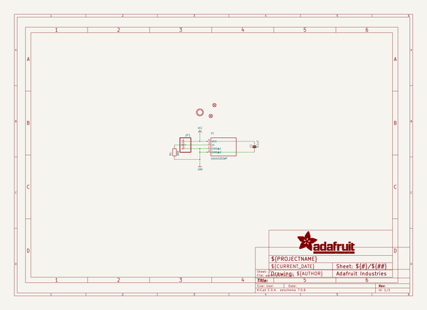
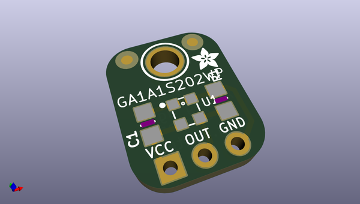
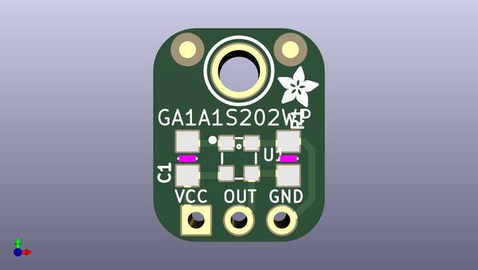
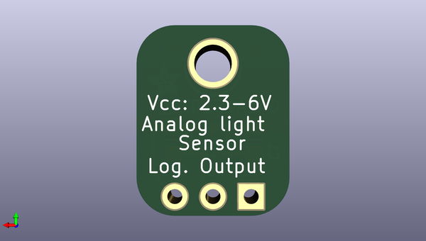

# adafruit_ga1a1s202wp_breakout_pcb
 
## summary 
* id: adafruit_adafruit_ga1a1s202wp_breakout_pcb_ga1a1s202wp_rev_b
* user: adafruit
* name: adafruit_ga1a1s202wp_breakout_pcb
* board: ga1a1s202wp_rev_b
* repo: https://github.com/adafruit/Adafruit-GA1A1S202WP-Breakout-PCB

* src_file_repo_sch: 
* src_file_repo_sch_link: https://github.com/adafruit/Adafruit-GA1A1S202WP-Breakout-PCB/tree/master/
* full details link: https://github.com/oomlout/oomlout_oomp_project_bot_v_2/tree/main/projects/adafruit_adafruit_ga1a1s202wp_breakout_pcb_ga1a1s202wp_rev_b/current_version/working  

## schematic  
  
[schematic (pdf)](working_schematic.pdf)  

## pcb  
 
  
  
  
[board (pdf)](working.pdf)  

## working_bom
| Id | Designator | Footprint | Quantity | Designation | Supplier and ref |  | None | 
| --- | --- | --- | --- | --- | --- | --- | --- | 
| 1 | FID1,FID2 | FIDUCIAL_1MM | 2 | FIDUCIAL" |  |  | [''] | 
| 2 | U$3 | MOUNTINGHOLE_2.5_PLATED | 1 | MOUNTINGHOLE2.5 |  |  | [''] | 
| 3 | U$4 | ADAFRUIT_2.5MM | 1 |  |  |  | [''] | 
| 4 | C1 | _0805MP | 1 | 0.1uF |  |  | [''] | 
| 5 | JP1 | 1X03_ROUND | 1 |  |  |  | [''] | 
| 6 | U1 | GA1A1S202WP | 1 | GA1A1S202WP |  |  | [''] | 
| 7 | R1 | _0805MP | 1 | 68K |  |  | [''] | 

## bom_schematic
| Ref | Qnty | Value | Cmp name | Footprint | Description | Vendor | DNP | 
| --- | --- | --- | --- | --- | --- | --- | --- | 
| C1 | 1 | 0.1uF | CAP_CERAMIC_0805MP | working:_0805MP |  |  |  | 
| FID1, FID2 | 2 | FIDUCIAL"" | FIDUCIAL{dblquote}{dblquote} | working:FIDUCIAL_1MM |  |  |  | 
| JP1 | 1 | HEADER-1X3ROUND | HEADER-1X3ROUND | working:1X03_ROUND |  |  |  | 
| R1 | 1 | 68K | RESISTOR_0805MP | working:_0805MP |  |  |  | 
| U1 | 1 | GA1A1S202WP | GA1A1S202WP | working:GA1A1S202WP |  |  |  | 
| U$3 | 1 | MOUNTINGHOLE2.5 | MOUNTINGHOLE2.5 | working:MOUNTINGHOLE_2.5_PLATED |  |  |  | 

## mounting_holes
| x | y | package | value | ref | size | 
| --- | --- | --- | --- | --- | --- | 
| 0.0 | 0.0 | MOUNTINGHOLE_2.5_PLATED | MOUNTINGHOLE2.5 | U$3 | m3 | 

