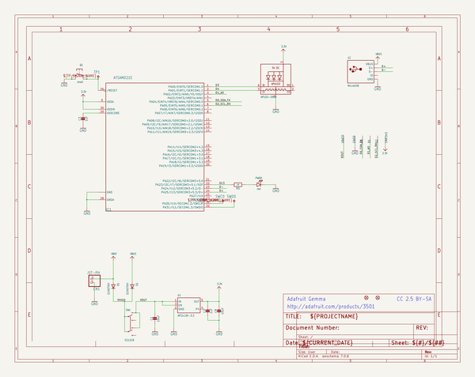
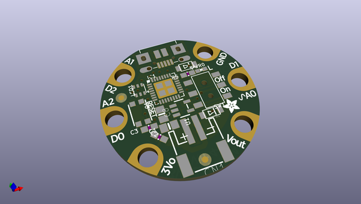
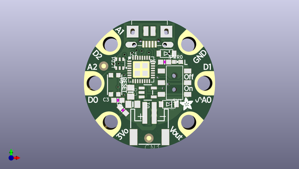
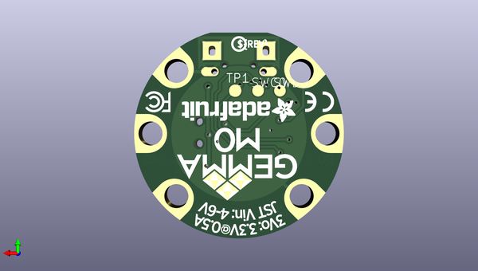

# adafruit_gemma_m0_pcb
 
## summary 
* id: adafruit_adafruit_gemma_m0_pcb_adafruit_gemma_m0
* user: adafruit
* name: adafruit_gemma_m0_pcb
* board: adafruit_gemma_m0
* repo: https://github.com/adafruit/Adafruit-Gemma-M0-PCB

* src_file_repo_sch: 
* src_file_repo_sch_link: https://github.com/adafruit/Adafruit-Gemma-M0-PCB/tree/master/
* full details link: https://github.com/oomlout/oomlout_oomp_project_bot_v_2/tree/main/projects/adafruit_adafruit_gemma_m0_pcb_adafruit_gemma_m0/current_version/working  

## schematic  
  
[schematic (pdf)](working_schematic.pdf) 

## pcb  
 
  
  
  
[board (pdf)](working.pdf)  

## working_bom
| Id | Designator | Footprint | Quantity | Designation | Supplier and ref |  | None | 
| --- | --- | --- | --- | --- | --- | --- | --- | 
| 1 | GND0,UNK3V3,B1,B2,B0,VBAT0 | SEWALLI | 6 | SEWTAP-ALLIGATOR |  |  | [''] | 
| 2 | SW1 | EG1390 | 1 | EG1218 |  |  | [''] | 
| 3 | U$1,U$6 | FIDUCIAL_1MM | 2 | FIDUCIAL_1MM |  |  | [''] | 
| 4 | C2,C3 | 0603-NO | 2 | 1uF |  |  | [''] | 
| 5 | C8,C1 | 0805-NO | 2 | 10uF |  |  | [''] | 
| 6 | D1,D2 | SOD-123FL | 2 | SCHOTTKY |  |  | [''] | 
| 7 | R5 | 0603-NO | 1 | 1K |  |  | [''] | 
| 8 | PWR0 | CHIPLED_0603_NOOUTLINE | 1 | red |  |  | [''] | 
| 9 | CN1 | JSTPH2 | 1 | JST-PH |  |  | [''] | 
| 10 | LED1 | APA102_2020 | 1 | AP102-2020 |  |  | [''] | 
| 11 | IC1 | QFN32_5MM | 1 | ATSAMD21E |  |  | [''] | 
| 12 | Q1 | BTN_KMR2_4.6X2.8 | 1 | reset |  |  | [''] | 
| 13 | X2 | 4UCONN_20329_V2 | 1 | MicroUSB |  |  | [''] | 
| 14 | U$8 | GEMMA_M0_TOP | 1 |  |  |  | [''] | 
| 15 | U1 | SOT23-5 | 1 | AP2112K-3.3 |  |  | [''] | 
| 16 | TP1 | TP16R | 1 | TPTP16R |  |  | [''] | 
| 17 | SWD0,SWC0 | TP15R | 2 | TPTP15R |  |  | [''] | 
| 18 | U$10 | PCBFEAT-REV-040 | 1 |  |  |  | [''] | 
| 19 | U$7 | GEMMA_M0_BOTTOM | 1 |  |  |  | [''] | 

## bom_schematic
| Ref | Qnty | Value | Cmp name | Footprint | Description | Vendor | DNP | 
| --- | --- | --- | --- | --- | --- | --- | --- | 
| B0, B1, B2 | 3 | SEWTAP-ALLIGATOR | SEWTAP-ALLIGATOR | working:SEWALLI |  |  |  | 
| C1, C8 | 2 | 10uF | CAP_CERAMIC0805-NOOUTLINE | working:0805-NO |  |  |  | 
| C2, C3 | 2 | 1uF | CAP_CERAMIC0603_NO | working:0603-NO |  |  |  | 
| CN1 | 1 | JST-PH | CON_JST_PH_2PIN | working:JSTPH2 |  |  |  | 
| D1, D2 | 2 | SCHOTTKY | DIODE_SOD-123FL | working:SOD-123FL |  |  |  | 
| GND0 | 1 | SEWTAP-ALLIGATOR | SEWTAP-ALLIGATOR | working:SEWALLI |  |  |  | 
| IC1 | 1 | ATSAMD21E | ATSAMD21E | working:QFN32_5MM |  |  |  | 
| LED1 | 1 | AP102-2020 | APA1022020 | working:APA102_2020 |  |  |  | 
| PWR0 | 1 | red | LED0603_NOOUTLINE | working:CHIPLED_0603_NOOUTLINE |  |  |  | 
| Q1 | 1 | reset | SWITCH_TACT_SMT4.6X2.8 | working:BTN_KMR2_4.6X2.8 |  |  |  | 
| R5 | 1 | 1K | RESISTOR_0603_NOOUT | working:0603-NO |  |  |  | 
| SW1 | 1 | EG1218 | SWITCH_DPDTEG1390 | working:EG1390 |  |  |  | 
| SWC0 | 1 | TPTP15R | TPTP15R | working:TP15R |  |  |  | 
| SWD0 | 1 | TPTP15R | TPTP15R | working:TP15R |  |  |  | 
| TP1 | 1 | TPTP16R | TPTP16R | working:TP16R |  |  |  | 
| U1 | 1 | AP2112K-3.3 | VREG_SOT23-5 | working:SOT23-5 |  |  |  | 
| U$1, U$6 | 2 | FIDUCIAL_1MM | FIDUCIAL_1MM | working:FIDUCIAL_1MM |  |  |  | 
| UNK3V3 | 1 | SEWTAP-ALLIGATOR | SEWTAP-ALLIGATOR | working:SEWALLI |  |  |  | 
| VBAT0 | 1 | SEWTAP-ALLIGATOR | SEWTAP-ALLIGATOR | working:SEWALLI |  |  |  | 
| X2 | 1 | MicroUSB | USB_MICRO_20329_V2 | working:4UCONN_20329_V2 |  |  |  | 

