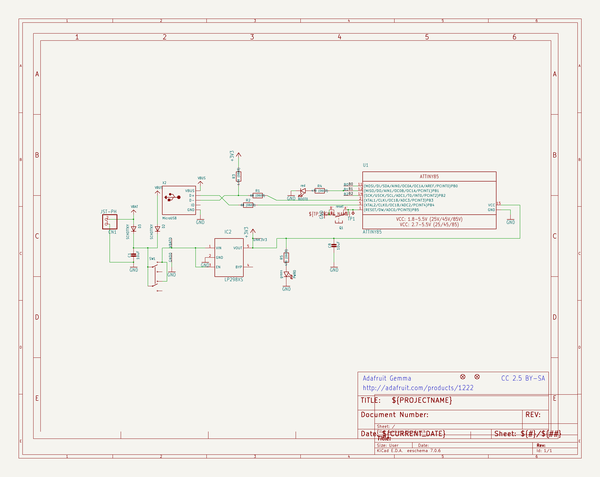
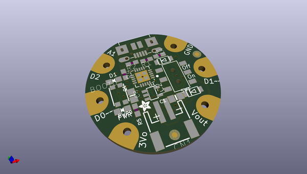
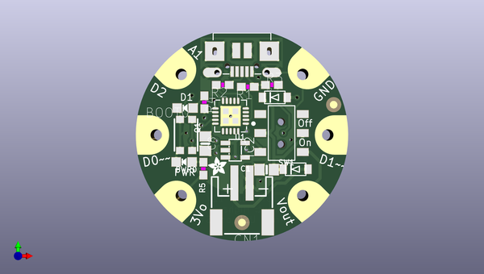
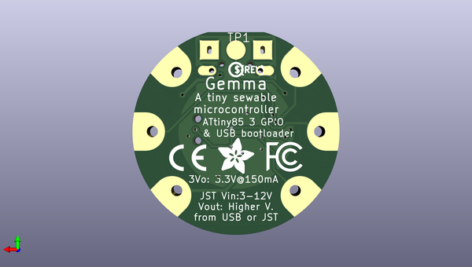

# adafruit_gemma_pcb
 
## summary 
* id: adafruit_adafruit_gemma_pcb_adafruit_gemma_rev_b
* user: adafruit
* name: adafruit_gemma_pcb
* board: adafruit_gemma_rev_b
* repo: https://github.com/adafruit/Adafruit-Gemma-PCB

* src_file_repo_sch: 
* src_file_repo_sch_link: https://github.com/adafruit/Adafruit-Gemma-PCB/tree/master/
* full details link: https://github.com/oomlout/oomlout_oomp_project_bot_v_2/tree/main/projects/adafruit_adafruit_gemma_pcb_adafruit_gemma_rev_b/current_version/working  

## schematic  
  
[schematic (pdf)](working_schematic.pdf)  

## pcb  
 
  
  
  
[board (pdf)](working.pdf)  

## working_bom
| Id | Designator | Footprint | Quantity | Designation | Supplier and ref |  | None | 
| --- | --- | --- | --- | --- | --- | --- | --- | 
| 1 | VBAT0,B1,GND0,UNK3V3,B0,B2 | SEWINGTAP_2.0 | 6 | SEWTAP-2.0IN |  |  | [''] | 
| 2 | R5,R4 | 0603-NO | 2 | 470 (0603) |  |  | [''] | 
| 3 | U$6,U$1 | FIDUCIAL_1MM | 2 | FIDUCIAL" |  |  | [''] | 
| 4 | R1,R2 | 0603-NO | 2 | 68 (0603) |  |  | [''] | 
| 5 | D3,D2 | SOD-123FL | 2 | SCHOTTKY |  |  | [''] | 
| 6 | R3 | 0603-NO | 1 | 1.5K (0603) |  |  | [''] | 
| 7 | SW1 | EG1390 | 1 |  |  |  | [''] | 
| 8 | CN1 | JSTPH2 | 1 | JST-PH |  |  | [''] | 
| 9 | C8,C1 | 0805-NO | 2 | 10uF |  |  | [''] | 
| 10 | PWR0 | CHIPLED_0805_NOOUTLINE | 1 | green |  |  | [''] | 
| 11 | IC2 | SOT23-5L | 1 | MIC5225-3.3v |  |  | [''] | 
| 12 | X2 | 4UCONN_20329 | 1 | MicroUSB |  |  | [''] | 
| 13 | Q1 | BTN_KMR2_4.6X2.8 | 1 | reset |  |  | [''] | 
| 14 | U1 | MLF20_4X4MM_0.5MM_ATMEL | 1 | ATTINY85 |  |  | [''] | 
| 15 | U$2 | ADAFRUIT_2.5MM | 1 |  |  |  | [''] | 
| 16 | BOOT0 | CHIPLED_0805_NOOUTLINE | 1 | red |  |  | [''] | 
| 17 | U$7 | ADAFRUIT_5MM | 1 |  |  |  | [''] | 
| 18 | U$8 | SYMBOL_FCC_5MM | 1 |  |  |  | [''] | 
| 19 | U$10 | PCBFEAT-REV-040 | 1 |  |  |  | [''] | 
| 20 | TP1 | B2,54 | 1 | TPB2,54 |  |  | [''] | 
| 21 | U$9 | SYMBOL_CE_5MM | 1 |  |  |  | [''] | 

## bom_schematic
| Ref | Qnty | Value | Cmp name | Footprint | Description | Vendor | DNP | 
| --- | --- | --- | --- | --- | --- | --- | --- | 
| B0, B1, B2 | 3 | SEWTAP-2.0IN | SEWTAP-2.0IN | working:SEWINGTAP_2.0 |  |  |  | 
| BOOT0 | 1 | red | LED0805_NOOUTLINE | working:CHIPLED_0805_NOOUTLINE |  |  |  | 
| C1, C8 | 2 | 10uF | CAP_CERAMIC0805-NOOUTLINE | working:0805-NO |  |  |  | 
| CN1 | 1 | JST-PH | CON_JST_PH_2PIN | working:JSTPH2 |  |  |  | 
| D2, D3 | 2 | SCHOTTKY | DIODE_SOD-123FL | working:SOD-123FL |  |  |  | 
| GND0 | 1 | SEWTAP-2.0IN | SEWTAP-2.0IN | working:SEWINGTAP_2.0 |  |  |  | 
| IC2 | 1 | LP298XS | LP298XS | working:SOT23-5L |  |  |  | 
| PWR0 | 1 | green | LED0805_NOOUTLINE | working:CHIPLED_0805_NOOUTLINE |  |  |  | 
| Q1 | 1 | reset | SWITCH_TACT_SMT4.6X2.8 | working:BTN_KMR2_4.6X2.8 |  |  |  | 
| R1, R2 | 2 | 68 (0603) | RESISTOR_0603_NOOUT | working:0603-NO |  |  |  | 
| R3 | 1 | 1.5K (0603) | RESISTOR_0603_NOOUT | working:0603-NO |  |  |  | 
| R4, R5 | 2 | 470 (0603) | RESISTOR_0603_NOOUT | working:0603-NO |  |  |  | 
| SW1 | 1 | SWITCH_DPDTEG1390 | SWITCH_DPDTEG1390 | working:EG1390 |  |  |  | 
| TP1 | 1 | TPB2,54 | TPB2,54 | working:B2,54 |  |  |  | 
| U1 | 1 | ATTINY85 | ATTINY85 | working:MLF20_4X4MM_0.5MM_ATMEL |  |  |  | 
| U$1, U$6 | 2 | FIDUCIAL"" | FIDUCIAL{dblquote}{dblquote} | working:FIDUCIAL_1MM |  |  |  | 
| UNK3V3 | 1 | SEWTAP-2.0IN | SEWTAP-2.0IN | working:SEWINGTAP_2.0 |  |  |  | 
| VBAT0 | 1 | SEWTAP-2.0IN | SEWTAP-2.0IN | working:SEWINGTAP_2.0 |  |  |  | 
| X2 | 1 | MicroUSB | USBMICRO_20329 | working:4UCONN_20329 |  |  |  | 

