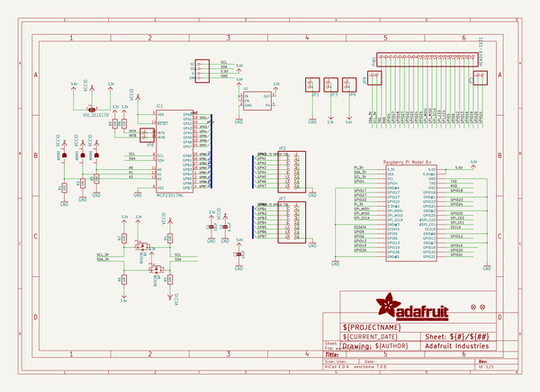
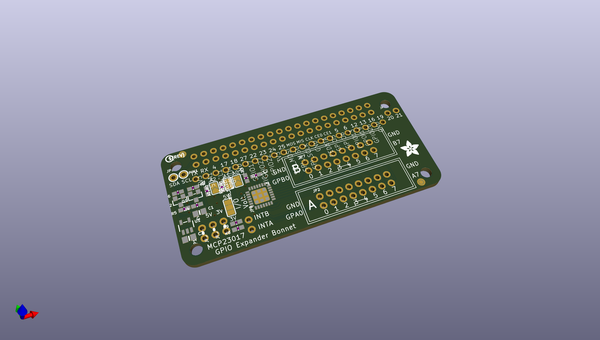
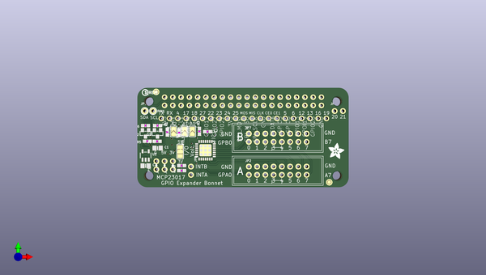
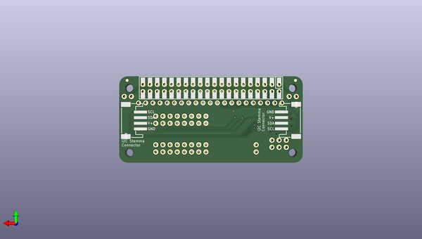

# adafruit_gpio_expander_bonnet_pcbs
 
## summary 
* id: adafruit_adafruit_gpio_expander_bonnet_pcbs_adafruit_gpio_expander_bonnet
* user: adafruit
* name: adafruit_gpio_expander_bonnet_pcbs
* board: adafruit_gpio_expander_bonnet
* repo: https://github.com/adafruit/Adafruit-GPIO-Expander-Bonnet-PCBs

* src_file_repo_sch: 
* src_file_repo_sch_link: https://github.com/adafruit/Adafruit-GPIO-Expander-Bonnet-PCBs/tree/master/
* full details link: https://github.com/oomlout/oomlout_oomp_project_bot_v_2/tree/main/projects/adafruit_adafruit_gpio_expander_bonnet_pcbs_adafruit_gpio_expander_bonnet/current_version/working  

## schematic  
  
[schematic (pdf)](working_schematic.pdf) 

## pcb  
 
  
  
  
[board (pdf)](working.pdf)  

## working_bom
| Id | Designator | Footprint | Quantity | Designation | Supplier and ref |  | None | 
| --- | --- | --- | --- | --- | --- | --- | --- | 
| 1 | IC1 | QFN28-ML_6X6MM | 1 | MCP23017ML |  |  | [''] | 
| 2 | U1 | SOT23-5 | 1 |  |  |  | [''] | 
| 3 | U$13 | PCBFEAT-REV-040 | 1 |  |  |  | [''] | 
| 4 | ADDR2,ADDR1,ADDR0 | SOLDERJUMPER_ARROW_NOPASTE | 3 |  |  |  | [''] | 
| 5 | R2,R3,R8,R9,R1,R4,R5,R6,R7 | 0603-NO | 9 | 10K |  |  | [''] | 
| 6 | Q2,Q1 | SOT23-WIDE | 2 | BSS138 |  |  | [''] | 
| 7 | FID1,FID2 | FIDUCIAL_1MM | 2 | FIDUCIAL_1MM |  |  | [''] | 
| 8 | JP8,JP3,JP5,JP6,JP9,JP1 | 1X02_ROUND | 6 |  |  |  | [''] | 
| 9 | RPI2 | PI_BONNET_2STEMMA_SMT | 1 | PIBONNET_STEMMA_2STEMMA_SMTTHM |  |  | [''] | 
| 10 | U$12 | ADAFRUIT_5MM | 1 |  |  |  | [''] | 
| 11 | JP2,JP7 | 2X08_SHROUDED | 2 |  |  |  | [''] | 
| 12 | C2 | 0603-NO | 1 | 0.1uF |  |  | [''] | 
| 13 | VIO_SELECT0 | SOLDERJUMPER_2WAY_OPEN_NOPASTE | 1 |  |  |  | [''] | 
| 14 | PIN1 | 1X21_ROUND_70MIL | 1 | HEADER-1X21 |  |  | [''] | 
| 15 | C3,C1 | 0805-NO | 2 | 10uF |  |  | [''] | 

## bom_schematic
| Ref | Qnty | Value | Cmp name | Footprint | Description | Vendor | DNP | 
| --- | --- | --- | --- | --- | --- | --- | --- | 
| ADDR0, ADDR1, ADDR2 | 3 | SOLDERJUMPER | SOLDERJUMPER | working:SOLDERJUMPER_ARROW_NOPASTE |  |  |  | 
| C1, C3 | 2 | 10uF | CAP_CERAMIC0805-NOOUTLINE | working:0805-NO |  |  |  | 
| C2 | 1 | 0.1uF | CAP_CERAMIC0603_NO | working:0603-NO |  |  |  | 
| FID1, FID2 | 2 | FIDUCIAL_1MM | FIDUCIAL_1MM | working:FIDUCIAL_1MM |  |  |  | 
| IC1 | 1 | MCP23017ML | MCP23017ML | working:QFN28-ML_6X6MM |  |  |  | 
| JP1, JP3, JP5, JP6, JP8, JP9 | 6 | HEADER-1X2ROUND | HEADER-1X2ROUND | working:1X02_ROUND |  |  |  | 
| JP2, JP7 | 2 | HEADER-2X8_SHROUDED | HEADER-2X8_SHROUDED | working:2X08_SHROUDED |  |  |  | 
| PIN1 | 1 | HEADER-1X21 | HEADER-1X21 | working:1X21_ROUND_70MIL |  |  |  | 
| Q1, Q2 | 2 | BSS138 | MOSFET-NWIDE | working:SOT23-WIDE |  |  |  | 
| R1, R2, R3, R4, R5, R6, R7, R8, R9 | 9 | 10K | RESISTOR_0603_NOOUT | working:0603-NO |  |  |  | 
| RPI2 | 1 | PIBONNET_STEMMA_2STEMMA_SMTTHM | PIBONNET_STEMMA_2STEMMA_SMTTHM | working:PI_BONNET_2STEMMA_SMT |  |  |  | 
| U1 | 1 | VREG_SOT23-5 | VREG_SOT23-5 | working:SOT23-5 |  |  |  | 
| VIO_SELECT0 | 1 | SOLDERJUMPER_2WAY | SOLDERJUMPER_2WAY | working:SOLDERJUMPER_2WAY_OPEN_NOPASTE |  |  |  | 

