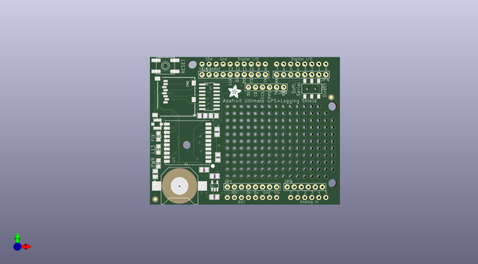
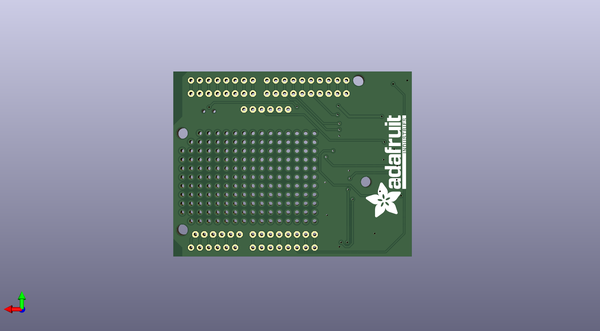

# adafruit_gps_logger_shield_pcb
 
## summary 
* id: adafruit_adafruit_gps_logger_shield_pcb_adafruit_gps_logger_shield
* user: adafruit
* name: adafruit_gps_logger_shield_pcb
* board: adafruit_gps_logger_shield
* repo: https://github.com/adafruit/Adafruit-GPS-Logger-Shield-PCB

* src_file_repo_sch: 
* src_file_repo_sch_link: https://github.com/adafruit/Adafruit-GPS-Logger-Shield-PCB/tree/master/
* full details link: https://github.com/oomlout/oomlout_oomp_project_bot_v_2/tree/main/projects/adafruit_adafruit_gps_logger_shield_pcb_adafruit_gps_logger_shield/current_version/working  

## schematic  
  
[schematic (pdf)](working_schematic.pdf) 

## pcb  
 
  
  
  
[board (pdf)](working.pdf)  

## working_bom
| Id | Designator | Footprint | Quantity | Designation | Supplier and ref |  | None | 
| --- | --- | --- | --- | --- | --- | --- | --- | 
| 1 | FB1 | 0805@1 | 1 | Ferrite |  |  | [''] | 
| 2 | @HOLE0,@HOLE2,@HOLE1 |  | 3 |  |  |  | [''] | 
| 3 | C2,C3 | 0805@1 | 2 | 10uF |  |  | [''] | 
| 4 | U1 | FGPMMOPA6H | 1 | FGPMMOPA6H |  |  | [''] | 
| 5 | FID2,FID1 | FIDUCIAL_1MM | 2 | FIDUCIAL" |  |  | [''] | 
| 6 | JP9,JP6 | 1X06-BIG | 2 |  |  |  | [''] | 
| 7 | U$9 | 1X10-BIG | 1 | PINHD-1X10 |  |  | [''] | 
| 8 | RESET0 | EVQ-Q2 | 1 | Reset |  |  | [''] | 
| 9 | R9,R10 | 0805 | 2 | 1k |  |  | [''] | 
| 10 | U$13 | ADAFRUIT_5MM | 1 |  |  |  | [''] | 
| 11 | R5 | 0805 | 1 | 10K |  |  | [''] | 
| 12 | C1 | 0805@1 | 1 | 0.1uF |  |  | [''] | 
| 13 | LED5 | CHIPLED_0805 | 1 | green |  |  | [''] | 
| 14 | U4 | SOIC16 | 1 | 4050 |  |  | [''] | 
| 15 | U2 | SOT23-5 | 1 | MIC5225-3.3 |  |  | [''] | 
| 16 | JP4,JP1 | 1X08-BIG | 2 | D0-D7 |  |  | [''] | 
| 17 | R1 | 0805 | 1 | 1K |  |  | [''] | 
| 18 | B1 | CR1220 | 1 | CR1220 |  |  | [''] | 
| 19 | SW1 | EG1390 | 1 |  |  |  | [''] | 
| 20 | U$20 | U.FL | 1 | U.FL |  |  | [''] | 
| 21 | CN2 | MICROSD | 1 |  |  |  | [''] | 
| 22 | LED4 | CHIPLED_0805 | 1 | yellow |  |  | [''] | 
| 23 | U3 | ARDUINOR3 | 1 | ARDUINOR3-DIMENSION |  |  | [''] | 
| 24 | LED1 | CHIPLED_0805 | 1 | red |  |  | [''] | 
| 25 | U$15 | ADAFRUIT_TEXT_30MM | 1 |  |  |  | [''] | 

## bom_schematic
| Ref | Qnty | Value | Cmp name | Footprint | Description | Vendor | DNP | 
| --- | --- | --- | --- | --- | --- | --- | --- | 
| B1 | 1 | CR1220 | BATTERYCR1220_SMT | working:CR1220 |  |  |  | 
| C1 | 1 | 0.1uF | CAP_CERAMIC0805 | working:0805@1 |  |  |  | 
| C2, C3 | 2 | 10uF | CAP_CERAMIC0805 | working:0805@1 |  |  |  | 
| CN2 | 1 | MICROSD | MICROSD | working:MICROSD |  |  |  | 
| FB1 | 1 | Ferrite | FERRITE0805 | working:0805@1 |  |  |  | 
| FID1, FID2 | 2 | FIDUCIAL"" | FIDUCIAL{dblquote}{dblquote} | working:FIDUCIAL_1MM |  |  |  | 
| JP1, JP4 | 2 | D0-D7 | PINHD-1X8BIG | working:1X08-BIG |  |  |  | 
| JP6, JP9 | 2 | PINHD-1X6B | PINHD-1X6B | working:1X06-BIG |  |  |  | 
| LED1 | 1 | red | LED0805 | working:CHIPLED_0805 |  |  |  | 
| LED4 | 1 | yellow | LED0805 | working:CHIPLED_0805 |  |  |  | 
| LED5 | 1 | green | LED0805 | working:CHIPLED_0805 |  |  |  | 
| R1 | 1 | 1K | RESISTOR0805 | working:0805 |  |  |  | 
| R5 | 1 | 10K | RESISTOR0805 | working:0805 |  |  |  | 
| R9, R10 | 2 | 1k | RESISTOR0805 | working:0805 |  |  |  | 
| RESET0 | 1 | SPST_TACT-EVQQ2 | SPST_TACT-EVQQ2 | working:EVQ-Q2 |  |  |  | 
| SW1 | 1 | DPDT-EG1390 | DPDT-EG1390 | working:EG1390 |  |  |  | 
| U1 | 1 | FGPMMOPA6H | GPS_FGPMMOPA6H | working:FGPMMOPA6H |  |  |  | 
| U2 | 1 | MIC5225-3.3 | VREG_SOT23-5 | working:SOT23-5 |  |  |  | 
| U3 | 1 | ARDUINOR3-DIMENSION | ARDUINOR3-DIMENSION | working:ARDUINOR3 |  |  |  | 
| U4 | 1 | 4050 | 74HC4050D | working:SOIC16 |  |  |  | 
| U$9 | 1 | PINHD-1X10 | PINHD-1X10 | working:1X10-BIG |  |  |  | 
| U$20 | 1 | U.FL | U.FL | working:U.FL |  |  |  | 

