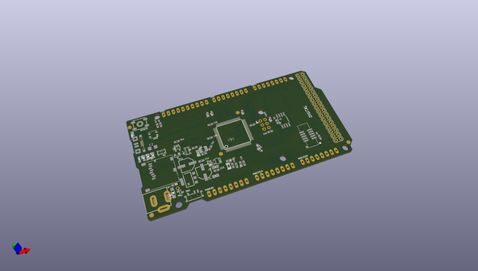
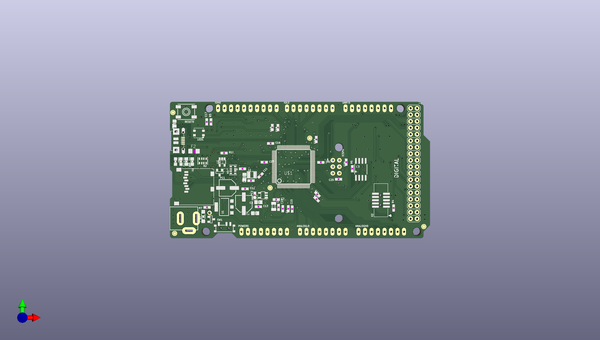
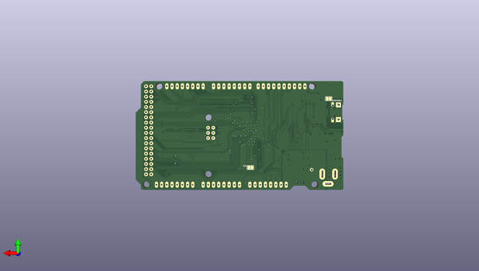

# adafruit_grand_central_pcb
 
## summary 
* id: adafruit_adafruit_grand_central_pcb_adafruit_grand_central_m4_express_rev_b
* user: adafruit
* name: adafruit_grand_central_pcb
* board: adafruit_grand_central_m4_express_rev_b
* repo: https://github.com/adafruit/Adafruit-Grand-Central-PCB

* src_file_repo_sch: 
* src_file_repo_sch_link: https://github.com/adafruit/Adafruit-Grand-Central-PCB/tree/master/
* full details link: https://github.com/oomlout/oomlout_oomp_project_bot_v_2/tree/main/projects/adafruit_adafruit_grand_central_pcb_adafruit_grand_central_m4_express_rev_b/current_version/working  

## schematic  
  
[schematic (pdf)](working_schematic.pdf) 

## pcb  
 
  
  
  
[board (pdf)](working.pdf)  

## bom_schematic
| Ref | Qnty | Value | Cmp name | Footprint | Description | Vendor | DNP | 
| --- | --- | --- | --- | --- | --- | --- | --- | 
| ANALOGH0 | 1 | 20610 | HEADER-1X8OVALWAVE | working:1X08_OVALWAVE |  |  |  | 
| ANALOGL0 | 1 | 20610 | HEADER-1X8OVALWAVE | working:1X08_OVALWAVE |  |  |  | 
| C1, C2, C3 | 3 | 10uF | CAP_CERAMIC0805-NOOUTLINE | working:0805-NO |  |  |  | 
| C4, C6, C8, C10, C11, C14, C15, C16, C18, C19, C20, C21, C22, C23, C24, C25 | 16 | .1u | CAP_CERAMIC0603_NO | working:0603-NO |  |  |  | 
| C5, C7 | 2 | 22pF | CAP_CERAMIC0603_NO | working:0603-NO |  |  |  | 
| C9 | 1 | 1uF | CAP_CERAMIC0603_NO | working:0603-NO |  |  |  | 
| C12, C13, C17 | 3 | 0.1uF | CAP_CERAMIC0603_NO | working:0603-NO |  |  |  | 
| D1 | 1 | MBR120 | DIODE-SCHOTTKYSOD-123 | working:SOD-123 |  |  |  | 
| F2 | 1 | 500mA | PTCFUSE-1206 | working:R1206 |  |  |  | 
| FB2 | 1 | FERRITE | FERRITE-0805NO | working:0805-NO |  |  |  | 
| FD1, FD2, FD3, FD4, FD5 | 5 | FIDUCIAL_1MM | FIDUCIAL_1MM | working:FIDUCIAL_1MM |  |  |  | 
| GROUND1 | 1 | SOLDERJUMPERCLOSED | SOLDERJUMPERCLOSED | working:SOLDERJUMPER_CLOSEDWIRE |  |  |  | 
| IC3 | 1 | 741G125DBV | 741G125DBV | working:SOT23-5 |  |  |  | 
| ICSP0 | 1 | 3x2 M | HEADER-2X3 | working:2X03_ROUND_70MIL |  |  |  | 
| IOH0 | 1 | 20611 | HEADER-1X10OVALWAVE | working:1X10_OVALWAVE |  |  |  | 
| IOL0 | 1 | 20610 | HEADER-1X8OVALWAVE | working:1X08_OVALWAVE |  |  |  | 
| JP1 | 1 | HEADER-1X1ROUND | HEADER-1X1ROUND | working:1X01_ROUND |  |  |  | 
| JP2 | 1 | PINHD-2X18_THICKWAV | PINHD-2X18_THICKWAV | working:2X18_THICKWAVE |  |  |  | 
| L0 | 1 | RED | LED0805_NOOUTLINE | working:CHIPLED_0805_NOOUTLINE |  |  |  | 
| L1 | 1 | 10uH | INDUCTOR | working:INDUCTOR_1007 |  |  |  | 
| LED1 | 1 | WS2812B3535 | WS2812B3535 | working:LED3535 |  |  |  | 
| ON0 | 1 | GREEN | LED0805_NOOUTLINE | working:CHIPLED_0805_NOOUTLINE |  |  |  | 
| PC1 | 1 | 47uF/25V | CAP_ELECTROLYTICPANASONIC_D | working:PANASONIC_D |  |  |  | 
| PC2 | 1 | 47uF+/6.3V+ | CAP_ELECTROLYTICPANASONIC_D | working:PANASONIC_D |  |  |  | 
| POWER0 | 1 | 20610 | HEADER-1X8OVALWAVE | working:1X08_OVALWAVE |  |  |  | 
| R1 | 1 | 100K | RESISTOR_4PACK | working:RESPACK_4X0603 |  |  |  | 
| R2 | 1 | 1K | RESISTOR_4PACK | working:RESPACK_4X0603 |  |  |  | 
| R3, R5, R7 | 3 | 10K | RESISTOR_0603_NOOUT | working:0603-NO |  |  |  | 
| R4 | 1 | 1K | RESISTOR_0603_NOOUT | working:0603-NO |  |  |  | 
| R11 | 1 | 330R | RESISTOR_0603_NOOUT | working:0603-NO |  |  |  | 
| RESET0 | 1 | EVQQ 6mm | SWITCH_TACT_SMT_EVQQ2_SMALL | working:EVQ-Q2_SMALLER |  |  |  | 
| RXLED0 | 1 | YELLOW | LED0805_NOOUTLINE | working:CHIPLED_0805_NOOUTLINE |  |  |  | 
| SJ1 | 1 | AREF_3V | SOLDERJUMPERCLOSED | working:SOLDERJUMPER_CLOSEDWIRE |  |  |  | 
| SW1 | 1 | SWITCH_SPDT | SWITCH_SPDT | working:SPDT_SMT_SSSS811101 |  |  |  | 
| T2 | 1 | DMP3098L-7 | PMOSSOT23 | working:SOT-23 |  |  |  | 
| TR1 | 1 | DMP3098L-7 | 0297_PMV48XP | working:SOT-23 |  |  |  | 
| TXLED0 | 1 | YELLOW | LED0805_NOOUTLINE | working:CHIPLED_0805_NOOUTLINE |  |  |  | 
| U1 | 1 | NCP1117ST50T3G | LM1117SOT223-REFLOW | working:SOT223-R |  |  |  | 
| U2 | 1 | LP2985-XXDBVR | LP2985-XXDBVR | working:SOT23-DBV |  |  |  | 
| U3 | 1 | GD25Q64 | SPIFLASH_SOIC8208MIL | working:SOIC8_208MIL |  |  |  | 
| U$1 | 1 | SAMD51PXXA | SAMD51PXXA | working:SQFP-S-14X14-128 |  |  |  | 
| UART0 | 1 | 20610 | HEADER-1X8OVALWAVE | working:1X08_OVALWAVE |  |  |  | 
| X1 | 1 | microsd | MICROSD | working:MICROSD |  |  |  | 
| X2 | 1 | 2x5 0.05" SWD | JTAG-CORTEXBOXPOSTS | working:2X05_1.27MM_BOX_POSTS |  |  |  | 
| X3 | 1 | USB_W_SHIELD_V2 | USB_W_SHIELD_V2 | working:4UCONN_20329_V2 |  |  |  | 
| X4 | 1 | 32.768 | XTAL-3.2X1.5 | working:XTAL3215 |  |  |  | 
| X5 | 1 | 2.1mm | DCBARRELPTH | working:DCJACK_2MM_PTH |  |  |  | 

