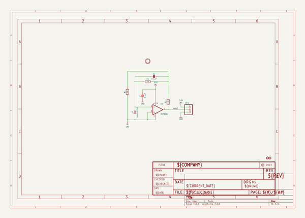
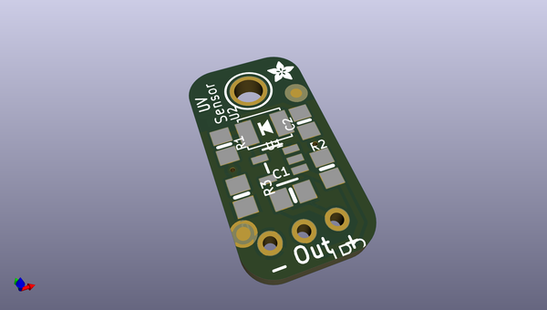
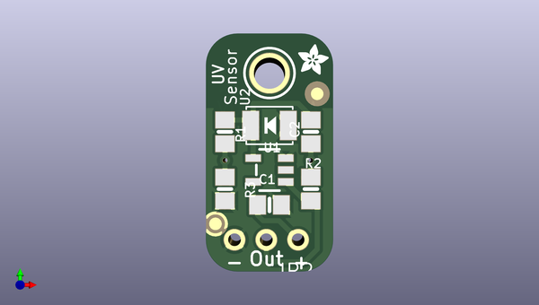
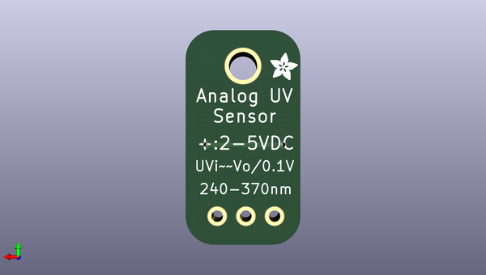

# adafruit_guva_analog_uv_sensor_breakout_pcb
 
## summary 
* id: adafruit_adafruit_guva_analog_uv_sensor_breakout_pcb_adafruit_guva_uv_sensor_breakout
* user: adafruit
* name: adafruit_guva_analog_uv_sensor_breakout_pcb
* board: adafruit_guva_uv_sensor_breakout
* repo: https://github.com/adafruit/Adafruit-GUVA-Analog-UV-Sensor-Breakout-PCB

* src_file_repo_sch: 
* src_file_repo_sch_link: https://github.com/adafruit/Adafruit-GUVA-Analog-UV-Sensor-Breakout-PCB/tree/master/
* full details link: https://github.com/oomlout/oomlout_oomp_project_bot_v_2/tree/main/projects/adafruit_adafruit_guva_analog_uv_sensor_breakout_pcb_adafruit_guva_uv_sensor_breakout/current_version/working  

## schematic  
  
[schematic (pdf)](working_schematic.pdf) 

## pcb  
 
  
  
  
[board (pdf)](working.pdf)  

## working_bom
| Id | Designator | Footprint | Quantity | Designation | Supplier and ref |  | None | 
| --- | --- | --- | --- | --- | --- | --- | --- | 
| 1 | U1 | SOT23-5 | 1 | MCP6001 |  |  | [''] | 
| 2 | R1 | 0805-NO | 1 | 1M |  |  | [''] | 
| 3 | JP2 | 1X03-CLEANBIG | 1 |  |  |  | [''] | 
| 4 | C2,C1 | 0805-NO | 2 | 0.1uF |  |  | [''] | 
| 5 | U2 | GUVA-S12SD | 1 | GUVA-S12SD |  |  | [''] | 
| 6 | U$7,U$8 | ADAFRUIT_2.5MM | 2 |  |  |  | [''] | 
| 7 | FID1,FID2 | FIDUCIAL_1MM | 2 | FIDUCIAL" |  |  | [''] | 
| 8 | U$6 | MOUNTINGHOLE_2.5_PLATED | 1 | MOUNTINGHOLE2.5 |  |  | [''] | 
| 9 | R2 | 0805-NO | 1 | 3.3K |  |  | [''] | 
| 10 | R3 | 0805-NO | 1 | 1K |  |  | [''] | 

## bom_schematic
| Ref | Qnty | Value | Cmp name | Footprint | Description | Vendor | DNP | 
| --- | --- | --- | --- | --- | --- | --- | --- | 
| C1, C2 | 2 | 0.1uF | CAP_CERAMIC0805-NOOUTLINE | working:0805-NO |  |  |  | 
| FID1, FID2 | 2 | FIDUCIAL"" | FIDUCIAL{dblquote}{dblquote} | working:FIDUCIAL_1MM |  |  |  | 
| JP2 | 1 | PINHD-1X3CB | PINHD-1X3CB | working:1X03-CLEANBIG |  |  |  | 
| R1 | 1 | 1M | RESISTOR0805_NOOUTLINE | working:0805-NO |  |  |  | 
| R2 | 1 | 3.3K | RESISTOR0805_NOOUTLINE | working:0805-NO |  |  |  | 
| R3 | 1 | 1K | RESISTOR0805_NOOUTLINE | working:0805-NO |  |  |  | 
| U1 | 1 | MCP6001 | OPAMP_SINGLESOT235 | working:SOT23-5 |  |  |  | 
| U2 | 1 | GUVA-S12SD | UV_GUVA-S12SD | working:GUVA-S12SD |  |  |  | 
| U$6 | 1 | MOUNTINGHOLE2.5 | MOUNTINGHOLE2.5 | working:MOUNTINGHOLE_2.5_PLATED |  |  |  | 

## mounting_holes
| x | y | package | value | ref | size | 
| --- | --- | --- | --- | --- | --- | 
| 0.0 | 0.0 | MOUNTINGHOLE_2.5_PLATED | MOUNTINGHOLE2.5 | U$6 | m3 | 

