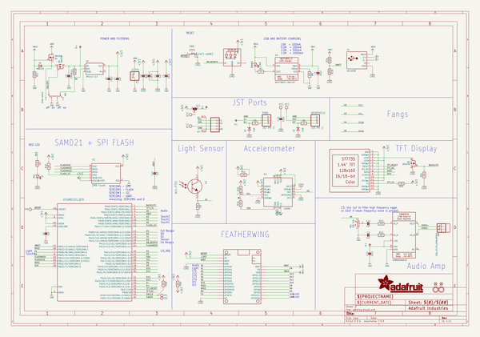
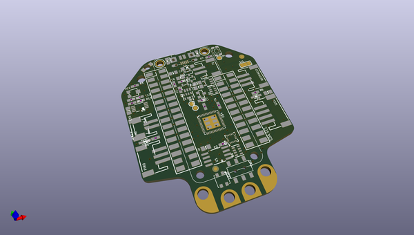
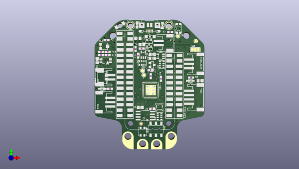
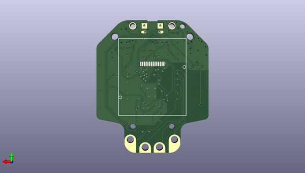

# adafruit_hallowing_m0_pcb
 
## summary 
* id: adafruit_adafruit_hallowing_m0_pcb_adafruit_hallowing_m0_express
* user: adafruit
* name: adafruit_hallowing_m0_pcb
* board: adafruit_hallowing_m0_express
* repo: https://github.com/adafruit/Adafruit-Hallowing-M0-PCB

* src_file_repo_sch: 
* src_file_repo_sch_link: https://github.com/adafruit/Adafruit-Hallowing-M0-PCB/tree/master/
* full details link: https://github.com/oomlout/oomlout_oomp_project_bot_v_2/tree/main/projects/adafruit_adafruit_hallowing_m0_pcb_adafruit_hallowing_m0_express/current_version/working  

## schematic  
  
[schematic (pdf)](working_schematic.pdf)  

## pcb  
 
  
  
  
[board (pdf)](working.pdf)  

## working_bom
| Id | Designator | Footprint | Quantity | Designation | Supplier and ref |  | None | 
| --- | --- | --- | --- | --- | --- | --- | --- | 
| 1 | D1,D2 | SOD-323 | 2 | 3.6V |  |  | [''] | 
| 2 | R3,R8 | 0603-NO | 2 | 10K |  |  | [''] | 
| 3 | U1 | SOIC8_208MIL | 1 | 2MB Flash |  |  | [''] | 
| 4 | @HOLE3,@HOLE1,@HOLE2,@HOLE0 |  | 4 |  |  |  | [''] | 
| 5 | C9,C13,C7,C1,C4,C2,C14 | 0603-NO | 7 | 1uF |  |  | [''] | 
| 6 | R6,R5,R2 | 0603-NO | 3 | 1K |  |  | [''] | 
| 7 | MS1 | FEATHERWING_SMT_NOHOLES | 1 | FEATHERWING_SMTDUALNOHOLES |  |  | [''] | 
| 8 | LED1 | LED3535 | 1 | WS2812B3535 |  |  | [''] | 
| 9 | TP28,TP4 | PCB_ALLI | 2 | SEWTAPPCB_ALLIGATOR |  |  | [''] | 
| 10 | U2 | SOT23-5 | 1 | AP2112-3.3 |  |  | [''] | 
| 11 | U3 | SOT23-5 | 1 | MCP73831T-2ACI/OT |  |  | [''] | 
| 12 | X6 | JSTPH2 | 1 | CON_JST_PH_2PIN_MTPH2 |  |  | [''] | 
| 13 | NEOPIXEL0,PIR0 | JSTPH3 | 2 | JST PH 3 |  |  | [''] | 
| 14 | U$12 | HALLOWING_FRONT | 1 |  |  |  | [''] | 
| 15 | R13,R12 | 0603-NO | 2 | 100 |  |  | [''] | 
| 16 | C10,C15,C5 | 0805-NO | 3 | 10uF |  |  | [''] | 
| 17 | R9,R4 | RESPACK_4X0603 | 2 | 10K |  |  | [''] | 
| 18 | I2C0 | JSTPH4 | 1 | JST PH 4 |  |  | [''] | 
| 19 | Q2,Q1 | SOT23-R | 2 | DMG341 |  |  | [''] | 
| 20 | U$35,U$34 | FIDUCIAL_1MM | 2 | FIDUCIAL_1MM |  |  | [''] | 
| 21 | U4 | ALS-PT26-21C | 1 | ALS-PT21 |  |  | [''] | 
| 22 | SJ1 | SOLDERJUMPER_2WAY_OPEN_NOPASTE | 1 |  |  |  | [''] | 
| 23 | C11 | 0805_10MGAP | 1 | 10uF |  |  | [''] | 
| 24 | TP3,TP29 | PCB_ALLI_LONG | 2 | SEWTAP_ALLILONG |  |  | [''] | 
| 25 | IC4 | LGA16_3X3MM | 1 | LIS3DH |  |  | [''] | 
| 26 | U$4 | TQFN48_7MM | 1 | ATSAMD21G18_QFN |  |  | [''] | 
| 27 | R1 | RESPACK_4X0603 | 1 | 100K |  |  | [''] | 
| 28 | SW2 | EG1390 | 1 | Slide Switch |  |  | [''] | 
| 29 | CHG0 | CHIPLED_0805_NOOUTLINE | 1 | ORANGE |  |  | [''] | 
| 30 | VR2 | TRIMPOT_BOURNS_3303W | 1 | 10K trim |  |  | [''] | 
| 31 | TP5,TP1,TP2 | TESTPOINT_ROUND_1.5MM | 3 |  |  |  | [''] | 
| 32 | X3 | 4UCONN_20329_V2 | 1 | microUSB |  |  | [''] | 
| 33 | U$31,U$32 | MOUNTINGHOLE_2.5_PLATED | 2 | MOUNTINGHOLE2.5 |  |  | [''] | 
| 34 | U5 | MSOP8_0.65MM | 1 | PAM8302AASCR |  |  | [''] | 
| 35 | R7 | 0603-NO | 1 | 2.2K |  |  | [''] | 
| 36 | U$13 | 53398-0271 | 1 | CON_MOLEX_2P |  |  | [''] | 
| 37 | C3,C6 | 0805-NO | 2 | 10µF |  |  | [''] | 
| 38 | Q3 | SOT23-WIDE | 1 | BSS138 |  |  | [''] | 
| 39 | C8 | 0805_10MGAP | 1 | 10µF |  |  | [''] | 
| 40 | D4 | SOD-123 | 1 | MBR120 |  |  | [''] | 
| 41 | L0 | CHIPLED_0805_NOOUTLINE | 1 | RED |  |  | [''] | 
| 42 | SW1 | KMR2 | 1 | SPST_TACT-KMR2 |  |  | [''] | 
| 43 | X1 | JSTPH2 | 1 | JSTPH |  |  | [''] | 
| 44 | TFT0 | TFT_1.44IN_128_128 | 1 | DISP_LCD_ST7735_1.44IN |  |  | [''] | 
| 45 | U$8 | HALLOWING_BACK | 1 |  |  |  | [''] | 

## bom_schematic
| Ref | Qnty | Value | Cmp name | Footprint | Description | Vendor | DNP | 
| --- | --- | --- | --- | --- | --- | --- | --- | 
| C1, C2, C4, C7, C9, C13, C14 | 7 | 1uF | CAP_CERAMIC0603_NO | working:0603-NO |  |  |  | 
| C3, C6 | 2 | 10µF | CAP_CERAMIC0805-NOOUTLINE | working:0805-NO |  |  |  | 
| C5, C10, C15 | 3 | 10uF | CAP_CERAMIC0805-NOOUTLINE | working:0805-NO |  |  |  | 
| C8 | 1 | 10µF | CAP_CERAMIC0805_10MGAP | working:0805_10MGAP |  |  |  | 
| C11 | 1 | 10uF | CAP_CERAMIC0805_10MGAP | working:0805_10MGAP |  |  |  | 
| CHG0 | 1 | ORANGE | LED0805_NOOUTLINE | working:CHIPLED_0805_NOOUTLINE |  |  |  | 
| D1, D2 | 2 | 3.6V | DIODE-ZENERSOD323 | working:SOD-323 |  |  |  | 
| D4 | 1 | MBR120 | DIODE-SCHOTTKYSOD-123 | working:SOD-123 |  |  |  | 
| I2C0 | 1 | STEMMA_I2C_RASMT | STEMMA_I2C_RASMT | working:JSTPH4 |  |  |  | 
| IC4 | 1 | LIS3DH | ACCEL_LIS3DHTR | working:LGA16_3X3MM |  |  |  | 
| L0 | 1 | RED | LED0805_NOOUTLINE | working:CHIPLED_0805_NOOUTLINE |  |  |  | 
| LED1 | 1 | WS2812B3535 | WS2812B3535 | working:LED3535 |  |  |  | 
| MS1 | 1 | FEATHERWING_SMTDUALNOHOLES | FEATHERWING_SMTDUALNOHOLES | working:FEATHERWING_SMT_NOHOLES |  |  |  | 
| NEOPIXEL0 | 1 | JST PH 3 | CON_JST_PH_3PIN | working:JSTPH3 |  |  |  | 
| PIR0 | 1 | JST PH 3 | CON_JST_PH_3PIN | working:JSTPH3 |  |  |  | 
| Q1, Q2 | 2 | DMG341 | MOSFET-P | working:SOT23-R |  |  |  | 
| Q3 | 1 | BSS138 | MOSFET-NWIDE | working:SOT23-WIDE |  |  |  | 
| R1 | 1 | 100K | RESISTOR_4PACK | working:RESPACK_4X0603 |  |  |  | 
| R2, R5, R6 | 3 | 1K | RESISTOR_0603_NOOUT | working:0603-NO |  |  |  | 
| R3, R8 | 2 | 10K | RESISTOR_0603_NOOUT | working:0603-NO |  |  |  | 
| R4, R9 | 2 | 10K | RESISTOR_4PACK | working:RESPACK_4X0603 |  |  |  | 
| R7 | 1 | 2.2K | RESISTOR_0603_NOOUT | working:0603-NO |  |  |  | 
| R12, R13 | 2 | 100 | RESISTOR_0603_NOOUT | working:0603-NO |  |  |  | 
| SJ1 | 1 | SOLDERJUMPER_2WAY | SOLDERJUMPER_2WAY | working:SOLDERJUMPER_2WAY_OPEN_NOPASTE |  |  |  | 
| SW1 | 1 | SPST_TACT-KMR2 | SPST_TACT-KMR2 | working:KMR2 |  |  |  | 
| SW2 | 1 | Slide Switch | SWITCH_DPDTEG1390 | working:EG1390 |  |  |  | 
| TFT0 | 1 | DISP_LCD_ST7735_1.44IN | DISP_LCD_ST7735_1.44IN | working:TFT_1.44IN_128_128 |  |  |  | 
| TP1, TP2, TP5 | 3 | TESTPOINTROUND1.5MM | TESTPOINTROUND1.5MM | working:TESTPOINT_ROUND_1.5MM |  |  |  | 
| TP3, TP29 | 2 | SEWTAP_ALLILONG | SEWTAP_ALLILONG | working:PCB_ALLI_LONG |  |  |  | 
| TP4, TP28 | 2 | SEWTAPPCB_ALLIGATOR | SEWTAPPCB_ALLIGATOR | working:PCB_ALLI |  |  |  | 
| U1 | 1 | 2MB Flash | SPIFLASH_8PIN208MIL | working:SOIC8_208MIL |  |  |  | 
| U2 | 1 | AP2112-3.3 | VREG_SOT23-5 | working:SOT23-5 |  |  |  | 
| U3 | 1 | MCP73831T-2ACI/OT | MCP73831/2 | working:SOT23-5 |  |  |  | 
| U4 | 1 | ALS-PT21 | PHOTOTRANSISTOR_PT26-21C | working:ALS-PT26-21C |  |  |  | 
| U5 | 1 | PAM8302AASCR | AUDIOAMP_PAM8302A | working:MSOP8_0.65MM |  |  |  | 
| U$4 | 1 | ATSAMD21G_QFN | ATSAMD21G_QFN | working:TQFN48_7MM |  |  |  | 
| U$13 | 1 | CON_MOLEX_2P | CON_MOLEX_2P | working:53398-0271 |  |  |  | 
| U$31, U$32 | 2 | MOUNTINGHOLE2.5 | MOUNTINGHOLE2.5 | working:MOUNTINGHOLE_2.5_PLATED |  |  |  | 
| U$34, U$35 | 2 | FIDUCIAL_1MM | FIDUCIAL_1MM | working:FIDUCIAL_1MM |  |  |  | 
| VR2 | 1 | 10K trim | TRIMPOT3303W/X | working:TRIMPOT_BOURNS_3303W |  |  |  | 
| X1 | 1 | JSTPH | CON_JST_PH_2PIN | working:JSTPH2 |  |  |  | 
| X3 | 1 | microUSB | USB_MICRO_20329_V2 | working:4UCONN_20329_V2 |  |  |  | 
| X6 | 1 | CON_JST_PH_2PIN_MTPH2 | CON_JST_PH_2PIN_MTPH2 | working:JSTPH2 |  |  |  | 

## mounting_holes
| x | y | package | value | ref | size | 
| --- | --- | --- | --- | --- | --- | 
| 17.78 | 0.0 | MOUNTINGHOLE_2.5_PLATED | MOUNTINGHOLE2.5 | U$31 | m3 | 
| 0.0 | 0.0 | MOUNTINGHOLE_2.5_PLATED | MOUNTINGHOLE2.5 | U$32 | m3 | 

