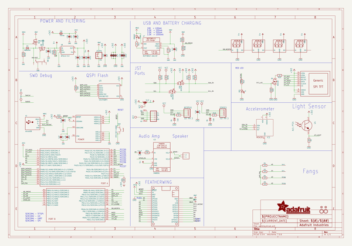
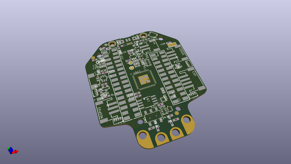
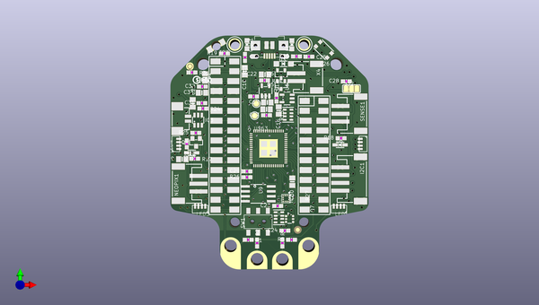
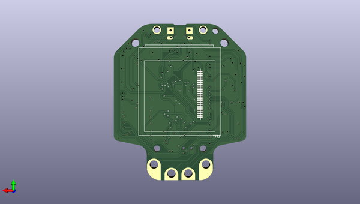

# adafruit_hallowing_m4_pcb
 
## summary 
* id: adafruit_adafruit_hallowing_m4_pcb_adafruit_hallowing_m4
* user: adafruit
* name: adafruit_hallowing_m4_pcb
* board: adafruit_hallowing_m4
* repo: https://github.com/adafruit/Adafruit-Hallowing-M4-PCB

* src_file_repo_sch: 
* src_file_repo_sch_link: https://github.com/adafruit/Adafruit-Hallowing-M4-PCB/tree/master/
* full details link: https://github.com/oomlout/oomlout_oomp_project_bot_v_2/tree/main/projects/adafruit_adafruit_hallowing_m4_pcb_adafruit_hallowing_m4/current_version/working  

## schematic  
  
[schematic (pdf)](working_schematic.pdf)  

## pcb  
 
  
  
  
[board (pdf)](working.pdf)  

## working_bom
| Id | Designator | Footprint | Quantity | Designation | Supplier and ref |  | None | 
| --- | --- | --- | --- | --- | --- | --- | --- | 
| 1 | @HOLE0,@HOLE2,@HOLE3,@HOLE1 |  | 4 |  |  |  | [''] | 
| 2 | C28,C23,C32,C29,C12,C27,C24 | 0603-NO | 7 | 1uF |  |  | [''] | 
| 3 | C18,C30,C21,C26,C19 | 0805-NO | 5 | 10uF |  |  | [''] | 
| 4 | TP3,TP29 | PCB_ALLI_LONG | 2 | SEWTAP_ALLILONG |  |  | [''] | 
| 5 | TP6,TP7 | TESTPOINT_ROUND_1.5MM | 2 |  |  |  | [''] | 
| 6 | U$32,U$31 | MOUNTINGHOLE_2.5_PLATED | 2 | MOUNTINGHOLE2.5 |  |  | [''] | 
| 7 | U$59 | 53398-0271 | 1 | CON_MOLEX_2P |  |  | [''] | 
| 8 | R5,R2,R1,R4 | 0603-NO | 4 | 1M |  |  | [''] | 
| 9 | U$1 | HALLOWINGM4_BACK | 1 |  |  |  | [''] | 
| 10 | C31,C25 | 0603-NO | 2 | 0.1uF |  |  | [''] | 
| 11 | R25,R26 | 0603-NO | 2 | 100K |  |  | [''] | 
| 12 | CHG1 | CHIPLED_0805_NOOUTLINE | 1 | ORANGE |  |  | [''] | 
| 13 | L1 | CHIPLED_0805_NOOUTLINE | 1 | RED |  |  | [''] | 
| 14 | SW3 | BTN_KMR2_4.6X2.8 | 1 | SPST_TACT-EVQQ2 |  |  | [''] | 
| 15 | R11,R17,R18 | 0603-NO | 3 | 1K |  |  | [''] | 
| 16 | R24 | 0603-NO | 1 | 47K |  |  | [''] | 
| 17 | C33,C22,C16,C17 | 0805-NO | 4 | 10µF |  |  | [''] | 
| 18 | R23 | 0603-NO | 1 | 10 |  |  | [''] | 
| 19 | Q6,Q5 | SOT23-R | 2 | DMG3405 |  |  | [''] | 
| 20 | LED3,LED2,LED4,LED1 | WS2812B_4020 | 4 | WS2812B_4020 |  |  | [''] | 
| 21 | R19,R3,R20 | 0603-NO | 3 | 10K |  |  | [''] | 
| 22 | U7 | SOT23-5 | 1 | MCP73831T-2ACI/OT |  |  | [''] | 
| 23 | U9 | SOIC8_208MIL | 1 | GD25Q64 |  |  | [''] | 
| 24 | U$34,U$35 | FIDUCIAL_1MM | 2 | FIDUCIAL_1MM |  |  | [''] | 
| 25 | MS2 | FEATHERWING_SMT_NOHOLES | 1 | FEATHERWING_SMTDUALNOHOLES |  |  | [''] | 
| 26 | TP28,TP4 | PCB_ALLI | 2 | SEWTAPPCB_ALLIGATOR |  |  | [''] | 
| 27 | U4 | ALS-PT26-21C | 1 | ALS-PT21 |  |  | [''] | 
| 28 | IC3 | SOT23-6 | 1 | PAM8301 |  |  | [''] | 
| 29 | R27 | RESPACK_4X0603 | 1 | 10K |  |  | [''] | 
| 30 | Q7 | SOT363 | 1 | BSS138 |  |  | [''] | 
| 31 | Q4 | SOT23-WIDE | 1 | BSS138 |  |  | [''] | 
| 32 | I2C1 | JSTPH4 | 1 | JST PH 4 |  |  | [''] | 
| 33 | SJ2 | SOLDERJUMPER_2WAY_OPEN_NOPASTE | 1 |  |  |  | [''] | 
| 34 | U6 | SOT23-5 | 1 | AP2112-3.3 |  |  | [''] | 
| 35 | D6,D5 | SOD-323 | 2 | 3.6V |  |  | [''] | 
| 36 | FB1 | 0805-NO | 1 | Ferrite |  |  | [''] | 
| 37 | R14 | 0603-NO | 1 | 4.7K |  |  | [''] | 
| 38 | IC2 | LGA12_2X2MM | 1 | MSA301 |  |  | [''] | 
| 39 | R10 | 0603-NO | 1 | 2.2K |  |  | [''] | 
| 40 | NEOPIX1,SENSE1 | JSTPH3 | 2 | JST PH 3 |  |  | [''] | 
| 41 | D3 | SOD-123 | 1 | MBR0540 |  |  | [''] | 
| 42 | U$63 | PQFN64-1 | 1 | ATSAMD51J19 |  |  | [''] | 
| 43 | SW1 | EG1390 | 1 |  |  |  | [''] | 
| 44 | R15 | RESPACK_4X0603 | 1 | 100K |  |  | [''] | 
| 45 | X2 | 4UCONN_20329_V2 | 1 | microUSB |  |  | [''] | 
| 46 | X4 | JSTPH2 | 1 | JSTPH |  |  | [''] | 
| 47 | U$79 | PCBFEAT-REV-040 | 1 |  |  |  | [''] | 
| 48 | TFT1 | TFT_1.54IN_240X240_HANDSOLDER | 1 | DISP_LCD_GENERIC_SPITFT_VDDIO_1.54_240X240_HANDSOLDER |  |  | [''] | 
| 49 | U$2 | HALLOWINGM4_FRONT | 1 |  |  |  | [''] | 

## bom_schematic
| Ref | Qnty | Value | Cmp name | Footprint | Description | Vendor | DNP | 
| --- | --- | --- | --- | --- | --- | --- | --- | 
| C12, C23, C24, C27, C28, C29, C32 | 7 | 1uF | CAP_CERAMIC0603_NO | working:0603-NO |  |  |  | 
| C16, C17, C22, C33 | 4 | 10µF | CAP_CERAMIC0805-NOOUTLINE | working:0805-NO |  |  |  | 
| C18, C19, C21, C26, C30 | 5 | 10uF | CAP_CERAMIC0805-NOOUTLINE | working:0805-NO |  |  |  | 
| C25, C31 | 2 | 0.1uF | CAP_CERAMIC0603_NO | working:0603-NO |  |  |  | 
| CHG1 | 1 | ORANGE | LED0805_NOOUTLINE | working:CHIPLED_0805_NOOUTLINE |  |  |  | 
| D3 | 1 | MBR0540 | DIODE-SCHOTTKYSOD-123 | working:SOD-123 |  |  |  | 
| D5, D6 | 2 | 3.6V | DIODE-ZENERSOD323 | working:SOD-323 |  |  |  | 
| FB1 | 1 | Ferrite | FERRITE-0805NO | working:0805-NO |  |  |  | 
| I2C1 | 1 | STEMMA_I2C_RASMT | STEMMA_I2C_RASMT | working:JSTPH4 |  |  |  | 
| IC2 | 1 | MSA301 | MSA301 | working:LGA12_2X2MM |  |  |  | 
| IC3 | 1 | PAM8301 | PAM8301 | working:SOT23-6 |  |  |  | 
| L1 | 1 | RED | LED0805_NOOUTLINE | working:CHIPLED_0805_NOOUTLINE |  |  |  | 
| LED1, LED2, LED3, LED4 | 4 | WS2812B_4020 | WS2812B_4020 | working:WS2812B_4020 |  |  |  | 
| MS2 | 1 | FEATHERWING_SMTDUALNOHOLES | FEATHERWING_SMTDUALNOHOLES | working:FEATHERWING_SMT_NOHOLES |  |  |  | 
| NEOPIX1 | 1 | JST PH 3 | CON_JST_PH_3PIN | working:JSTPH3 |  |  |  | 
| Q4 | 1 | BSS138 | MOSFET-NWIDE | working:SOT23-WIDE |  |  |  | 
| Q5, Q6 | 2 | DMG3405 | MOSFET-P | working:SOT23-R |  |  |  | 
| Q7 | 1 | BSS138 | MOSFET-N_DUAL | working:SOT363 |  |  |  | 
| R1, R2, R4, R5 | 4 | 1M | RESISTOR_0603_NOOUT | working:0603-NO |  |  |  | 
| R3, R19, R20 | 3 | 10K | RESISTOR_0603_NOOUT | working:0603-NO |  |  |  | 
| R10 | 1 | 2.2K | RESISTOR_0603_NOOUT | working:0603-NO |  |  |  | 
| R11, R17, R18 | 3 | 1K | RESISTOR_0603_NOOUT | working:0603-NO |  |  |  | 
| R14 | 1 | 4.7K | RESISTOR_0603_NOOUT | working:0603-NO |  |  |  | 
| R15 | 1 | 100K | RESISTOR_4PACK | working:RESPACK_4X0603 |  |  |  | 
| R23 | 1 | 10 | RESISTOR_0603_NOOUT | working:0603-NO |  |  |  | 
| R24 | 1 | 47K | RESISTOR_0603_NOOUT | working:0603-NO |  |  |  | 
| R25, R26 | 2 | 100K | RESISTOR_0603_NOOUT | working:0603-NO |  |  |  | 
| R27 | 1 | 10K | RESISTOR_4PACK | working:RESPACK_4X0603 |  |  |  | 
| SENSE1 | 1 | JST PH 3 | CON_JST_PH_3PIN | working:JSTPH3 |  |  |  | 
| SJ2 | 1 | SOLDERJUMPER_2WAY | SOLDERJUMPER_2WAY | working:SOLDERJUMPER_2WAY_OPEN_NOPASTE |  |  |  | 
| SW1 | 1 | SWITCH_DPDTEG1390 | SWITCH_DPDTEG1390 | working:EG1390 |  |  |  | 
| SW3 | 1 | SPST_TACT-EVQQ2 | SWITCH_TACT_SMT4.6X2.8 | working:BTN_KMR2_4.6X2.8 |  |  |  | 
| TFT1 | 1 | DISP_LCD_GENERIC_SPITFT_VDDIO_1.54_240X240_HANDSOLDER | DISP_LCD_GENERIC_SPITFT_VDDIO_1.54_240X240_HANDSOLDER | working:TFT_1.54IN_240X240_HANDSOLDER |  |  |  | 
| TP3, TP29 | 2 | SEWTAP_ALLILONG | SEWTAP_ALLILONG | working:PCB_ALLI_LONG |  |  |  | 
| TP4, TP28 | 2 | SEWTAPPCB_ALLIGATOR | SEWTAPPCB_ALLIGATOR | working:PCB_ALLI |  |  |  | 
| TP6, TP7 | 2 | TESTPOINTROUND1.5MM | TESTPOINTROUND1.5MM | working:TESTPOINT_ROUND_1.5MM |  |  |  | 
| U4 | 1 | ALS-PT21 | PHOTOTRANSISTOR_PT26-21C | working:ALS-PT26-21C |  |  |  | 
| U6 | 1 | AP2112-3.3 | VREG_SOT23-5 | working:SOT23-5 |  |  |  | 
| U7 | 1 | MCP73831T-2ACI/OT | MCP73831/2 | working:SOT23-5 |  |  |  | 
| U9 | 1 | GD25Q64 | SPIFLASH_8PIN208MIL | working:SOIC8_208MIL |  |  |  | 
| U$31, U$32 | 2 | MOUNTINGHOLE2.5 | MOUNTINGHOLE2.5 | working:MOUNTINGHOLE_2.5_PLATED |  |  |  | 
| U$34, U$35 | 2 | FIDUCIAL_1MM | FIDUCIAL_1MM | working:FIDUCIAL_1MM |  |  |  | 
| U$59 | 1 | CON_MOLEX_2P | CON_MOLEX_2P | working:53398-0271 |  |  |  | 
| U$63 | 1 | ATSAMD51J | ATSAMD51J | working:PQFN64-1 |  |  |  | 
| X2 | 1 | microUSB | USB_MICRO_20329_V2 | working:4UCONN_20329_V2 |  |  |  | 
| X4 | 1 | JSTPH | CON_JST_PH_2PIN | working:JSTPH2 |  |  |  | 

## mounting_holes
| x | y | package | value | ref | size | 
| --- | --- | --- | --- | --- | --- | 
| 17.78 | 0.0 | MOUNTINGHOLE_2.5_PLATED | MOUNTINGHOLE2.5 | U$31 | m3 | 
| 0.0 | 0.0 | MOUNTINGHOLE_2.5_PLATED | MOUNTINGHOLE2.5 | U$32 | m3 | 

