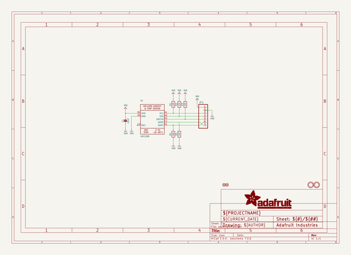
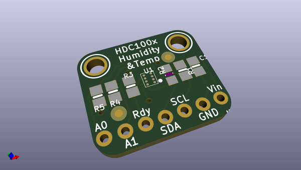
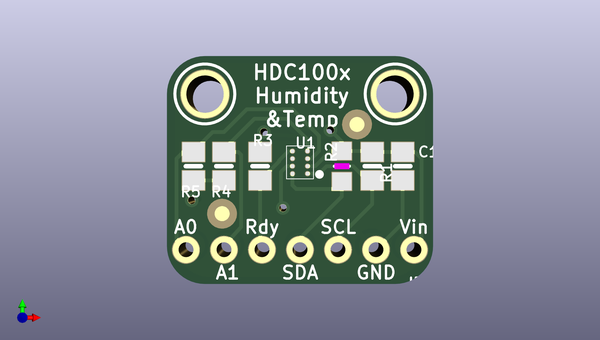
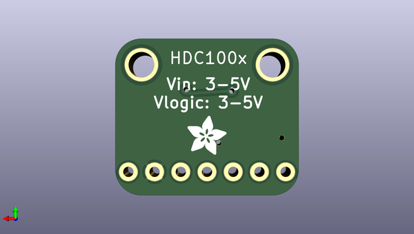

# adafruit_hdc1008_breakout_pcb
 
## summary 
* id: adafruit_adafruit_hdc1008_breakout_pcb_adafruit_hdc1008
* user: adafruit
* name: adafruit_hdc1008_breakout_pcb
* board: adafruit_hdc1008
* repo: https://github.com/adafruit/Adafruit-HDC1008-Breakout-PCB

* src_file_repo_sch: 
* src_file_repo_sch_link: https://github.com/adafruit/Adafruit-HDC1008-Breakout-PCB/tree/master/
* full details link: https://github.com/oomlout/oomlout_oomp_project_bot_v_2/tree/main/projects/adafruit_adafruit_hdc1008_breakout_pcb_adafruit_hdc1008/current_version/working  

## schematic  
  
[schematic (pdf)](working_schematic.pdf) 

## pcb  
 
  
  
  
[board (pdf)](working.pdf)  

## working_bom
| Id | Designator | Footprint | Quantity | Designation | Supplier and ref |  | None | 
| --- | --- | --- | --- | --- | --- | --- | --- | 
| 1 | FID2,FID1 | FIDUCIAL_1MM | 2 | FIDUCIAL" |  |  | [''] | 
| 2 | U1 | DSBGA8_HDC1008 | 1 | HDC1008 |  |  | [''] | 
| 3 | U$2,U$3 | MOUNTINGHOLE_2.5_PLATED | 2 | MOUNTINGHOLE2.5 |  |  | [''] | 
| 4 | JP1 | 1X07_ROUND_70 | 1 |  |  |  | [''] | 
| 5 | R4,R3,R5,R1 | 0805-NO | 4 | 10K |  |  | [''] | 
| 6 | C1 | 0805-NO | 1 | 10uF |  |  | [''] | 
| 7 | R2 | _0805MP | 1 | 10K |  |  | [''] | 
| 8 | U$14 | ADAFRUIT_3.5MM | 1 |  |  |  | [''] | 

## bom_schematic
| Ref | Qnty | Value | Cmp name | Footprint | Description | Vendor | DNP | 
| --- | --- | --- | --- | --- | --- | --- | --- | 
| C1 | 1 | 10uF | CAP_CERAMIC0805-NOOUTLINE | working:0805-NO |  |  |  | 
| FID1, FID2 | 2 | FIDUCIAL"" | FIDUCIAL{dblquote}{dblquote} | working:FIDUCIAL_1MM |  |  |  | 
| JP1 | 1 | HEADER-1X770MIL | HEADER-1X770MIL | working:1X07_ROUND_70 |  |  |  | 
| R1, R3, R4, R5 | 4 | 10K | RESISTOR0805_NOOUTLINE | working:0805-NO |  |  |  | 
| R2 | 1 | 10K | RESISTOR_0805MP | working:_0805MP |  |  |  | 
| U1 | 1 | HDC1008 | HDC1008 | working:DSBGA8_HDC1008 |  |  |  | 
| U$2, U$3 | 2 | MOUNTINGHOLE2.5 | MOUNTINGHOLE2.5 | working:MOUNTINGHOLE_2.5_PLATED |  |  |  | 

## mounting_holes
| x | y | package | value | ref | size | 
| --- | --- | --- | --- | --- | --- | 
| 0.0 | 0.0 | MOUNTINGHOLE_2.5_PLATED | MOUNTINGHOLE2.5 | U$2 | m3 | 
| 12.7 | 0.0 | MOUNTINGHOLE_2.5_PLATED | MOUNTINGHOLE2.5 | U$3 | m3 | 

