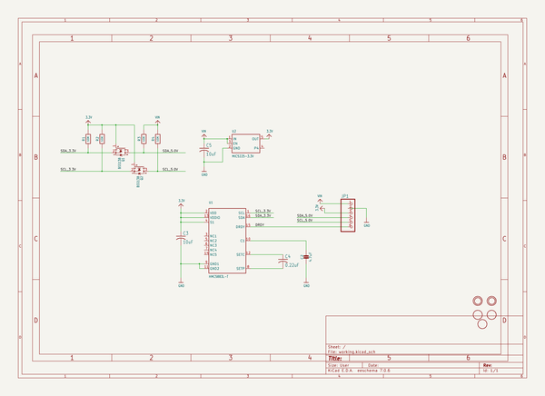
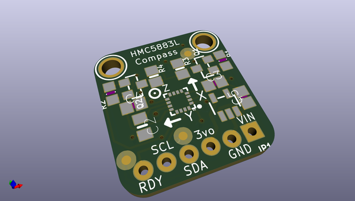
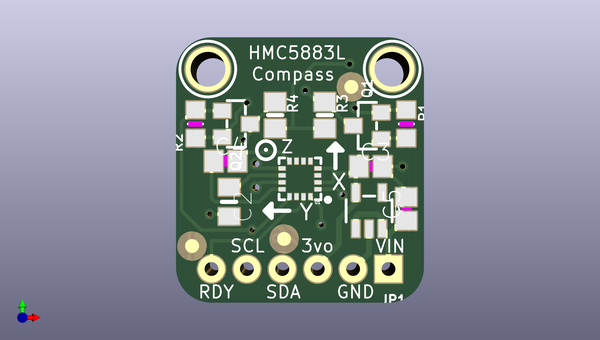
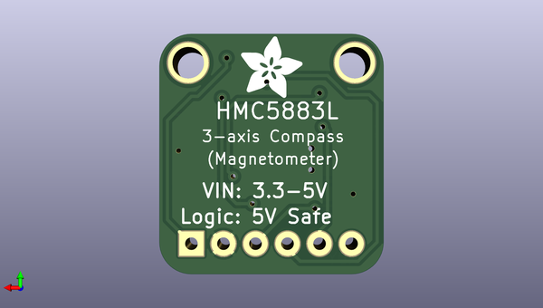

# adafruit_hmc5883_mag_compass_sensor_pcb
 
## summary 
* id: adafruit_adafruit_hmc5883_mag_compass_sensor_pcb_adafruit_hmc5883l_compass
* user: adafruit
* name: adafruit_hmc5883_mag_compass_sensor_pcb
* board: adafruit_hmc5883l_compass
* repo: https://github.com/adafruit/Adafruit-HMC5883-Mag-Compass-Sensor-PCB

* src_file_repo_sch: 
* src_file_repo_sch_link: https://github.com/adafruit/Adafruit-HMC5883-Mag-Compass-Sensor-PCB/tree/master/
* full details link: https://github.com/oomlout/oomlout_oomp_project_bot_v_2/tree/main/projects/adafruit_adafruit_hmc5883_mag_compass_sensor_pcb_adafruit_hmc5883l_compass/current_version/working  

## schematic  
  
[schematic (pdf)](working_schematic.pdf) 

## pcb  
 
  
  
  
[board (pdf)](working.pdf)  

## working_bom
| Id | Designator | Footprint | Quantity | Designation | Supplier and ref |  | None | 
| --- | --- | --- | --- | --- | --- | --- | --- | 
| 1 | Q2,Q1 | SOT23-WIDE | 2 | BSS138 |  |  | [''] | 
| 2 | R4,R3 | 0805-NO | 2 | 10K |  |  | [''] | 
| 3 | C3,C5 | C0805 | 2 | 10uF |  |  | [''] | 
| 4 | U2 | SOT23-5 | 1 | MIC5225-3.3V |  |  | [''] | 
| 5 | U$12,U$10,U$11 | FIDUCIAL_1MM | 3 | FIDUCIAL |  |  | [''] | 
| 6 | U$9,U$8 | MOUNTINGHOLE_2.5_PLATED | 2 | MOUNTINGHOLE2.5 |  |  | [''] | 
| 7 | U1 | HMC5883L | 1 | HMC5883L-T |  |  | [''] | 
| 8 | R2,R1 | _0805MP | 2 | 10K |  |  | [''] | 
| 9 | C2 | 0805_10MGAP | 1 | 4.7uF |  |  | [''] | 
| 10 | C4 | C0805 | 1 | 0.22uF |  |  | [''] | 
| 11 | JP1 | 1X06_ROUND_76 | 1 |  |  |  | [''] | 
| 12 | U$7 | ADAFRUIT_5MM | 1 |  |  |  | [''] | 

## bom_schematic
| Ref | Qnty | Value | Cmp name | Footprint | Description | Vendor | DNP | 
| --- | --- | --- | --- | --- | --- | --- | --- | 
| C2 | 1 | 4.7uF | CAP_CERAMIC0805_10MGAP | working:0805_10MGAP |  |  |  | 
| C3, C5 | 2 | 10uF | C-USC0805 | working:C0805 |  |  |  | 
| C4 | 1 | 0.22uF | C-USC0805 | working:C0805 |  |  |  | 
| JP1 | 1 | HEADER-1X676MIL | HEADER-1X676MIL | working:1X06_ROUND_76 |  |  |  | 
| Q1, Q2 | 2 | BSS138 | MOSFET-NWIDE | working:SOT23-WIDE |  |  |  | 
| R1, R2 | 2 | 10K | RESISTOR_0805MP | working:_0805MP |  |  |  | 
| R3, R4 | 2 | 10K | RESISTOR0805_NOOUTLINE | working:0805-NO |  |  |  | 
| U1 | 1 | HMC5883L-T | HMC5883L | working:HMC5883L |  |  |  | 
| U2 | 1 | MIC5225-3.3V | VREG_SOT23-5 | working:SOT23-5 |  |  |  | 
| U$8, U$9 | 2 | MOUNTINGHOLE2.5 | MOUNTINGHOLE2.5 | working:MOUNTINGHOLE_2.5_PLATED |  |  |  | 
| U$10, U$11, U$12 | 3 | FIDUCIAL | FIDUCIAL | working:FIDUCIAL_1MM |  |  |  | 

## mounting_holes
| x | y | package | value | ref | size | 
| --- | --- | --- | --- | --- | --- | 
| 0.0 | 0.0 | MOUNTINGHOLE_2.5_PLATED | MOUNTINGHOLE2.5 | U$8 | m3 | 
| 13.21 | 0.0 | MOUNTINGHOLE_2.5_PLATED | MOUNTINGHOLE2.5 | U$9 | m3 | 

