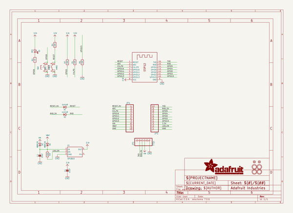
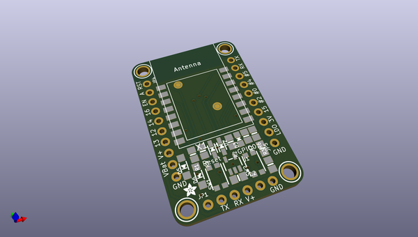

# adafruit_huzzah_esp8266_basic_breakout_pcb
 
## summary 
* id: adafruit_adafruit_huzzah_esp8266_basic_breakout_pcb_adafruit_huzzah_esp8266_basic_breakout
* user: adafruit
* name: adafruit_huzzah_esp8266_basic_breakout_pcb
* board: adafruit_huzzah_esp8266_basic_breakout
* repo: https://github.com/adafruit/Adafruit-Huzzah-ESP8266-Basic-Breakout-PCB

* src_file_repo_sch: 
* src_file_repo_sch_link: https://github.com/adafruit/Adafruit-Huzzah-ESP8266-Basic-Breakout-PCB/tree/master/
* full details link: https://github.com/oomlout/oomlout_oomp_project_bot_v_2/tree/main/projects/adafruit_adafruit_huzzah_esp8266_basic_breakout_pcb_adafruit_huzzah_esp8266_basic_breakout/current_version/working  

## schematic  
  
[schematic (pdf)](working_schematic.pdf) 

## pcb  
 
  
  
  
[board (pdf)](working.pdf)  

## working_bom
| Id | Designator | Footprint | Quantity | Designation | Supplier and ref |  | None | 
| --- | --- | --- | --- | --- | --- | --- | --- | 
| 1 | JP4,JP5 | 1X10_ROUND70 | 2 |  |  |  | [''] | 
| 2 | C2,C1 | 0805-NO | 2 | 10uF |  |  | [''] | 
| 3 | X1 | ESP-12 | 1 | ESP-12 |  |  | [''] | 
| 4 | FID3,FID1 | FIDUCIAL_1MM | 2 | FIDUCIAL" |  |  | [''] | 
| 5 | D3 | CHIPLED_0805_NOOUTLINE | 1 | RED |  |  | [''] | 
| 6 | D6,D5 | SOD-123 | 2 | MBR120 |  |  | [''] | 
| 7 | R6,R1,R3,R7,R4 | 0805-NO | 5 | 10K |  |  | [''] | 
| 8 | U$16,U$15,U$17,U$18 | MOUNTINGHOLE_2.5_PLATED | 4 | MOUNTINGHOLE2.5 |  |  | [''] | 
| 9 | U1 | SOT23-5 | 1 | SPX3819 |  |  | [''] | 
| 10 | SW1,SW2 | BTN_KMR2_4.6X2.8 | 2 | KMR2 |  |  | [''] | 
| 11 | D2,D1 | SOD-323 | 2 | 1n4148 |  |  | [''] | 
| 12 | U$3 | ADAFRUIT_2.5MM | 1 |  |  |  | [''] | 
| 13 | R2 | 0805-NO | 1 | 1K |  |  | [''] | 
| 14 | JP1 | 1X06_ROUND_70 | 1 | FTDI |  |  | [''] | 
| 15 | U$12 | ADAFRUIT_TEXT_20MM | 1 |  |  |  | [''] | 
| 16 | U$2 | HUZZAHLOGO | 1 |  |  |  | [''] | 
| 17 | U$13 | PCBFEAT-REV-040 | 1 |  |  |  | [''] | 

## bom_schematic
| Ref | Qnty | Value | Cmp name | Footprint | Description | Vendor | DNP | 
| --- | --- | --- | --- | --- | --- | --- | --- | 
| C1, C2 | 2 | 10uF | CAP_CERAMIC0805-NOOUTLINE | working:0805-NO |  |  |  | 
| D1, D2 | 2 | 1n4148 | DIODESOD-323 | working:SOD-323 |  |  |  | 
| D3 | 1 | RED | LED0805_NOOUTLINE | working:CHIPLED_0805_NOOUTLINE |  |  |  | 
| D5, D6 | 2 | MBR120 | DIODE-SCHOTTKYSOD-123 | working:SOD-123 |  |  |  | 
| FID1, FID3 | 2 | FIDUCIAL"" | FIDUCIAL{dblquote}{dblquote} | working:FIDUCIAL_1MM |  |  |  | 
| JP1 | 1 | FTDI | HEADER-1X670MIL | working:1X06_ROUND_70 |  |  |  | 
| JP4, JP5 | 2 | HEADER-1X1070MIL | HEADER-1X1070MIL | working:1X10_ROUND70 |  |  |  | 
| R1, R3, R4, R6, R7 | 5 | 10K | RESISTOR0805_NOOUTLINE | working:0805-NO |  |  |  | 
| R2 | 1 | 1K | RESISTOR0805_NOOUTLINE | working:0805-NO |  |  |  | 
| SW1, SW2 | 2 | KMR2 | SWITCH_TACT_SMT4.6X2.8 | working:BTN_KMR2_4.6X2.8 |  |  |  | 
| U1 | 1 | SPX3819 | VREG_SOT23-5 | working:SOT23-5 |  |  |  | 
| U$15, U$16, U$17, U$18 | 4 | MOUNTINGHOLE2.5 | MOUNTINGHOLE2.5 | working:MOUNTINGHOLE_2.5_PLATED |  |  |  | 
| X1 | 1 | ESP-12 | ESP-12 | working:ESP-12 |  |  |  | 

## mounting_holes
| x | y | package | value | ref | size | 
| --- | --- | --- | --- | --- | --- | 
| 20.32 | 33.02 | MOUNTINGHOLE_2.5_PLATED | MOUNTINGHOLE2.5 | U$15 | m3 | 
| 0.0 | 33.02 | MOUNTINGHOLE_2.5_PLATED | MOUNTINGHOLE2.5 | U$16 | m3 | 
| 20.32 | 0.0 | MOUNTINGHOLE_2.5_PLATED | MOUNTINGHOLE2.5 | U$17 | m3 | 
| 0.0 | 0.0 | MOUNTINGHOLE_2.5_PLATED | MOUNTINGHOLE2.5 | U$18 | m3 | 

