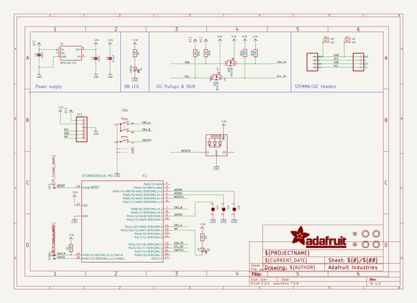
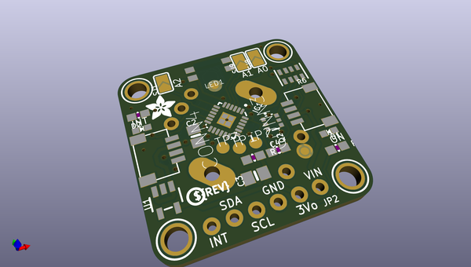
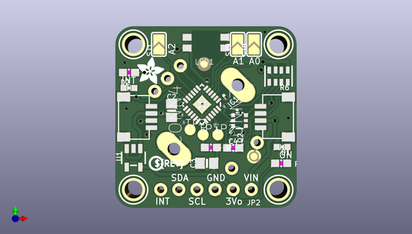
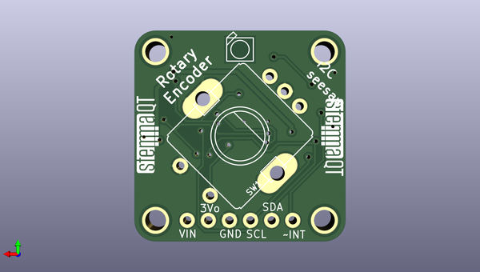

# adafruit_i2c_qt_rotary_encoder_pcb
 
## summary 
* id: adafruit_adafruit_i2c_qt_rotary_encoder_pcb_adafruit_i2c_qt_rotary_encoder
* user: adafruit
* name: adafruit_i2c_qt_rotary_encoder_pcb
* board: adafruit_i2c_qt_rotary_encoder
* repo: https://github.com/adafruit/Adafruit-I2C-QT-Rotary-Encoder-PCB

* src_file_repo_sch: 
* src_file_repo_sch_link: https://github.com/adafruit/Adafruit-I2C-QT-Rotary-Encoder-PCB/tree/main/
* full details link: https://github.com/oomlout/oomlout_oomp_project_bot_v_2/tree/main/projects/adafruit_adafruit_i2c_qt_rotary_encoder_pcb_adafruit_i2c_qt_rotary_encoder/current_version/working  

## schematic  
  
[schematic (pdf)](working_schematic.pdf)  

## pcb  
 
  
  
  
[board (pdf)](working.pdf)  

## working_bom
| Id | Designator | Footprint | Quantity | Designation | Supplier and ref |  | None | 
| --- | --- | --- | --- | --- | --- | --- | --- | 
| 1 | JP2 | 1X06_ROUND_70 | 1 |  |  |  | [''] | 
| 2 | TP2,TP1,TP3 | TP15R | 3 | TPTP15R |  |  | [''] | 
| 3 | R7,R2,R1 | 0603-NO | 3 | 10K |  |  | [''] | 
| 4 | Q2 | SOT363 | 1 | BSS138 |  |  | [''] | 
| 5 | D1 | CHIPLED_0603_NOOUTLINE | 1 | GREEN |  |  | [''] | 
| 6 | U$29,U$25,U$30,U$27 | MOUNTINGHOLE_2.5_PLATED | 4 | MOUNTINGHOLE2.5 |  |  | [''] | 
| 7 | CONN3,CONN4 | JST_SH4 | 2 | STEMMA_I2C_QT |  |  | [''] | 
| 8 | FID4,FID3 | FIDUCIAL_1MM | 2 | FIDUCIAL_1MM |  |  | [''] | 
| 9 | U1 | SOT23-5 | 1 | AP2112K-3.3 |  |  | [''] | 
| 10 | IC1 | QFN24_4MM | 1 | ATSAMD09D14A-MU |  |  | [''] | 
| 11 | U$32 | ADAFRUIT_3.5MM | 1 |  |  |  | [''] | 
| 12 | SJ9,SJ8,SJ1 | SOLDERJUMPER_ARROW_NOPASTE | 3 |  |  |  | [''] | 
| 13 | C3,C2 | 0805-NO | 2 | 10uF |  |  | [''] | 
| 14 | C4 | 0603-NO | 1 | 0.1uF |  |  | [''] | 
| 15 | R6 | RESPACK_4X0603 | 1 | 10K |  |  | [''] | 
| 16 | D2 | CHIPLED_0603_NOOUTLINE | 1 | red |  |  | [''] | 
| 17 | U$33 | PCBFEAT-REV-040 | 1 |  |  |  | [''] | 
| 18 | U$35,U$34 | STEMMAQT | 2 |  |  |  | [''] | 
| 19 | LED1 | NEO3535_REVERSE | 1 | WS2812B_SK6812E |  |  | [''] | 
| 20 | SW1 | PEC11+SWITCH | 1 |  |  |  | [''] | 

## bom_schematic
| Ref | Qnty | Value | Cmp name | Footprint | Description | Vendor | DNP | 
| --- | --- | --- | --- | --- | --- | --- | --- | 
| C2, C3 | 2 | 10uF | CAP_CERAMIC0805-NOOUTLINE | working:0805-NO |  |  |  | 
| C4 | 1 | 0.1uF | CAP_CERAMIC0603_NO | working:0603-NO |  |  |  | 
| CONN3, CONN4 | 2 | STEMMA_I2C_QT | STEMMA_I2C_QT | working:JST_SH4 |  |  |  | 
| D1 | 1 | GREEN | LED0603_NOOUTLINE | working:CHIPLED_0603_NOOUTLINE |  |  |  | 
| D2 | 1 | red | LED0603_NOOUTLINE | working:CHIPLED_0603_NOOUTLINE |  |  |  | 
| FID3, FID4 | 2 | FIDUCIAL_1MM | FIDUCIAL_1MM | working:FIDUCIAL_1MM |  |  |  | 
| IC1 | 1 | ATSAMD09D14A-MU | ATSAMD09D14A-MU | working:QFN24_4MM |  |  |  | 
| JP2 | 1 | HEADER-1X670MIL | HEADER-1X670MIL | working:1X06_ROUND_70 |  |  |  | 
| LED1 | 1 | WS2812B_SK6812E | WS2812B_SK6812E | working:NEO3535_REVERSE |  |  |  | 
| Q2 | 1 | BSS138 | MOSFET-N_DUAL | working:SOT363 |  |  |  | 
| R1, R2, R7 | 3 | 10K | RESISTOR_0603_NOOUT | working:0603-NO |  |  |  | 
| R6 | 1 | 10K | RESISTOR_4PACK | working:RESPACK_4X0603 |  |  |  | 
| SJ1, SJ8, SJ9 | 3 | SOLDERJUMPER | SOLDERJUMPER | working:SOLDERJUMPER_ARROW_NOPASTE |  |  |  | 
| SW1 | 1 | ENCODER_PLUS_SWITCH_PEC11 | ENCODER_PLUS_SWITCH_PEC11 | working:PEC11+SWITCH |  |  |  | 
| TP1, TP2, TP3 | 3 | TPTP15R | TPTP15R | working:TP15R |  |  |  | 
| U1 | 1 | AP2112K-3.3 | VREG_SOT23-5 | working:SOT23-5 |  |  |  | 
| U$25, U$27, U$29, U$30 | 4 | MOUNTINGHOLE2.5 | MOUNTINGHOLE2.5 | working:MOUNTINGHOLE_2.5_PLATED |  |  |  | 

## mounting_holes
| x | y | package | value | ref | size | 
| --- | --- | --- | --- | --- | --- | 
| 0.0 | 20.320000000000007 | MOUNTINGHOLE_2.5_PLATED | MOUNTINGHOLE2.5 | U$25 | m3 | 
| 20.319999999999993 | 20.320000000000007 | MOUNTINGHOLE_2.5_PLATED | MOUNTINGHOLE2.5 | U$27 | m3 | 
| 0.0 | 0.0 | MOUNTINGHOLE_2.5_PLATED | MOUNTINGHOLE2.5 | U$29 | m3 | 
| 20.319999999999993 | 0.0 | MOUNTINGHOLE_2.5_PLATED | MOUNTINGHOLE2.5 | U$30 | m3 | 

