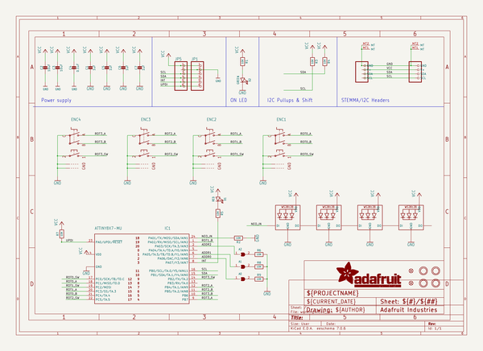
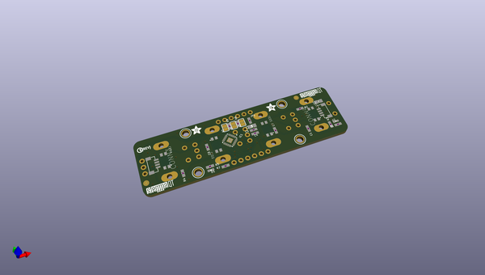
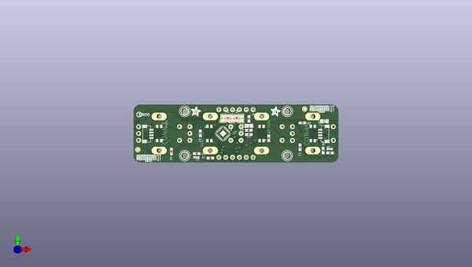
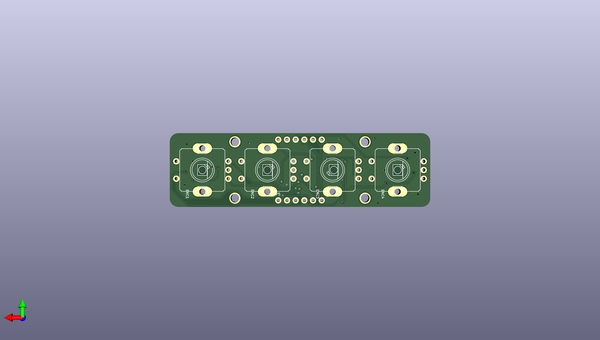

# adafruit_i2c_quad_rotary_encoder_breakout_pcb
 
## summary 
* id: adafruit_adafruit_i2c_quad_rotary_encoder_breakout_pcb_adafruit_i2c_quad_rotary_encoder_breakout
* user: adafruit
* name: adafruit_i2c_quad_rotary_encoder_breakout_pcb
* board: adafruit_i2c_quad_rotary_encoder_breakout
* repo: https://github.com/adafruit/Adafruit-I2C-Quad-Rotary-Encoder-Breakout-PCB

* src_file_repo_sch: 
* src_file_repo_sch_link: https://github.com/adafruit/Adafruit-I2C-Quad-Rotary-Encoder-Breakout-PCB/tree/main/
* full details link: https://github.com/oomlout/oomlout_oomp_project_bot_v_2/tree/main/projects/adafruit_adafruit_i2c_quad_rotary_encoder_breakout_pcb_adafruit_i2c_quad_rotary_encoder_breakout/current_version/working  

## schematic  
  
[schematic (pdf)](working_schematic.pdf)  

## pcb  
 
  
  
  
[board (pdf)](working.pdf)  

## working_bom
| Id | Designator | Footprint | Quantity | Designation | Supplier and ref |  | None | 
| --- | --- | --- | --- | --- | --- | --- | --- | 
| 1 | PLABEL9 | PLABEL9 | 1 |  |  |  | [''] | 
| 2 | D2 | CHIPLED_0603_NOOUTLINE | 1 | GREEN |  |  | [''] | 
| 3 | PLABEL10 | PLABEL10 | 1 |  |  |  | [''] | 
| 4 | CONN4,CONN3 | JST_SH4_RA | 2 | STEMMA_I2C_QTRA |  |  | [''] | 
| 5 | U$3,U$21,U$17,U$19 | MOUNTINGHOLE_2.5_PLATED | 4 | MOUNTINGHOLE2.5 |  |  | [''] | 
| 6 | JP1,JP5 | 1X06_ROUND_70 | 2 |  |  |  | [''] | 
| 7 | C1,C7,C5,C6 | 0603-NO | 4 | 1uF |  |  | [''] | 
| 8 | R7,R6,R9,R4,R3,R8,R1,R5,R2 | 0603-NO | 9 | 10K |  |  | [''] | 
| 9 | FID1,FID2 | FIDUCIAL_1MM | 2 | FIDUCIAL_1MM |  |  | [''] | 
| 10 | U$9,U$2 | ADAFRUIT_3.5MM | 2 |  |  |  | [''] | 
| 11 | D1 | CHIPLED_0603_NOOUTLINE | 1 | RED |  |  | [''] | 
| 12 | PLABEL13 | PLABEL13 | 1 |  |  |  | [''] | 
| 13 | C4 | 0603-NO | 1 | 0.1uF |  |  | [''] | 
| 14 | PLABEL7 | PLABEL7 | 1 |  |  |  | [''] | 
| 15 | U$25 | PCBFEAT-REV-040 | 1 |  |  |  | [''] | 
| 16 | PLABEL6 | PLABEL6 | 1 |  |  |  | [''] | 
| 17 | PLABEL14 | PLABEL14 | 1 |  |  |  | [''] | 
| 18 | PLABEL11 | PLABEL11 | 1 |  |  |  | [''] | 
| 19 | C2,C3 | 0805-NO | 2 | 10uF |  |  | [''] | 
| 20 | PLABEL15 | PLABEL15 | 1 |  |  |  | [''] | 
| 21 | PLABEL16 | PLABEL16 | 1 |  |  |  | [''] | 
| 22 | A1,A0,A2 | SOLDERJUMPER_CLOSEDWIRE | 3 |  |  |  | [''] | 
| 23 | PLABEL8 | PLABEL8 | 1 |  |  |  | [''] | 
| 24 | PLABEL0 | PLABEL0 | 1 |  |  |  | [''] | 
| 25 | PLABEL5 | PLABEL5 | 1 |  |  |  | [''] | 
| 26 | IC1 | QFN24_4MM | 1 | ATTINY8X7-MU |  |  | [''] | 
| 27 | PLABEL1 | PLABEL1 | 1 |  |  |  | [''] | 
| 28 | U$30,U$31 | STEMMAQT | 2 |  |  |  | [''] | 
| 29 | PLABEL4 | PLABEL4 | 1 |  |  |  | [''] | 
| 30 | PLABEL2 | PLABEL2 | 1 |  |  |  | [''] | 
| 31 | PLABEL12 | PLABEL12 | 1 |  |  |  | [''] | 
| 32 | PLABEL3 | PLABEL3 | 1 |  |  |  | [''] | 
| 33 | LED1,LED3,LED2,LED4 | NEO3535_REVERSE | 4 | WS2812B_SK6812E |  |  | [''] | 
| 34 | PLABEL20 | PLABEL20 | 1 |  |  |  | [''] | 
| 35 | PLABEL29 | PLABEL29 | 1 |  |  |  | [''] | 
| 36 | ENC4,ENC3,ENC2,ENC1 | PEC11+SWITCH | 4 |  |  |  | [''] | 
| 37 | PLABEL24 | PLABEL24 | 1 |  |  |  | [''] | 
| 38 | PLABEL27 | PLABEL27 | 1 |  |  |  | [''] | 
| 39 | PLABEL19 | PLABEL19 | 1 |  |  |  | [''] | 
| 40 | PLABEL26 | PLABEL26 | 1 |  |  |  | [''] | 
| 41 | PLABEL28 | PLABEL28 | 1 |  |  |  | [''] | 
| 42 | PLABEL32 | PLABEL32 | 1 |  |  |  | [''] | 
| 43 | PLABEL25 | PLABEL25 | 1 |  |  |  | [''] | 
| 44 | PLABEL21 | PLABEL21 | 1 |  |  |  | [''] | 
| 45 | PLABEL31 | PLABEL31 | 1 |  |  |  | [''] | 
| 46 | PLABEL30 | PLABEL30 | 1 |  |  |  | [''] | 
| 47 | PLABEL22 | PLABEL22 | 1 |  |  |  | [''] | 
| 48 | PLABEL23 | PLABEL23 | 1 |  |  |  | [''] | 
| 49 | PLABEL18 | PLABEL18 | 1 |  |  |  | [''] | 
| 50 | PLABEL17 | PLABEL17 | 1 |  |  |  | [''] | 

## bom_schematic
| Ref | Qnty | Value | Cmp name | Footprint | Description | Vendor | DNP | 
| --- | --- | --- | --- | --- | --- | --- | --- | 
| A0, A1, A2 | 3 | SOLDERJUMPERCLOSED | SOLDERJUMPERCLOSED | working:SOLDERJUMPER_CLOSEDWIRE |  |  |  | 
| C1, C5, C6, C7 | 4 | 1uF | CAP_CERAMIC0603_NO | working:0603-NO |  |  |  | 
| C2, C3 | 2 | 10uF | CAP_CERAMIC0805-NOOUTLINE | working:0805-NO |  |  |  | 
| C4 | 1 | 0.1uF | CAP_CERAMIC0603_NO | working:0603-NO |  |  |  | 
| CONN3, CONN4 | 2 | STEMMA_I2C_QTRA | STEMMA_I2C_QTRA | working:JST_SH4_RA |  |  |  | 
| D1 | 1 | RED | LED0603_NOOUTLINE | working:CHIPLED_0603_NOOUTLINE |  |  |  | 
| D2 | 1 | GREEN | LED0603_NOOUTLINE | working:CHIPLED_0603_NOOUTLINE |  |  |  | 
| ENC1, ENC2, ENC3, ENC4 | 4 | ENCODER_PLUS_SWITCH_PEC11 | ENCODER_PLUS_SWITCH_PEC11 | working:PEC11+SWITCH |  |  |  | 
| FID1, FID2 | 2 | FIDUCIAL_1MM | FIDUCIAL_1MM | working:FIDUCIAL_1MM |  |  |  | 
| IC1 | 1 | ATTINY8X7-MU | ATTINY8X7-MU | working:QFN24_4MM |  |  |  | 
| JP1, JP5 | 2 | HEADER-1X670MIL | HEADER-1X670MIL | working:1X06_ROUND_70 |  |  |  | 
| LED1, LED2, LED3, LED4 | 4 | WS2812B_SK6812E | WS2812B_SK6812E | working:NEO3535_REVERSE |  |  |  | 
| R1, R2, R3, R4, R5, R6, R7, R8, R9 | 9 | 10K | RESISTOR_0603_NOOUT | working:0603-NO |  |  |  | 
| U$3, U$17, U$19, U$21 | 4 | MOUNTINGHOLE2.5 | MOUNTINGHOLE2.5 | working:MOUNTINGHOLE_2.5_PLATED |  |  |  | 

## mounting_holes
| x | y | package | value | ref | size | 
| --- | --- | --- | --- | --- | --- | 
| 38.099999999999994 | 16.510000000000005 | MOUNTINGHOLE_2.5_PLATED | MOUNTINGHOLE2.5 | U$3 | m3 | 
| 0.0 | 16.510000000000005 | MOUNTINGHOLE_2.5_PLATED | MOUNTINGHOLE2.5 | U$17 | m3 | 
| 38.099999999999994 | 0.0 | MOUNTINGHOLE_2.5_PLATED | MOUNTINGHOLE2.5 | U$19 | m3 | 
| 0.0 | 0.0 | MOUNTINGHOLE_2.5_PLATED | MOUNTINGHOLE2.5 | U$21 | m3 | 

