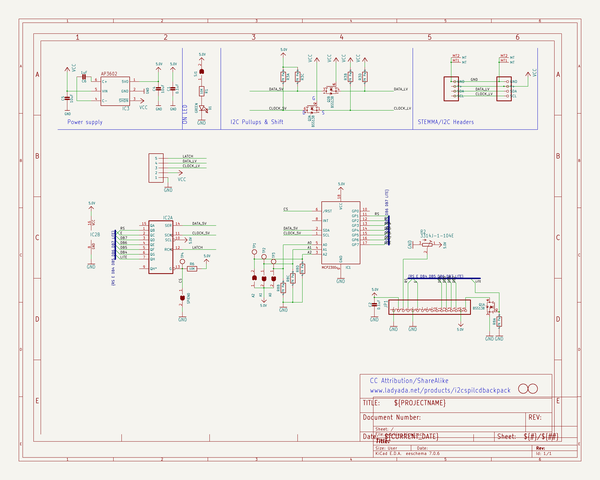
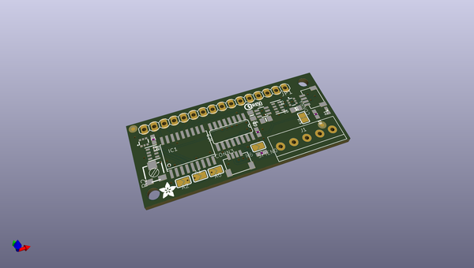
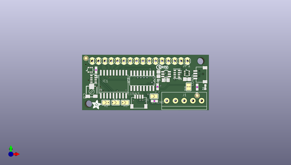
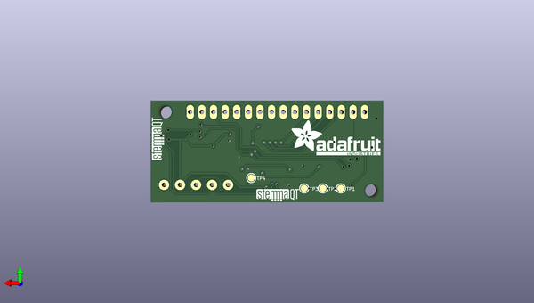

# adafruit_i2c_spi_lcd_backpack_pcb
 
## summary 
* id: adafruit_adafruit_i2c_spi_lcd_backpack_pcb_i2cspilcdbackpack
* user: adafruit
* name: adafruit_i2c_spi_lcd_backpack_pcb
* board: i2cspilcdbackpack
* repo: https://github.com/adafruit/Adafruit-I2C-SPI-LCD-Backpack-PCB

* src_file_repo_sch: 
* src_file_repo_sch_link: https://github.com/adafruit/Adafruit-I2C-SPI-LCD-Backpack-PCB/tree/master/
* full details link: https://github.com/oomlout/oomlout_oomp_project_bot_v_2/tree/main/projects/adafruit_adafruit_i2c_spi_lcd_backpack_pcb_i2cspilcdbackpack/current_version/working  

## schematic  
  
[schematic (pdf)](working_schematic.pdf) 

## pcb  
 
  
  
  
[board (pdf)](working.pdf)  

## working_bom
| Id | Designator | Footprint | Quantity | Designation | Supplier and ref |  | None | 
| --- | --- | --- | --- | --- | --- | --- | --- | 
| 1 | PLABEL8 | PLABEL8 | 1 |  |  |  | [''] | 
| 2 | U$7 | PCBFEAT-REV-040 | 1 |  |  |  | [''] | 
| 3 | @HOLE1,@HOLE0 |  | 2 |  |  |  | [''] | 
| 4 | SPIEN0,A2,A1,A0 | SOLDERJUMPER_ARROW_NOPASTE | 4 |  |  |  | [''] | 
| 5 | PLABEL0 | PLABEL0 | 1 |  |  |  | [''] | 
| 6 | C5,C4 | 0805-NO | 2 | 10uF |  |  | [''] | 
| 7 | SJ1 | SOLDERJUMPER_CLOSEDWIRE | 1 |  |  |  | [''] | 
| 8 | D1 | CHIPLED_0603_NOOUTLINE | 1 | GREEN |  |  | [''] | 
| 9 | R8,R3 | RESPACK_4X0603 | 2 | 4.7K Pack |  |  | [''] | 
| 10 | CONN4,CONN3 | JST_SH4 | 2 | STEMMA_I2C_QT |  |  | [''] | 
| 11 | PLABEL10 | PLABEL10 | 1 |  |  |  | [''] | 
| 12 | C6 | 0805-NO | 1 | 1uF |  |  | [''] | 
| 13 | C1,C2 | 0603-NO | 2 | 0.1uF |  |  | [''] | 
| 14 | R2 | RTRIM3314J | 1 | 3314J-1-104E |  |  | [''] | 
| 15 | JP1 | 1X16 | 1 |  |  |  | [''] | 
| 16 | R1,R6 | 0603-NO | 2 | 10K |  |  | [''] | 
| 17 | U$4 | ADAFRUIT_3.5MM | 1 |  |  |  | [''] | 
| 18 | PLABEL6 | PLABEL6 | 1 |  |  |  | [''] | 
| 19 | U$1,U$2 | FIDUCIAL_1MM | 2 | FIDUCIAL |  |  | [''] | 
| 20 | PLABEL11 | PLABEL11 | 1 |  |  |  | [''] | 
| 21 | IC1 | SO18W | 1 | MCP23008/SO |  |  | [''] | 
| 22 | IC3 | SOT23-6 | 1 | AP3602/RT9361 |  |  | [''] | 
| 23 | Q1,Q2 | SOT363 | 2 | BSS138 |  |  | [''] | 
| 24 | PLABEL4 | PLABEL4 | 1 |  |  |  | [''] | 
| 25 | IC2 | SO16 | 1 | 74HC595D |  |  | [''] | 
| 26 | PLABEL5 | PLABEL5 | 1 |  |  |  | [''] | 
| 27 | PLABEL9 | PLABEL9 | 1 |  |  |  | [''] | 
| 28 | PLABEL2 | PLABEL2 | 1 |  |  |  | [''] | 
| 29 | PLABEL3 | PLABEL3 | 1 |  |  |  | [''] | 
| 30 | PLABEL7 | PLABEL7 | 1 |  |  |  | [''] | 
| 31 | PLABEL1 | PLABEL1 | 1 |  |  |  | [''] | 
| 32 | J1 | 1X05-3.5MM | 1 | 1X5 |  |  | [''] | 
| 33 | TP3,TP2,TP1,TP4 | TESTPOINT_ROUND_1.5MM | 4 |  |  |  | [''] | 
| 34 | U$23 | ADAFRUIT_TEXT_20MM | 1 |  |  |  | [''] | 
| 35 | PLABEL12 | PLABEL12 | 1 |  |  |  | [''] | 
| 36 | U$11,U$12 | STEMMAQT | 2 |  |  |  | [''] | 

## bom_schematic
| Ref | Qnty | Value | Cmp name | Footprint | Description | Vendor | DNP | 
| --- | --- | --- | --- | --- | --- | --- | --- | 
| A0, A1, A2 | 3 | SOLDERJUMPER | SOLDERJUMPER | working:SOLDERJUMPER_ARROW_NOPASTE |  |  |  | 
| C1, C2 | 2 | 0.1uF | CAP_CERAMIC0603_NO | working:0603-NO |  |  |  | 
| C4, C5 | 2 | 10uF | CAP_CERAMIC0805-NOOUTLINE | working:0805-NO |  |  |  | 
| C6 | 1 | 1uF | CAP_CERAMIC0805-NOOUTLINE | working:0805-NO |  |  |  | 
| CONN3, CONN4 | 2 | STEMMA_I2C_QT | STEMMA_I2C_QT | working:JST_SH4 |  |  |  | 
| D1 | 1 | GREEN | LED0603_NOOUTLINE | working:CHIPLED_0603_NOOUTLINE |  |  |  | 
| IC1 | 1 | MCP23008/SO | MCP23008/SO | working:SO18W |  |  |  | 
| IC2 | 1 | 74595D | 74595D | working:SO16 |  |  |  | 
| IC3 | 1 | AP3602 | AP3602 | working:SOT23-6 |  |  |  | 
| J1 | 1 | 1X5 | 1X5 | working:1X05-3.5MM |  |  |  | 
| JP1 | 1 | PINHD-1X16 | PINHD-1X16 | working:1X16 |  |  |  | 
| Q1, Q2 | 2 | BSS138 | MOSFET-N_DUAL | working:SOT363 |  |  |  | 
| R1, R6 | 2 | 10K | RESISTOR_0603_NOOUT | working:0603-NO |  |  |  | 
| R2 | 1 | 3314J-1-104E | R-TRIMM3314J | working:RTRIM3314J |  |  |  | 
| R3, R8 | 2 | 4.7K Pack | RESISTOR_4PACK | working:RESPACK_4X0603 |  |  |  | 
| SJ1 | 1 | SOLDERJUMPERCLOSED | SOLDERJUMPERCLOSED | working:SOLDERJUMPER_CLOSEDWIRE |  |  |  | 
| SPIEN0 | 1 | SOLDERJUMPER | SOLDERJUMPER | working:SOLDERJUMPER_ARROW_NOPASTE |  |  |  | 
| TP1, TP2, TP3, TP4 | 4 | TESTPOINTROUND1.5MM | TESTPOINTROUND1.5MM | working:TESTPOINT_ROUND_1.5MM |  |  |  | 
| U$1, U$2 | 2 | FIDUCIAL | FIDUCIAL | working:FIDUCIAL_1MM |  |  |  | 

