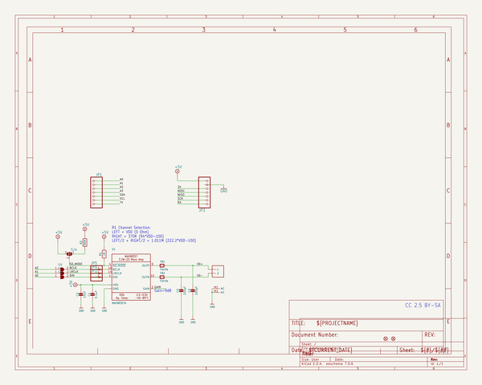
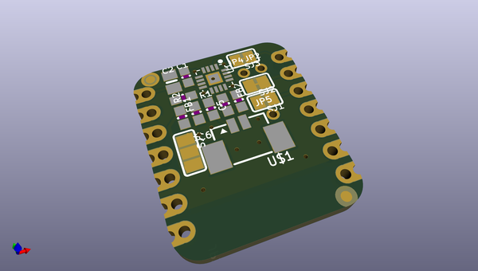
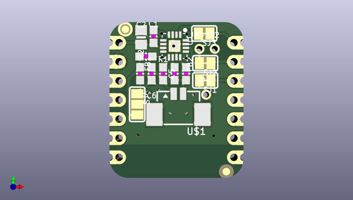
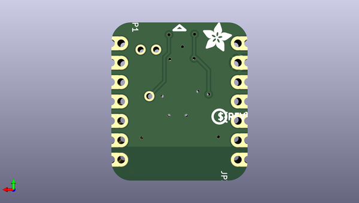

# adafruit_i2s_amplifier_bff_pcb
 
## summary 
* id: adafruit_adafruit_i2s_amplifier_bff_pcb_adafruit_i2s_amplifier_bff
* user: adafruit
* name: adafruit_i2s_amplifier_bff_pcb
* board: adafruit_i2s_amplifier_bff
* repo: https://github.com/adafruit/Adafruit-I2S-Amplifier-BFF-PCB

* src_file_repo_sch: 
* src_file_repo_sch_link: https://github.com/adafruit/Adafruit-I2S-Amplifier-BFF-PCB/tree/main/
* full details link: https://github.com/oomlout/oomlout_oomp_project_bot_v_2/tree/main/projects/adafruit_adafruit_i2s_amplifier_bff_pcb_adafruit_i2s_amplifier_bff/current_version/working  

## schematic  
  
[schematic (pdf)](working_schematic.pdf)  

## pcb  
 
  
  
  
[board (pdf)](working.pdf)  

## working_bom
| Id | Designator | Footprint | Quantity | Designation | Supplier and ref |  | None | 
| --- | --- | --- | --- | --- | --- | --- | --- | 
| 1 | U$6,U$8 | FIDUCIAL_1MM | 2 | FIDUCIAL_1MM |  |  | [''] | 
| 2 | PLABEL3 | PLABEL3 | 1 |  |  |  | [''] | 
| 3 | PLABEL8 | PLABEL8 | 1 |  |  |  | [''] | 
| 4 | SJ1,SJ2,SJ3 | SOLDERJUMPER_CLOSEDWIRE | 3 |  |  |  | [''] | 
| 5 | JP5,JP4,JP2 | 1X01_2MM | 3 |  |  |  | [''] | 
| 6 | SJ4 | SOLDERJUMPER_2WAY_OPEN_NOPASTE | 1 |  |  |  | [''] | 
| 7 | R2 | 0603-NO | 1 | 560K |  |  | [''] | 
| 8 | PLABEL23 | PLABEL23 | 1 |  |  |  | [''] | 
| 9 | PLABEL7 | PLABEL7 | 1 |  |  |  | [''] | 
| 10 | PLABEL21 | PLABEL21 | 1 |  |  |  | [''] | 
| 11 | PLABEL20 | PLABEL20 | 1 |  |  |  | [''] | 
| 12 | PLABEL14 | PLABEL14 | 1 |  |  |  | [''] | 
| 13 | FB2,FB1 | 0603-NO | 2 | Ferrite |  |  | [''] | 
| 14 | R1 | 0603-NO | 1 | 1M |  |  | [''] | 
| 15 | U1 | QFN16_3MM | 1 | MAX98357A |  |  | [''] | 
| 16 | C1 | 0603-NO | 1 | 0.1uF |  |  | [''] | 
| 17 | PLABEL5 | PLABEL5 | 1 |  |  |  | [''] | 
| 18 | U$1 | 53398-0271 | 1 | CON_MOLEX_2P |  |  | [''] | 
| 19 | C6,C5 | 0603-NO | 2 | 220pF |  |  | [''] | 
| 20 | PLABEL4 | PLABEL4 | 1 |  |  |  | [''] | 
| 21 | C2 | 0805-NO | 1 | 10uF |  |  | [''] | 
| 22 | PLABEL22 | PLABEL22 | 1 |  |  |  | [''] | 
| 23 | PLABEL12 | PLABEL12 | 1 |  |  |  | [''] | 
| 24 | PLABEL6 | PLABEL6 | 1 |  |  |  | [''] | 
| 25 | PLABEL1 | PLABEL1 | 1 |  |  |  | [''] | 
| 26 | PLABEL2 | PLABEL2 | 1 |  |  |  | [''] | 
| 27 | JP3,JP1 | 1X07_CASTEL | 2 |  |  |  | [''] | 
| 28 | PLABEL27 | PLABEL27 | 1 |  |  |  | [''] | 
| 29 | PLABEL25 | PLABEL25 | 1 |  |  |  | [''] | 
| 30 | PLABEL26 | PLABEL26 | 1 |  |  |  | [''] | 
| 31 | PLABEL24 | PLABEL24 | 1 |  |  |  | [''] | 
| 32 | PLABEL28 | PLABEL28 | 1 |  |  |  | [''] | 
| 33 | U$2 | ADAFRUIT_3.5MM | 1 |  |  |  | [''] | 
| 34 | U$3 | PCBFEAT-REV-040 | 1 |  |  |  | [''] | 
| 35 | PLABEL19 | PLABEL19 | 1 |  |  |  | [''] | 

## bom_schematic
| Ref | Qnty | Value | Cmp name | Footprint | Description | Vendor | DNP | 
| --- | --- | --- | --- | --- | --- | --- | --- | 
| C1 | 1 | 0.1uF | CAP_CERAMIC0603_NO | working:0603-NO |  |  |  | 
| C2 | 1 | 10uF | CAP_CERAMIC0805-NOOUTLINE | working:0805-NO |  |  |  | 
| C5, C6 | 2 | 220pF | CAP_CERAMIC0603_NO | working:0603-NO |  |  |  | 
| FB1, FB2 | 2 | Ferrite | FERRITE-0603NO | working:0603-NO |  |  |  | 
| JP1, JP3 | 2 | HEADER-1X7_CASTEL | HEADER-1X7_CASTEL | working:1X07_CASTEL |  |  |  | 
| JP2, JP4, JP5 | 3 | HEADER-1X12MM | HEADER-1X12MM | working:1X01_2MM |  |  |  | 
| R1 | 1 | 1M | RESISTOR_0603_NOOUT | working:0603-NO |  |  |  | 
| R2 | 1 | 560K | RESISTOR_0603_NOOUT | working:0603-NO |  |  |  | 
| SJ1, SJ2, SJ3 | 3 | SOLDERJUMPERCLOSED | SOLDERJUMPERCLOSED | working:SOLDERJUMPER_CLOSEDWIRE |  |  |  | 
| SJ4 | 1 | SOLDERJUMPER_2WAY | SOLDERJUMPER_2WAY | working:SOLDERJUMPER_2WAY_OPEN_NOPASTE |  |  |  | 
| U1 | 1 | MAX98357A | AUDIOAMP_MAX98357 | working:QFN16_3MM |  |  |  | 
| U$1 | 1 | CON_MOLEX_2P | CON_MOLEX_2P | working:53398-0271 |  |  |  | 
| U$6, U$8 | 2 | FIDUCIAL_1MM | FIDUCIAL_1MM | working:FIDUCIAL_1MM |  |  |  | 

