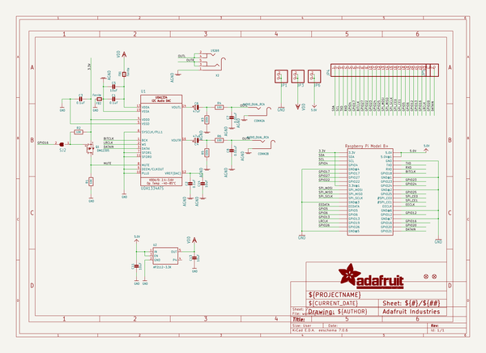
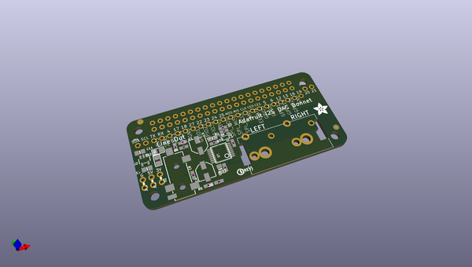
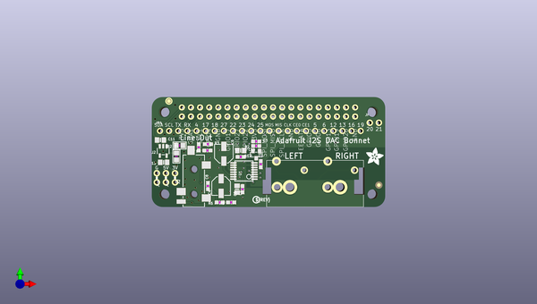
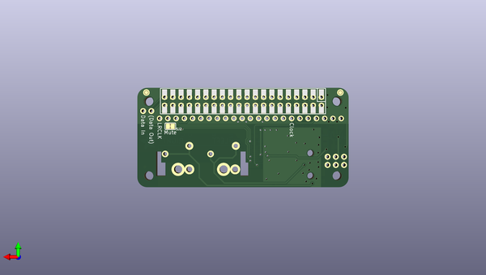

# adafruit_i2s_audio_bonnet_for_raspberry_pi_pcb
 
## summary 
* id: adafruit_adafruit_i2s_audio_bonnet_for_raspberry_pi_pcb_adafruit_i2s_audio_uda1334_bonnet
* user: adafruit
* name: adafruit_i2s_audio_bonnet_for_raspberry_pi_pcb
* board: adafruit_i2s_audio_uda1334_bonnet
* repo: https://github.com/adafruit/Adafruit-I2S-Audio-Bonnet-for-Raspberry-Pi-PCB

* src_file_repo_sch: 
* src_file_repo_sch_link: https://github.com/adafruit/Adafruit-I2S-Audio-Bonnet-for-Raspberry-Pi-PCB/tree/master/
* full details link: https://github.com/oomlout/oomlout_oomp_project_bot_v_2/tree/main/projects/adafruit_adafruit_i2s_audio_bonnet_for_raspberry_pi_pcb_adafruit_i2s_audio_uda1334_bonnet/current_version/working  

## schematic  
  
[schematic (pdf)](working_schematic.pdf)  

## pcb  
 
  
  
  
[board (pdf)](working.pdf)  

## working_bom
| Id | Designator | Footprint | Quantity | Designation | Supplier and ref |  | None | 
| --- | --- | --- | --- | --- | --- | --- | --- | 
| 1 | FID2,FID1 | FIDUCIAL_1MM | 2 | FIDUCIAL_1MM |  |  | [''] | 
| 2 | R2,R1 | 0603-NO | 2 | 10K |  |  | [''] | 
| 3 | U1 | SSOP16_4.4MM | 1 | UDA1334ATS |  |  | [''] | 
| 4 | U$11 | PCBFEAT-REV-040 | 1 |  |  |  | [''] | 
| 5 | C1,C2,C3 | 0603-NO | 3 | 0.1uF |  |  | [''] | 
| 6 | R5,R3 | 0603-NO | 2 | 220k |  |  | [''] | 
| 7 | JP6,JP5,JP1,JP3 | 1X02_ROUND | 4 |  |  |  | [''] | 
| 8 | C8,C7 | 0603-NO | 2 | 0.01uF |  |  | [''] | 
| 9 | U2 | SOT23-5 | 1 | AP2112-3.3K |  |  | [''] | 
| 10 | FB1,FB2 | 0805 | 2 | Ferrite |  |  | [''] | 
| 11 | CONN2 | RCA_DUAL_JACK | 1 | AUDIO_DUAL_RCA |  |  | [''] | 
| 12 | U$5 | ADAFRUIT_5MM | 1 |  |  |  | [''] | 
| 13 | C13,C11,C14,C5 | 0805-NO | 4 | 10uF |  |  | [''] | 
| 14 | C4,C6 | PANASONIC_C | 2 | 47uF |  |  | [''] | 
| 15 | R4,R6 | 0603-NO | 2 | 100 |  |  | [''] | 
| 16 | JP4 | 1X23_ROUND_70MIL | 1 |  |  |  | [''] | 
| 17 | Q1 | SOT23-WIDE | 1 |  DMG2305 |  |  | [''] | 
| 18 | X2 | 4UCONN_19269 | 1 | 19269 |  |  | [''] | 
| 19 | RPI1 | PI_BONNET_THMSMT | 1 | RASPBERRYPI_BPLUS_BONNET_THMSMT |  |  | [''] | 
| 20 | SJ2 | SOLDERJUMPER_CLOSEDWIRE | 1 |  |  |  | [''] | 

## bom_schematic
| Ref | Qnty | Value | Cmp name | Footprint | Description | Vendor | DNP | 
| --- | --- | --- | --- | --- | --- | --- | --- | 
| C1, C2, C3 | 3 | 0.1uF | CAP_CERAMIC0603_NO | working:0603-NO |  |  |  | 
| C4, C6 | 2 | 47uF | CAP_ELECTROLYTICPANASONIC_C | working:PANASONIC_C |  |  |  | 
| C5, C11, C13, C14 | 4 | 10uF | CAP_CERAMIC0805-NOOUTLINE | working:0805-NO |  |  |  | 
| C7, C8 | 2 | 0.01uF | CAP_CERAMIC0603_NO | working:0603-NO |  |  |  | 
| CONN2 | 1 | AUDIO_DUAL_RCA | AUDIO_DUAL_RCA | working:RCA_DUAL_JACK |  |  |  | 
| FB1, FB2 | 2 | Ferrite | FERRITE0805 | working:0805 |  |  |  | 
| FID1, FID2 | 2 | FIDUCIAL_1MM | FIDUCIAL_1MM | working:FIDUCIAL_1MM |  |  |  | 
| JP1, JP3, JP5, JP6 | 4 | HEADER-1X2ROUND | HEADER-1X2ROUND | working:1X02_ROUND |  |  |  | 
| JP4 | 1 | HEADER-1X23 | HEADER-1X23 | working:1X23_ROUND_70MIL |  |  |  | 
| Q1 | 1 |  DMG2305 | MOSFET-PWIDE | working:SOT23-WIDE |  |  |  | 
| R1, R2 | 2 | 10K | RESISTOR_0603_NOOUT | working:0603-NO |  |  |  | 
| R3, R5 | 2 | 220k | RESISTOR_0603_NOOUT | working:0603-NO |  |  |  | 
| R4, R6 | 2 | 100 | RESISTOR_0603_NOOUT | working:0603-NO |  |  |  | 
| RPI1 | 1 | RASPBERRYPI_BPLUS_BONNET_THMSMT | RASPBERRYPI_BPLUS_BONNET_THMSMT | working:PI_BONNET_THMSMT |  |  |  | 
| SJ2 | 1 | SOLDERJUMPER_CLOSED | SOLDERJUMPER_CLOSED | working:SOLDERJUMPER_CLOSEDWIRE |  |  |  | 
| U1 | 1 | UDA1334ATS | AUDIO_I2S_UDA1334{dblquote}{dblquote} | working:SSOP16_4.4MM |  |  |  | 
| U2 | 1 | AP2112-3.3K | VREG_SOT23-5 | working:SOT23-5 |  |  |  | 
| X2 | 1 | 19269 | AUDIO_3.5MMJACK | working:4UCONN_19269 |  |  |  | 

