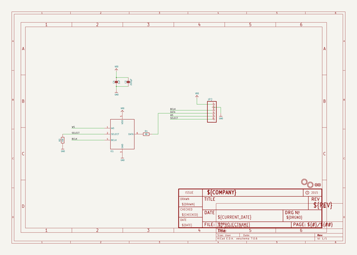
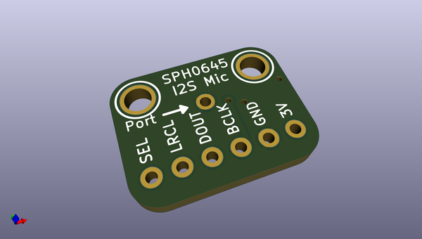
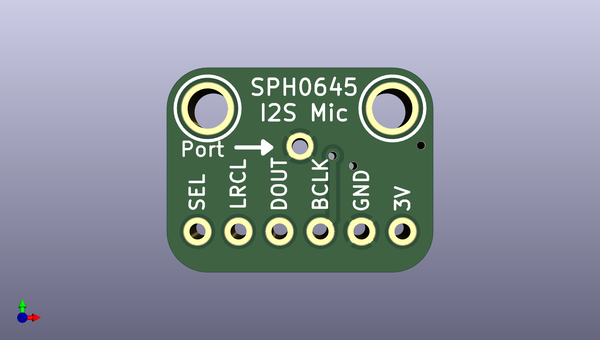
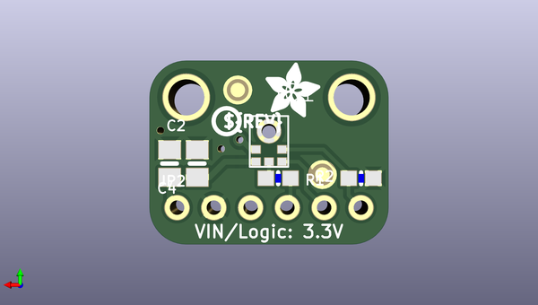

# adafruit_i2s_microphone_breakout_pcb
 
## summary 
* id: adafruit_adafruit_i2s_microphone_breakout_pcb_adafruit_i2s_mic_spk0415hm4h
* user: adafruit
* name: adafruit_i2s_microphone_breakout_pcb
* board: adafruit_i2s_mic_spk0415hm4h
* repo: https://github.com/adafruit/Adafruit-I2S-Microphone-Breakout-PCB

* src_file_repo_sch: 
* src_file_repo_sch_link: https://github.com/adafruit/Adafruit-I2S-Microphone-Breakout-PCB/tree/master/
* full details link: https://github.com/oomlout/oomlout_oomp_project_bot_v_2/tree/main/projects/adafruit_adafruit_i2s_microphone_breakout_pcb_adafruit_i2s_mic_spk0415hm4h/current_version/working  

## schematic  
  
[schematic (pdf)](working_schematic.pdf)  

## pcb  
 
  
  
  
[board (pdf)](working.pdf)  

## working_bom
| Id | Designator | Footprint | Quantity | Designation | Supplier and ref |  | None | 
| --- | --- | --- | --- | --- | --- | --- | --- | 
| 1 | U$6,U$12 | MOUNTINGHOLE_2.5_PLATED | 2 | MOUNTINGHOLE2.5 |  |  | [''] | 
| 2 | R2 | 0603-NO | 1 | 10k |  |  | [''] | 
| 3 | IC1 | SPH0645LM4H | 1 | MIC_I2S_SPH0645 |  |  | [''] | 
| 4 | FID1,FID2 | FIDUCIAL_1MM | 2 | FIDUCIAL_1MM |  |  | [''] | 
| 5 | C4 | 0805-NO | 1 | 1uF |  |  | [''] | 
| 6 | C2 | 0805-NO | 1 | 220pF |  |  | [''] | 
| 7 | U$13 | PCBFEAT-REV-040 | 1 |  |  |  | [''] | 
| 8 | JP2 | 1X06_ROUND | 1 |  |  |  | [''] | 
| 9 | R1 | 0603-NO | 1 | 68 |  |  | [''] | 
| 10 | U$5 | ADAFRUIT_3.5MM | 1 |  |  |  | [''] | 

## bom_schematic
| Ref | Qnty | Value | Cmp name | Footprint | Description | Vendor | DNP | 
| --- | --- | --- | --- | --- | --- | --- | --- | 
| C2 | 1 | 220pF | CAP_CERAMIC0805-NOOUTLINE | working:0805-NO |  |  |  | 
| C4 | 1 | 1uF | CAP_CERAMIC0805-NOOUTLINE | working:0805-NO |  |  |  | 
| FID1, FID2 | 2 | FIDUCIAL_1MM | FIDUCIAL_1MM | working:FIDUCIAL_1MM |  |  |  | 
| IC1 | 1 | MIC_I2S_SPH0645 | MIC_I2S_SPH0645 | working:SPH0645LM4H |  |  |  | 
| JP2 | 1 | HEADER-1X6ROUND | HEADER-1X6ROUND | working:1X06_ROUND |  |  |  | 
| R1 | 1 | 68 | RESISTOR_0603_NOOUT | working:0603-NO |  |  |  | 
| R2 | 1 | 10k | RESISTOR_0603_NOOUT | working:0603-NO |  |  |  | 
| U$6, U$12 | 2 | MOUNTINGHOLE2.5 | MOUNTINGHOLE2.5 | working:MOUNTINGHOLE_2.5_PLATED |  |  |  | 

## mounting_holes
| x | y | package | value | ref | size | 
| --- | --- | --- | --- | --- | --- | 
| 0.0 | 0.0 | MOUNTINGHOLE_2.5_PLATED | MOUNTINGHOLE2.5 | U$6 | m3 | 
| 11.430000000000007 | 0.0 | MOUNTINGHOLE_2.5_PLATED | MOUNTINGHOLE2.5 | U$12 | m3 | 

