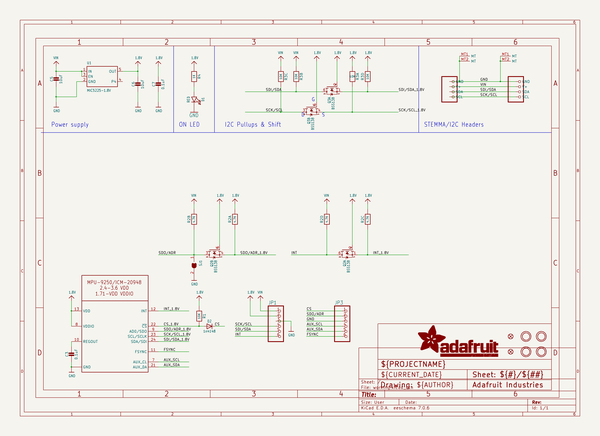
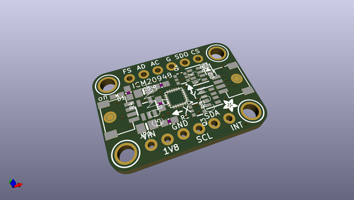
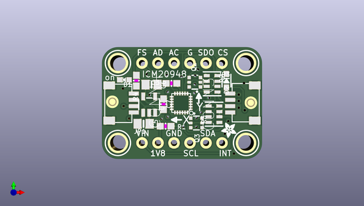
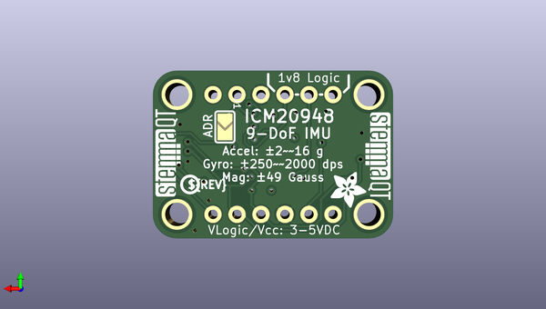

# adafruit_icm20948_pcb
 
## summary 
* id: adafruit_adafruit_icm20948_pcb_adafruit_icm20948
* user: adafruit
* name: adafruit_icm20948_pcb
* board: adafruit_icm20948
* repo: https://github.com/adafruit/Adafruit-ICM20948-PCB

* src_file_repo_sch: 
* src_file_repo_sch_link: https://github.com/adafruit/Adafruit-ICM20948-PCB/tree/master/
* full details link: https://github.com/oomlout/oomlout_oomp_project_bot_v_2/tree/main/projects/adafruit_adafruit_icm20948_pcb_adafruit_icm20948/current_version/working  

## schematic  
  
[schematic (pdf)](working_schematic.pdf)  

## pcb  
 
  
  
  
[board (pdf)](working.pdf)  

## working_bom
| Id | Designator | Footprint | Quantity | Designation | Supplier and ref |  | None | 
| --- | --- | --- | --- | --- | --- | --- | --- | 
| 1 | C3,C7 | 0603-NO | 2 | 0.1uF |  |  | [''] | 
| 2 | D1 | CHIPLED_0603_NOOUTLINE | 1 | RED |  |  | [''] | 
| 3 | Q2,Q3 | SOT363 | 2 | BSS138 |  |  | [''] | 
| 4 | FID2,FID4 | FIDUCIAL_1MM | 2 | FIDUCIAL_1MM |  |  | [''] | 
| 5 | U$2 | ADAFRUIT_2.5MM | 1 |  |  |  | [''] | 
| 6 | C5,C6 | 0805-NO | 2 | 10uF |  |  | [''] | 
| 7 | CONN4,CONN3 | JST_SH4 | 2 | STEMMA_I2C_QT |  |  | [''] | 
| 8 | U$41,U$38,U$39,U$42 | MOUNTINGHOLE_2.5_PLATED | 4 | MOUNTINGHOLE2.5 |  |  | [''] | 
| 9 | D2 | SOD-323_MINI | 1 | 1n4148 |  |  | [''] | 
| 10 | U$21 | QFN24_3MM_NOEP | 1 | MPU-9250_ICM20948 |  |  | [''] | 
| 11 | R3 | RESPACK_4X0603 | 1 | 10K |  |  | [''] | 
| 12 | R1 | 0603-NO | 1 | 10K |  |  | [''] | 
| 13 | R4 | 0603-NO | 1 | 1K |  |  | [''] | 
| 14 | R2 | RESPACK_4X0603 | 1 | 4.7K |  |  | [''] | 
| 15 | U1 | SOT23-5 | 1 | MIC5225-1.8V |  |  | [''] | 
| 16 | JP1,JP3 | 1X06_ROUND_70 | 2 |  |  |  | [''] | 
| 17 | SJ1 | SOLDERJUMPER_ARROW_NOPASTE | 1 |  |  |  | [''] | 
| 18 | U$46,U$47 | STEMMAQT | 2 |  |  |  | [''] | 
| 19 | U$12 | ADAFRUIT_3.5MM | 1 |  |  |  | [''] | 
| 20 | U$45 | PCBFEAT-REV-040 | 1 |  |  |  | [''] | 

## bom_schematic
| Ref | Qnty | Value | Cmp name | Footprint | Description | Vendor | DNP | 
| --- | --- | --- | --- | --- | --- | --- | --- | 
| C3, C7 | 2 | 0.1uF | CAP_CERAMIC0603_NO | working:0603-NO |  |  |  | 
| C5, C6 | 2 | 10uF | CAP_CERAMIC0805-NOOUTLINE | working:0805-NO |  |  |  | 
| CONN3, CONN4 | 2 | STEMMA_I2C_QT | STEMMA_I2C_QT | working:JST_SH4 |  |  |  | 
| D1 | 1 | RED | LED0603_NOOUTLINE | working:CHIPLED_0603_NOOUTLINE |  |  |  | 
| D2 | 1 | 1n4148 | DIODE_SOD323MINI | working:SOD-323_MINI |  |  |  | 
| FID2, FID4 | 2 | FIDUCIAL_1MM | FIDUCIAL_1MM | working:FIDUCIAL_1MM |  |  |  | 
| JP1, JP3 | 2 | HEADER-1X670MIL | HEADER-1X670MIL | working:1X06_ROUND_70 |  |  |  | 
| Q2, Q3 | 2 | BSS138 | MOSFET-N_DUAL | working:SOT363 |  |  |  | 
| R1 | 1 | 10K | RESISTOR_0603_NOOUT | working:0603-NO |  |  |  | 
| R2 | 1 | 4.7K | RESISTOR_4PACK | working:RESPACK_4X0603 |  |  |  | 
| R3 | 1 | 10K | RESISTOR_4PACK | working:RESPACK_4X0603 |  |  |  | 
| R4 | 1 | 1K | RESISTOR_0603_NOOUT | working:0603-NO |  |  |  | 
| SJ1 | 1 | SOLDERJUMPER | SOLDERJUMPER | working:SOLDERJUMPER_ARROW_NOPASTE |  |  |  | 
| U1 | 1 | MIC5225-1.8V | VREG_SOT23-5 | working:SOT23-5 |  |  |  | 
| U$21 | 1 | MPU-9250_ICM20948 | MPU-9250_ICM20948 | working:QFN24_3MM_NOEP |  |  |  | 
| U$38, U$39, U$41, U$42 | 4 | MOUNTINGHOLE2.5 | MOUNTINGHOLE2.5 | working:MOUNTINGHOLE_2.5_PLATED |  |  |  | 

## mounting_holes
| x | y | package | value | ref | size | 
| --- | --- | --- | --- | --- | --- | 
| 0.0 | 12.700000000000003 | MOUNTINGHOLE_2.5_PLATED | MOUNTINGHOLE2.5 | U$38 | m3 | 
| 20.319999999999993 | 12.700000000000003 | MOUNTINGHOLE_2.5_PLATED | MOUNTINGHOLE2.5 | U$39 | m3 | 
| 0.0 | 0.0 | MOUNTINGHOLE_2.5_PLATED | MOUNTINGHOLE2.5 | U$41 | m3 | 
| 20.319999999999993 | 0.0 | MOUNTINGHOLE_2.5_PLATED | MOUNTINGHOLE2.5 | U$42 | m3 | 

