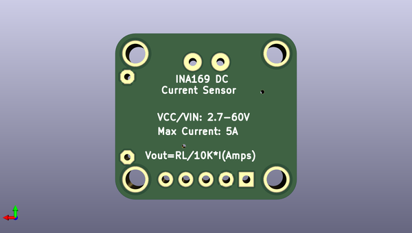

# adafruit_ina169_breakout_pcb
 
## summary 
* id: adafruit_adafruit_ina169_breakout_pcb_adafruit_ina169_curpowermonitor
* user: adafruit
* name: adafruit_ina169_breakout_pcb
* board: adafruit_ina169_curpowermonitor
* repo: https://github.com/adafruit/Adafruit-INA169-Breakout-PCB

* src_file_repo_sch: 
* src_file_repo_sch_link: https://github.com/adafruit/Adafruit-INA169-Breakout-PCB/tree/master/
* full details link: https://github.com/oomlout/oomlout_oomp_project_bot_v_2/tree/main/projects/adafruit_adafruit_ina169_breakout_pcb_adafruit_ina169_curpowermonitor/current_version/working  

## schematic  
  
[schematic (pdf)](working_schematic.pdf)  

## pcb  
 
  
  
  
[board (pdf)](working.pdf)  

## working_bom
| Id | Designator | Footprint | Quantity | Designation | Supplier and ref |  | None | 
| --- | --- | --- | --- | --- | --- | --- | --- | 
| 1 | U$7,U$8,U$10,U$9 | MOUNTINGHOLE_2.5_PLATED | 4 | MOUNTINGHOLE2.5 |  |  | [''] | 
| 2 | J1 | TERMBLOCK_1X2-3.5MM | 1 |  |  |  | [''] | 
| 3 | R1 | 0805-THM | 1 | 10K |  |  | [''] | 
| 4 | FID2,FID1 | FIDUCIAL_1MM | 2 | FIDUCIAL" |  |  | [''] | 
| 5 | U$11 | ADAFRUIT_3.5MM | 1 |  |  |  | [''] | 
| 6 | U1 | SOT23-5 | 1 | INA169 |  |  | [''] | 
| 7 | JP1 | 1X05_ROUND_70 | 1 |  |  |  | [''] | 
| 8 | RSHUNT0 | 2512 | 1 | 0.1/1% (PT2512FK-070R1L) |  |  | [''] | 
| 9 | C1 | 0805 | 1 | 0.1µF |  |  | [''] | 

## bom_schematic
| Ref | Qnty | Value | Cmp name | Footprint | Description | Vendor | DNP | 
| --- | --- | --- | --- | --- | --- | --- | --- | 
| C1 | 1 | 0.1µF | CAP_CERAMIC0805 | working:0805 |  |  |  | 
| FID1, FID2 | 2 | FIDUCIAL"" | FIDUCIAL{dblquote}{dblquote} | working:FIDUCIAL_1MM |  |  |  | 
| J1 | 1 | TERMBLOCK_1X2 | TERMBLOCK_1X2 | working:TERMBLOCK_1X2-3.5MM |  |  |  | 
| JP1 | 1 | HEADER-1X570MIL | HEADER-1X570MIL | working:1X05_ROUND_70 |  |  |  | 
| R1 | 1 | 10K | RESISTOR_DUAL | working:0805-THM |  |  |  | 
| RSHUNT0 | 1 | 0.1/1% (PT2512FK-070R1L) | RESISTOR2512 | working:2512 |  |  |  | 
| U1 | 1 | INA169 | INA169 | working:SOT23-5 |  |  |  | 
| U$7, U$8, U$9, U$10 | 4 | MOUNTINGHOLE2.5 | MOUNTINGHOLE2.5 | working:MOUNTINGHOLE_2.5_PLATED |  |  |  | 

## mounting_holes
| x | y | package | value | ref | size | 
| --- | --- | --- | --- | --- | --- | 
| 17.78 | 0.0 | MOUNTINGHOLE_2.5_PLATED | MOUNTINGHOLE2.5 | U$7 | m3 | 
| 0.0 | 0.0 | MOUNTINGHOLE_2.5_PLATED | MOUNTINGHOLE2.5 | U$8 | m3 | 
| 0.0 | 15.89 | MOUNTINGHOLE_2.5_PLATED | MOUNTINGHOLE2.5 | U$9 | m3 | 
| 17.78 | 15.89 | MOUNTINGHOLE_2.5_PLATED | MOUNTINGHOLE2.5 | U$10 | m3 | 

