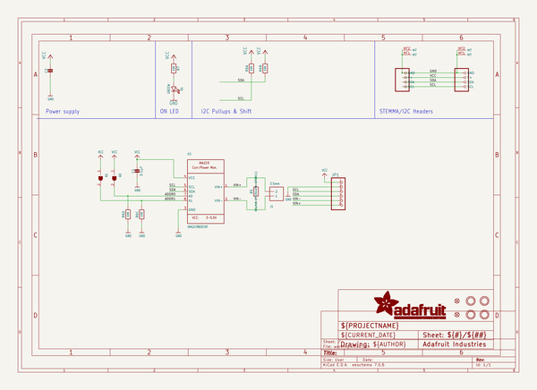
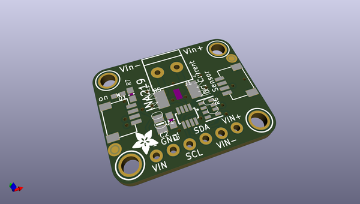
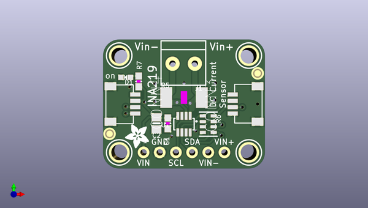
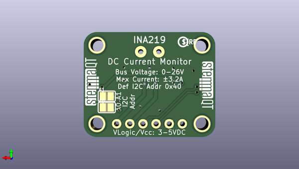

# adafruit_ina219_current_sensor_pcb
 
## summary 
* id: adafruit_adafruit_ina219_current_sensor_pcb_adafruit_ina219_curpowermonitor
* user: adafruit
* name: adafruit_ina219_current_sensor_pcb
* board: adafruit_ina219_curpowermonitor
* repo: https://github.com/adafruit/Adafruit-INA219-Current-Sensor-PCB

* src_file_repo_sch: 
* src_file_repo_sch_link: https://github.com/adafruit/Adafruit-INA219-Current-Sensor-PCB/tree/master/
* full details link: https://github.com/oomlout/oomlout_oomp_project_bot_v_2/tree/main/projects/adafruit_adafruit_ina219_current_sensor_pcb_adafruit_ina219_curpowermonitor/current_version/working  

## schematic  
  
[schematic (pdf)](working_schematic.pdf)  

## pcb  
 
  
  
  
[board (pdf)](working.pdf)  

## working_bom
| Id | Designator | Footprint | Quantity | Designation | Supplier and ref |  | None | 
| --- | --- | --- | --- | --- | --- | --- | --- | 
| 1 | C2 | 0805-NO | 1 | 10uF |  |  | [''] | 
| 2 | CONN3,CONN4 | JST_SH4 | 2 | STEMMA_I2C_QT |  |  | [''] | 
| 3 | R5 | 2512 | 1 | 0.1/1% (PT2512FK-070R1L) |  |  | [''] | 
| 4 | J1 | TERMBLOCK_1X2-3.5MM | 1 | 3.5mm |  |  | [''] | 
| 5 | U$20,U$27,U$25,U$21 | MOUNTINGHOLE_2.5_PLATED | 4 | MOUNTINGHOLE2.5 |  |  | [''] | 
| 6 | C1 | 0603-NO | 1 | 0.1µF |  |  | [''] | 
| 7 | FID3,FID4 | FIDUCIAL_1MM | 2 | FIDUCIAL_1MM |  |  | [''] | 
| 8 | JP1 | 1X06_ROUND_70 | 1 |  |  |  | [''] | 
| 9 | U1 | SOT23-8 | 1 | INA219BIDCNT |  |  | [''] | 
| 10 | R6 | RESPACK_4X0603 | 1 | 10K |  |  | [''] | 
| 11 | U$29 | ADAFRUIT_3.5MM | 1 |  |  |  | [''] | 
| 12 | R7 | 0603-NO | 1 | 10K |  |  | [''] | 
| 13 | D1 | CHIPLED_0603_NOOUTLINE | 1 | GREEN |  |  | [''] | 
| 14 | U$31,U$32 | STEMMAQT | 2 |  |  |  | [''] | 
| 15 | U$30 | PCBFEAT-REV-040 | 1 |  |  |  | [''] | 
| 16 | A1,A0 | SOLDERJUMPER_REFLOW_NOPASTE | 2 |  |  |  | [''] | 

## bom_schematic
| Ref | Qnty | Value | Cmp name | Footprint | Description | Vendor | DNP | 
| --- | --- | --- | --- | --- | --- | --- | --- | 
| A0, A1 | 2 | SOLDERJUMPERREFLOW_NOPASTE | SOLDERJUMPERREFLOW_NOPASTE | working:SOLDERJUMPER_REFLOW_NOPASTE |  |  |  | 
| C1 | 1 | 0.1µF | CAP_CERAMIC0603_NO | working:0603-NO |  |  |  | 
| C2 | 1 | 10uF | CAP_CERAMIC0805-NOOUTLINE | working:0805-NO |  |  |  | 
| CONN3, CONN4 | 2 | STEMMA_I2C_QT | STEMMA_I2C_QT | working:JST_SH4 |  |  |  | 
| D1 | 1 | GREEN | LED0603_NOOUTLINE | working:CHIPLED_0603_NOOUTLINE |  |  |  | 
| FID3, FID4 | 2 | FIDUCIAL_1MM | FIDUCIAL_1MM | working:FIDUCIAL_1MM |  |  |  | 
| J1 | 1 | 3.5mm | TERMBLOCK_1X2_3.5MM | working:TERMBLOCK_1X2-3.5MM |  |  |  | 
| JP1 | 1 | HEADER-1X670MIL | HEADER-1X670MIL | working:1X06_ROUND_70 |  |  |  | 
| R5 | 1 | 0.1/1% (PT2512FK-070R1L) | RESISTOR2512 | working:2512 |  |  |  | 
| R6 | 1 | 10K | RESISTOR_4PACK | working:RESPACK_4X0603 |  |  |  | 
| R7 | 1 | 10K | RESISTOR_0603_NOOUT | working:0603-NO |  |  |  | 
| U1 | 1 | INA219BIDCNT | INA219 | working:SOT23-8 |  |  |  | 
| U$20, U$21, U$25, U$27 | 4 | MOUNTINGHOLE2.5 | MOUNTINGHOLE2.5 | working:MOUNTINGHOLE_2.5_PLATED |  |  |  | 

## mounting_holes
| x | y | package | value | ref | size | 
| --- | --- | --- | --- | --- | --- | 
| 0.0 | 15.239999999999995 | MOUNTINGHOLE_2.5_PLATED | MOUNTINGHOLE2.5 | U$20 | m3 | 
| 20.319999999999993 | 15.239999999999995 | MOUNTINGHOLE_2.5_PLATED | MOUNTINGHOLE2.5 | U$21 | m3 | 
| 0.0 | 0.0 | MOUNTINGHOLE_2.5_PLATED | MOUNTINGHOLE2.5 | U$25 | m3 | 
| 20.319999999999993 | 0.0 | MOUNTINGHOLE_2.5_PLATED | MOUNTINGHOLE2.5 | U$27 | m3 | 

