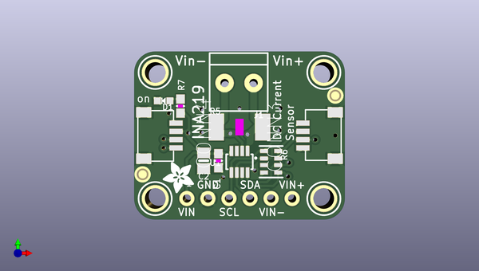
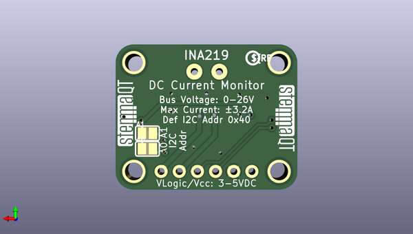

# adafruit_ina219_current_sensor_pcb
 
## summary 
* id: adafruit_adafruit_ina219_current_sensor_pcb_adafruit_ina219_stemma_qt
* user: adafruit
* name: adafruit_ina219_current_sensor_pcb
* board: adafruit_ina219_stemma_qt
* repo: https://github.com/adafruit/Adafruit-INA219-Current-Sensor-PCB

* src_file_repo_sch: 
* src_file_repo_sch_link: https://github.com/adafruit/Adafruit-INA219-Current-Sensor-PCB/tree/master/
* full details link: https://github.com/oomlout/oomlout_oomp_project_bot_v_2/tree/main/projects/adafruit_adafruit_ina219_current_sensor_pcb_adafruit_ina219_stemma_qt/current_version/working  

## pcb  
 
  
  
  
[board (pdf)](working.pdf)  

## working_bom
| Id | Designator | Footprint | Quantity | Designation | Supplier and ref |  | None | 
| --- | --- | --- | --- | --- | --- | --- | --- | 
| 1 | U$21,U$27,U$25,U$20 | MOUNTINGHOLE_2.5_PLATED | 4 | MOUNTINGHOLE2.5 |  |  | [''] | 
| 2 | JP1 | 1X06_ROUND_70 | 1 |  |  |  | [''] | 
| 3 | C1 | 0603-NO | 1 | 0.1µF |  |  | [''] | 
| 4 | R5 | 2512 | 1 | 0.1/1% (PT2512FK-070R1L) |  |  | [''] | 
| 5 | FID4,FID3 | FIDUCIAL_1MM | 2 | FIDUCIAL_1MM |  |  | [''] | 
| 6 | R6 | RESPACK_4X0603 | 1 | 10K |  |  | [''] | 
| 7 | CONN4,CONN3 | JST_SH4 | 2 | STEMMA_I2C_QT |  |  | [''] | 
| 8 | U1 | SOT23-8 | 1 | INA219BIDCNT |  |  | [''] | 
| 9 | C2 | 0805-NO | 1 | 10uF |  |  | [''] | 
| 10 | U$29 | ADAFRUIT_3.5MM | 1 |  |  |  | [''] | 
| 11 | R7 | 0603-NO | 1 | 10K |  |  | [''] | 
| 12 | J1 | TERMBLOCK_1X2-3.5MM | 1 | 3.5mm |  |  | [''] | 
| 13 | D1 | CHIPLED_0603_NOOUTLINE | 1 | GREEN |  |  | [''] | 
| 14 | U$31,U$32 | STEMMAQT | 2 |  |  |  | [''] | 
| 15 | U$30 | PCBFEAT-REV-040 | 1 |  |  |  | [''] | 
| 16 | A1,A0 | SOLDERJUMPER_REFLOW_NOPASTE | 2 |  |  |  | [''] | 

## mounting_holes
| x | y | package | value | ref | size | 
| --- | --- | --- | --- | --- | --- | 
| 0.0 | 15.24 | MOUNTINGHOLE_2.5_PLATED | MOUNTINGHOLE2.5 | U$20 | m3 | 
| 20.32 | 15.24 | MOUNTINGHOLE_2.5_PLATED | MOUNTINGHOLE2.5 | U$21 | m3 | 
| 0.0 | 0.0 | MOUNTINGHOLE_2.5_PLATED | MOUNTINGHOLE2.5 | U$25 | m3 | 
| 20.32 | 0.0 | MOUNTINGHOLE_2.5_PLATED | MOUNTINGHOLE2.5 | U$27 | m3 | 

