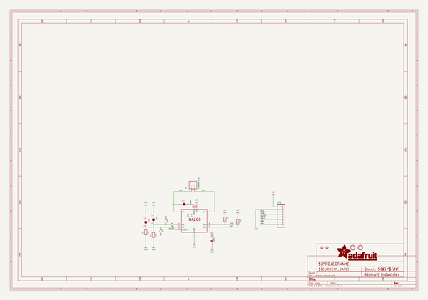
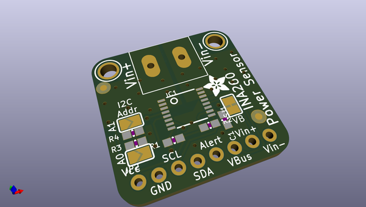
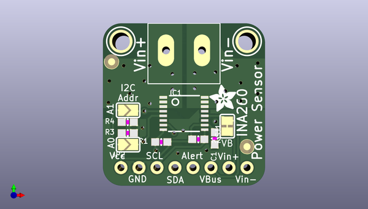
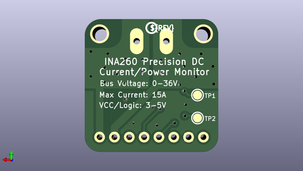

# adafruit_ina260_pcb
 
## summary 
* id: adafruit_adafruit_ina260_pcb_adafruit_ina260
* user: adafruit
* name: adafruit_ina260_pcb
* board: adafruit_ina260
* repo: https://github.com/adafruit/Adafruit-INA260-PCB

* src_file_repo_sch: 
* src_file_repo_sch_link: https://github.com/adafruit/Adafruit-INA260-PCB/tree/master/
* full details link: https://github.com/oomlout/oomlout_oomp_project_bot_v_2/tree/main/projects/adafruit_adafruit_ina260_pcb_adafruit_ina260/current_version/working  

## schematic  
  
[schematic (pdf)](working_schematic.pdf) 

## pcb  
 
  
  
  
[board (pdf)](working.pdf)  

## working_bom
| Id | Designator | Footprint | Quantity | Designation | Supplier and ref |  | None | 
| --- | --- | --- | --- | --- | --- | --- | --- | 
| 1 | JP2 | 1X08_ROUND_70 | 1 |  |  |  | [''] | 
| 2 | R4,R3,R1,R2 | 0603-NO | 4 | 10K |  |  | [''] | 
| 3 | U$1 | ADAFRUIT_3.5MM | 1 |  |  |  | [''] | 
| 4 | SJ4,SJ3 | SOLDERJUMPER_ARROW_NOPASTE | 2 |  |  |  | [''] | 
| 5 | X1 | TERMBLOCK_508_1X2 | 1 | 5.08mm Term |  |  | [''] | 
| 6 | FID3,FID4 | MICROBUILDER_FIDUCIAL_1MM | 2 | MICROBUILDER_FIDUCIAL" |  |  | [''] | 
| 7 | C1 | 0603-NO | 1 | 1uF |  |  | [''] | 
| 8 | U$7,U$8 | MOUNTINGHOLE_2.5_PLATED | 2 | MOUNTINGHOLE2.5 |  |  | [''] | 
| 9 | SJ1 | SOLDERJUMPER_CLOSEDWIRE | 1 |  |  |  | [''] | 
| 10 | IC1 | TSSOP16 | 1 | INA260 |  |  | [''] | 
| 11 | TP1,TP2 | TESTPOINT_ROUND_1.5MM | 2 |  |  |  | [''] | 
| 12 | U$6 | PCBFEAT-REV-040 | 1 |  |  |  | [''] | 

## bom_schematic
| Ref | Qnty | Value | Cmp name | Footprint | Description | Vendor | DNP | 
| --- | --- | --- | --- | --- | --- | --- | --- | 
| C1 | 1 | 1uF | CAP_CERAMIC0603_NO | working:0603-NO |  |  |  | 
| FID3, FID4 | 2 | MICROBUILDER_FIDUCIAL"" | MICROBUILDER_FIDUCIAL{dblquote}{dblquote} | working:MICROBUILDER_FIDUCIAL_1MM |  |  |  | 
| IC1 | 1 | INA260 | INA260 | working:TSSOP16 |  |  |  | 
| JP2 | 1 | HEADER-1X870MIL | HEADER-1X870MIL | working:1X08_ROUND_70 |  |  |  | 
| R1, R2, R3, R4 | 4 | 10K | RESISTOR_0603_NOOUT | working:0603-NO |  |  |  | 
| SJ1 | 1 | SOLDERJUMPER_CLOSED | SOLDERJUMPER_CLOSED | working:SOLDERJUMPER_CLOSEDWIRE |  |  |  | 
| SJ3, SJ4 | 2 | SOLDERJUMPER | SOLDERJUMPER | working:SOLDERJUMPER_ARROW_NOPASTE |  |  |  | 
| TP1, TP2 | 2 | TESTPOINTROUND1.5MM | TESTPOINTROUND1.5MM | working:TESTPOINT_ROUND_1.5MM |  |  |  | 
| U$7, U$8 | 2 | MOUNTINGHOLE2.5 | MOUNTINGHOLE2.5 | working:MOUNTINGHOLE_2.5_PLATED |  |  |  | 
| X1 | 1 | 5.08mm Term | TERMBLOCK_1X2_5.08MM | working:TERMBLOCK_508_1X2 |  |  |  | 

## mounting_holes
| x | y | package | value | ref | size | 
| --- | --- | --- | --- | --- | --- | 
| 17.78 | 0.0 | MOUNTINGHOLE_2.5_PLATED | MOUNTINGHOLE2.5 | U$7 | m3 | 
| 0.0 | 0.0 | MOUNTINGHOLE_2.5_PLATED | MOUNTINGHOLE2.5 | U$8 | m3 | 

