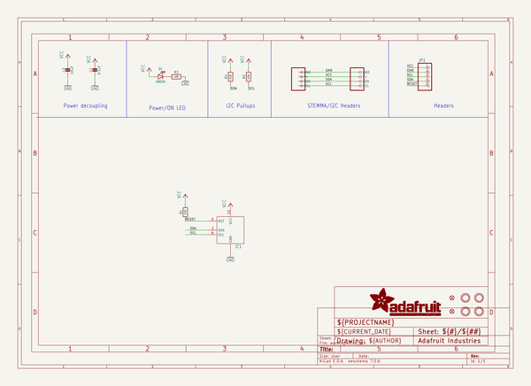
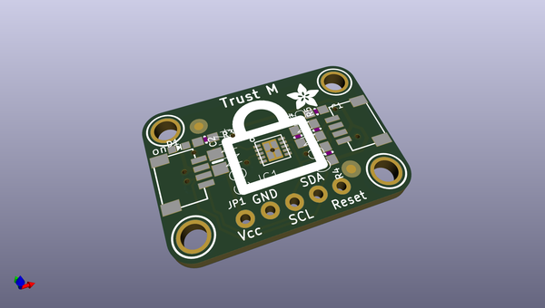
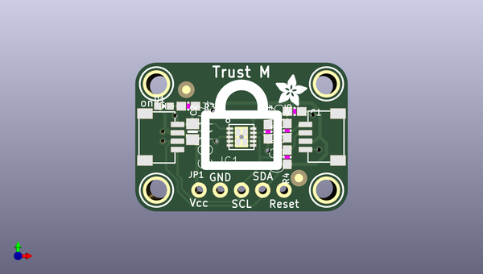
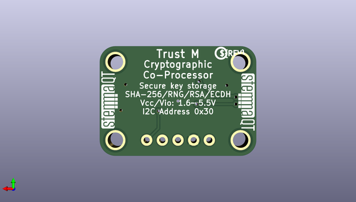

# adafruit_infineon_trust_m_pcb
 
## summary 
* id: adafruit_adafruit_infineon_trust_m_pcb_adafruit_infineon_trust_m
* user: adafruit
* name: adafruit_infineon_trust_m_pcb
* board: adafruit_infineon_trust_m
* repo: https://github.com/adafruit/Adafruit-Infineon-Trust-M-PCB

* src_file_repo_sch: 
* src_file_repo_sch_link: https://github.com/adafruit/Adafruit-Infineon-Trust-M-PCB/tree/main/
* full details link: https://github.com/oomlout/oomlout_oomp_project_bot_v_2/tree/main/projects/adafruit_adafruit_infineon_trust_m_pcb_adafruit_infineon_trust_m/current_version/working  

## schematic  
  
[schematic (pdf)](working_schematic.pdf) 

## pcb  
 
  
  
  
[board (pdf)](working.pdf)  

## working_bom
| Id | Designator | Footprint | Quantity | Designation | Supplier and ref |  | None | 
| --- | --- | --- | --- | --- | --- | --- | --- | 
| 1 | U$15,U$12,U$14,U$11 | MOUNTINGHOLE_2.5_PLATED | 4 | MOUNTINGHOLE2.5 |  |  | [''] | 
| 2 | C1 | 0603-NO | 1 | 0.1uF |  |  | [''] | 
| 3 | R4,R1,R5,R3 | 0603-NO | 4 | 10K |  |  | [''] | 
| 4 | CONN3,CONN4 | JST_SH4 | 2 | STEMMA_I2C_QT |  |  | [''] | 
| 5 | C2 | 0805-NO | 1 | 10uF |  |  | [''] | 
| 6 | U$17 | ADAFRUIT_3.5MM | 1 |  |  |  | [''] | 
| 7 | FID4,FID3 | FIDUCIAL_1MM | 2 | FIDUCIAL_1MM |  |  | [''] | 
| 8 | D1 | CHIPLED_0603_NOOUTLINE | 1 | GREEN |  |  | [''] | 
| 9 | JP1 | 1X05_ROUND_70 | 1 |  |  |  | [''] | 
| 10 | IC1 | PG-USON10-10-2 | 1 |  |  |  | [''] | 
| 11 | U$19,U$20 | STEMMAQT | 2 |  |  |  | [''] | 
| 12 | U$18 | PCBFEAT-REV-040 | 1 |  |  |  | [''] | 

## bom_schematic
| Ref | Qnty | Value | Cmp name | Footprint | Description | Vendor | DNP | 
| --- | --- | --- | --- | --- | --- | --- | --- | 
| C1 | 1 | 0.1uF | CAP_CERAMIC0603_NO | working:0603-NO |  |  |  | 
| C2 | 1 | 10uF | CAP_CERAMIC0805-NOOUTLINE | working:0805-NO |  |  |  | 
| CONN3, CONN4 | 2 | STEMMA_I2C_QT | STEMMA_I2C_QT | working:JST_SH4 |  |  |  | 
| D1 | 1 | GREEN | LED0603_NOOUTLINE | working:CHIPLED_0603_NOOUTLINE |  |  |  | 
| FID3, FID4 | 2 | FIDUCIAL_1MM | FIDUCIAL_1MM | working:FIDUCIAL_1MM |  |  |  | 
| IC1 | 1 | OPTIGA_TRUST_X | OPTIGA_TRUST_X | working:PG-USON10-10-2 |  |  |  | 
| JP1 | 1 | HEADER-1X570MIL | HEADER-1X570MIL | working:1X05_ROUND_70 |  |  |  | 
| R1, R3, R4, R5 | 4 | 10K | RESISTOR_0603_NOOUT | working:0603-NO |  |  |  | 
| U$11, U$12, U$14, U$15 | 4 | MOUNTINGHOLE2.5 | MOUNTINGHOLE2.5 | working:MOUNTINGHOLE_2.5_PLATED |  |  |  | 

## mounting_holes
| x | y | package | value | ref | size | 
| --- | --- | --- | --- | --- | --- | 
| 0.0 | 12.7 | MOUNTINGHOLE_2.5_PLATED | MOUNTINGHOLE2.5 | U$11 | m3 | 
| 20.32 | 12.7 | MOUNTINGHOLE_2.5_PLATED | MOUNTINGHOLE2.5 | U$12 | m3 | 
| 0.0 | 0.0 | MOUNTINGHOLE_2.5_PLATED | MOUNTINGHOLE2.5 | U$14 | m3 | 
| 20.32 | 0.0 | MOUNTINGHOLE_2.5_PLATED | MOUNTINGHOLE2.5 | U$15 | m3 | 

