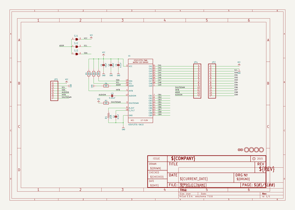
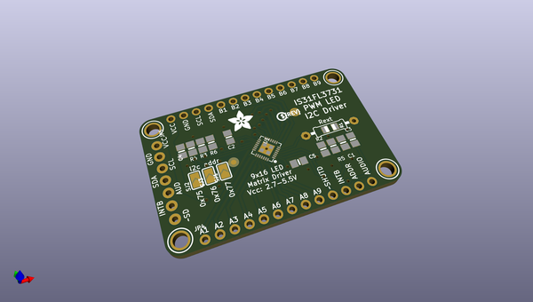
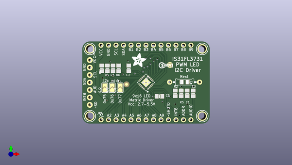
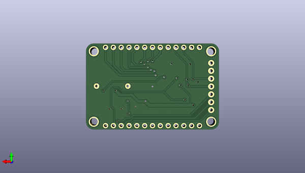

# adafruit_is31fl3731_charlieplex_led_breakout_pcb
 
## summary 
* id: adafruit_adafruit_is31fl3731_charlieplex_led_breakout_pcb_adafruit_is31fl3731_charlieplex_grid
* user: adafruit
* name: adafruit_is31fl3731_charlieplex_led_breakout_pcb
* board: adafruit_is31fl3731_charlieplex_grid
* repo: https://github.com/adafruit/Adafruit-IS31FL3731-CharliePlex-LED-Breakout-PCB

* src_file_repo_sch: 
* src_file_repo_sch_link: https://github.com/adafruit/Adafruit-IS31FL3731-CharliePlex-LED-Breakout-PCB/tree/master/
* full details link: https://github.com/oomlout/oomlout_oomp_project_bot_v_2/tree/main/projects/adafruit_adafruit_is31fl3731_charlieplex_led_breakout_pcb_adafruit_is31fl3731_charlieplex_grid/current_version/working  

## schematic  
  
[schematic (pdf)](working_schematic.pdf) 

## pcb  
 
  
  
  
[board (pdf)](working.pdf)  

## working_bom
| Id | Designator | Footprint | Quantity | Designation | Supplier and ref |  | None | 
| --- | --- | --- | --- | --- | --- | --- | --- | 
| 1 | C1,C4 | 0805-NO | 2 | 10uF |  |  | [''] | 
| 2 | R3,R6,R4,R2,R5 | 0805-NO | 5 | 20K |  |  | [''] | 
| 3 | R1 | 0805-THM | 1 | 20K |  |  | [''] | 
| 4 | SJ1,SJ3,SJ2 | SOLDERJUMPER_ARROW_NOPASTE | 3 |  |  |  | [''] | 
| 5 | C2,C5 | 0805-NO | 2 | 0.1uF |  |  | [''] | 
| 6 | C3 | 0805-NO | 1 | 0.22uF |  |  | [''] | 
| 7 | U$3,U$5,U$6,U$4 | MOUNTINGHOLE_2.5_PLATED | 4 | MOUNTINGHOLE2.5 |  |  | [''] | 
| 8 | JP2,JP4 | 1X13_ROUND_70 | 2 |  |  |  | [''] | 
| 9 | U1 | QFN28_4MM_0.4MM | 1 | IS31FL3731-SALS2 |  |  | [''] | 
| 10 | JP5 | 1X07_ROUND_76 | 1 |  |  |  | [''] | 
| 11 | U$11 | PCBFEAT-REV-040 | 1 |  |  |  | [''] | 
| 12 | U$10 | ADAFRUIT_5MM | 1 |  |  |  | [''] | 
| 13 | FID2,FID1 | FIDUCIAL_1MM | 2 | FIDUCIAL" |  |  | [''] | 

## bom_schematic
| Ref | Qnty | Value | Cmp name | Footprint | Description | Vendor | DNP | 
| --- | --- | --- | --- | --- | --- | --- | --- | 
| C1, C4 | 2 | 10uF | CAP_CERAMIC0805-NOOUTLINE | working:0805-NO |  |  |  | 
| C2, C5 | 2 | 0.1uF | CAP_CERAMIC0805-NOOUTLINE | working:0805-NO |  |  |  | 
| C3 | 1 | 0.22uF | CAP_CERAMIC0805-NOOUTLINE | working:0805-NO |  |  |  | 
| FID1, FID2 | 2 | FIDUCIAL"" | FIDUCIAL{dblquote}{dblquote} | working:FIDUCIAL_1MM |  |  |  | 
| JP2, JP4 | 2 | HEADER-1X13 | HEADER-1X13 | working:1X13_ROUND_70 |  |  |  | 
| JP5 | 1 | HEADER-1X7THICKER | HEADER-1X7THICKER | working:1X07_ROUND_76 |  |  |  | 
| R1 | 1 | 20K | FLIPFLOP-RES | working:0805-THM |  |  |  | 
| R2, R3, R4, R5, R6 | 5 | 20K | RESISTOR0805_NOOUTLINE | working:0805-NO |  |  |  | 
| SJ1, SJ2, SJ3 | 3 | SOLDERJUMPER | SOLDERJUMPER | working:SOLDERJUMPER_ARROW_NOPASTE |  |  |  | 
| U1 | 1 | IS31FL3731-SALS2 | IS31FL3731QFN | working:QFN28_4MM_0.4MM |  |  |  | 
| U$3, U$4, U$5, U$6 | 4 | MOUNTINGHOLE2.5 | MOUNTINGHOLE2.5 | working:MOUNTINGHOLE_2.5_PLATED |  |  |  | 

## mounting_holes
| x | y | package | value | ref | size | 
| --- | --- | --- | --- | --- | --- | 
| 0.0 | 0.0 | MOUNTINGHOLE_2.5_PLATED | MOUNTINGHOLE2.5 | U$3 | m3 | 
| 38.1 | 0.0 | MOUNTINGHOLE_2.5_PLATED | MOUNTINGHOLE2.5 | U$4 | m3 | 
| 0.0 | 22.86 | MOUNTINGHOLE_2.5_PLATED | MOUNTINGHOLE2.5 | U$5 | m3 | 
| 38.1 | 22.86 | MOUNTINGHOLE_2.5_PLATED | MOUNTINGHOLE2.5 | U$6 | m3 | 

