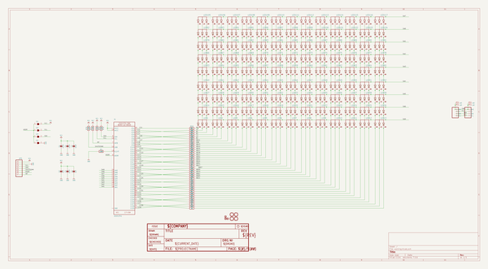
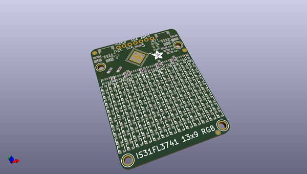
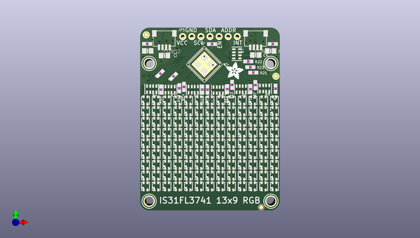
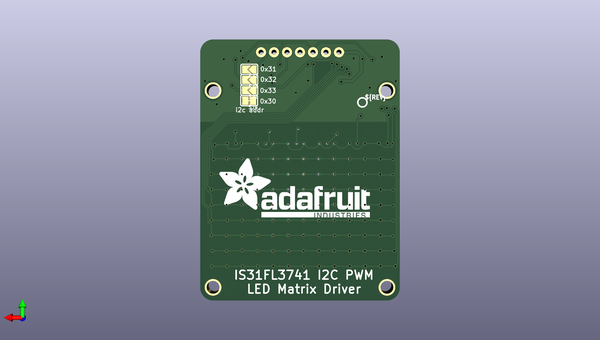

# adafruit_is31fl3741_pcb
 
## summary 
* id: adafruit_adafruit_is31fl3741_pcb_adafruit_is31fl3741_matrix
* user: adafruit
* name: adafruit_is31fl3741_pcb
* board: adafruit_is31fl3741_matrix
* repo: https://github.com/adafruit/Adafruit-IS31FL3741-PCB

* src_file_repo_sch: 
* src_file_repo_sch_link: https://github.com/adafruit/Adafruit-IS31FL3741-PCB/tree/main/
* full details link: https://github.com/oomlout/oomlout_oomp_project_bot_v_2/tree/main/projects/adafruit_adafruit_is31fl3741_pcb_adafruit_is31fl3741_matrix/current_version/working  

## schematic  
  
[schematic (pdf)](working_schematic.pdf) 

## pcb  
 
  
  
  
[board (pdf)](working.pdf)  

## working_bom
| Id | Designator | Footprint | Quantity | Designation | Supplier and ref |  | None | 
| --- | --- | --- | --- | --- | --- | --- | --- | 
| 1 | R3,R5,R4,R8,R6,R2 | RESPACK_4X0603 | 6 | 22 |  |  | [''] | 
| 2 | LED19,LED42,LED82,LED111,LED49,LED40,LED66,LED69,LED11,LED24,LED57,LED33,LED100,LED54,LED76,LED108,LED62,LED109,LED107,LED53,LED18,LED1,LED36,LED101,LED34,LED60,LED59,LED71,LED85,LED91,LED7,LED68,LED41,LED20,LED31,LED12,LED14,LED38,LED78,LED61,LED6,LED21,LED90,LED22,LED67,LED46,LED17,LED84,LED25,LED64,LED29,LED50,LED32,LED98,LED35,LED113,LED55,LED45,LED37,LED99,LED30,LED65,LED102,LED43,LED3,LED28,LED4,LED8,LED116,LED83,LED105,LED89,LED16,LED114,LED48,LED52,LED70,LED93,LED72,LED80,LED110,LED79,LED15,LED92,LED77,LED74,LED73,LED87,LED13,LED117,LED58,LED86,LED51,LED26,LED44,LED39,LED56,LED97,LED94,LED96,LED106,LED5,LED104,LED75,LED112,LED81,LED88,LED103,LED63,LED2,LED95,LED115,LED10,LED47,LED23,LED9,LED27 | RGBLED_2121 | 117 | RGBLED_CA_2121 |  |  | [''] | 
| 3 | R14,R21,R16,R10,R19,R12,R18,R20,R17,R22,R13,R11,R15 | 0603-NO | 13 | 51 |  |  | [''] | 
| 4 | R1 | 0603-NO | 1 | 2.2K |  |  | [''] | 
| 5 | R9,R23 | 0603-NO | 2 | 22 |  |  | [''] | 
| 6 | FID1,FID2,FID3 | FIDUCIAL_1MM | 3 | FIDUCIAL_1MM |  |  | [''] | 
| 7 | U$4,U$3,U$5,U$6 | MOUNTINGHOLE_2.5_PLATED | 4 | MOUNTINGHOLE2.5 |  |  | [''] | 
| 8 | U$10 | ADAFRUIT_5MM | 1 |  |  |  | [''] | 
| 9 | C4,C5,C1,C3 | 0805-NO | 4 | 10uF |  |  | [''] | 
| 10 | CONN2,CONN1 | JST_SH4 | 2 | STEMMA_I2C_QT |  |  | [''] | 
| 11 | JP5 | 1X07_ROUND_76 | 1 |  |  |  | [''] | 
| 12 | X1 | QFN60_7MM | 1 | IS31FL3741 |  |  | [''] | 
| 13 | C6,C2 | 0603-NO | 2 | 1uF |  |  | [''] | 
| 14 | R7 | RESPACK_4X0603 | 1 | 4.7K |  |  | [''] | 
| 15 | SJ2,SJ1,SJ3 | SOLDERJUMPER_ARROW_NOPASTE | 3 |  |  |  | [''] | 
| 16 | SJ4 | SOLDERJUMPER_CLOSEDWIRE | 1 |  |  |  | [''] | 
| 17 | U$11 | PCBFEAT-REV-040 | 1 |  |  |  | [''] | 
| 18 | U$16 | ADAFRUIT_TEXT_30MM | 1 |  |  |  | [''] | 

## bom_schematic
| Ref | Qnty | Value | Cmp name | Footprint | Description | Vendor | DNP | 
| --- | --- | --- | --- | --- | --- | --- | --- | 
| C1, C3, C4, C5 | 4 | 10uF | CAP_CERAMIC0805-NOOUTLINE | working:0805-NO |  |  |  | 
| C2, C6 | 2 | 1uF | CAP_CERAMIC0603_NO | working:0603-NO |  |  |  | 
| CONN1, CONN2 | 2 | STEMMA_I2C_QT | STEMMA_I2C_QT | working:JST_SH4 |  |  |  | 
| FID1, FID2, FID3 | 3 | FIDUCIAL_1MM | FIDUCIAL_1MM | working:FIDUCIAL_1MM |  |  |  | 
| JP5 | 1 | HEADER-1X7THICKER | HEADER-1X7THICKER | working:1X07_ROUND_76 |  |  |  | 
| LED1, LED2, LED3, LED4, LED5, LED6, LED7, LED8, LED9, LED10, LED11, LED12, LED13, LED14, LED15, LED16, LED17, LED18, LED19, LED20, LED21, LED22, LED23, LED24, LED25, LED26, LED27, LED28, LED29, LED30, LED31, LED32, LED33, LED34, LED35, LED36, LED37, LED38, LED39, LED40, LED41, LED42, LED43, LED44, LED45, LED46, LED47, LED48, LED49, LED50, LED51, LED52, LED53, LED54, LED55, LED56, LED57, LED58, LED59, LED60, LED61, LED62, LED63, LED64, LED65, LED66, LED67, LED68, LED69, LED70, LED71, LED72, LED73, LED74, LED75, LED76, LED77, LED78, LED79, LED80, LED81, LED82, LED83, LED84, LED85, LED86, LED87, LED88, LED89, LED90, LED91, LED92, LED93, LED94, LED95, LED96, LED97, LED98, LED99, LED100, LED101, LED102, LED103, LED104, LED105, LED106, LED107, LED108, LED109, LED110, LED111, LED112, LED113, LED114, LED115, LED116, LED117 | 117 | RGBLED_CA_2121 | RGBLED_CA_2121 | working:RGBLED_2121 |  |  |  | 
| R1 | 1 | 2.2K | RESISTOR_0603_NOOUT | working:0603-NO |  |  |  | 
| R2, R3, R4, R5, R6, R8 | 6 | 22 | RESISTOR_4PACK | working:RESPACK_4X0603 |  |  |  | 
| R7 | 1 | 4.7K | RESISTOR_4PACK | working:RESPACK_4X0603 |  |  |  | 
| R9, R23 | 2 | 22 | RESISTOR_0603_NOOUT | working:0603-NO |  |  |  | 
| R10, R11, R12, R13, R14, R15, R16, R17, R18, R19, R20, R21, R22 | 13 | 51 | RESISTOR_0603_NOOUT | working:0603-NO |  |  |  | 
| SJ1, SJ2, SJ3 | 3 | SOLDERJUMPER | SOLDERJUMPER | working:SOLDERJUMPER_ARROW_NOPASTE |  |  |  | 
| SJ4 | 1 | SOLDERJUMPERCLOSED | SOLDERJUMPERCLOSED | working:SOLDERJUMPER_CLOSEDWIRE |  |  |  | 
| U$3, U$4, U$5, U$6 | 4 | MOUNTINGHOLE2.5 | MOUNTINGHOLE2.5 | working:MOUNTINGHOLE_2.5_PLATED |  |  |  | 
| X1 | 1 | IS31FL3741 | IS31FL3741 | working:QFN60_7MM |  |  |  | 

## mounting_holes
| x | y | package | value | ref | size | 
| --- | --- | --- | --- | --- | --- | 
| 0.0 | 0.0 | MOUNTINGHOLE_ | MOUNTINGHOLE2. | U$3 | m3 | 
| 34.0 | 0.0 | MOUNTINGHOLE_ | MOUNTINGHOLE2. | U$4 | m3 | 
| 0.0 | 38.5 | MOUNTINGHOLE_ | MOUNTINGHOLE2. | U$5 | m3 | 
| 34.0 | 38.5 | MOUNTINGHOLE_ | MOUNTINGHOLE2. | U$6 | m3 | 

