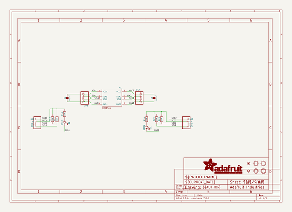
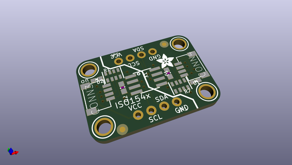
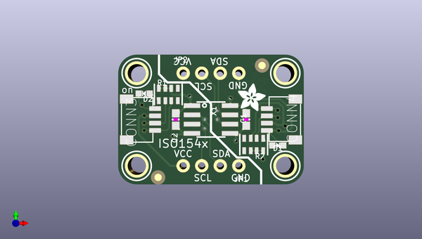
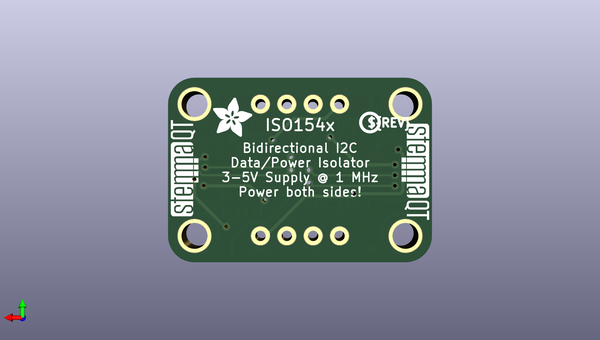

# adafruit_iso1540_pcb
 
## summary 
* id: adafruit_adafruit_iso1540_pcb_adafruit_iso1540
* user: adafruit
* name: adafruit_iso1540_pcb
* board: adafruit_iso1540
* repo: https://github.com/adafruit/Adafruit-ISO1540-PCB

* src_file_repo_sch: 
* src_file_repo_sch_link: https://github.com/adafruit/Adafruit-ISO1540-PCB/tree/main/
* full details link: https://github.com/oomlout/oomlout_oomp_project_bot_v_2/tree/main/projects/adafruit_adafruit_iso1540_pcb_adafruit_iso1540/current_version/working  

## schematic  
  
[schematic (pdf)](working_schematic.pdf) 

## pcb  
 
  
  
  
[board (pdf)](working.pdf)  

## working_bom
| Id | Designator | Footprint | Quantity | Designation | Supplier and ref |  | None | 
| --- | --- | --- | --- | --- | --- | --- | --- | 
| 1 | C2,C1 | 0603-NO | 2 | 0.1uF |  |  | [''] | 
| 2 | X1 | SOIC8_150MIL | 1 | ISO154X |  |  | [''] | 
| 3 | CONN4,CONN3 | JST_SH4 | 2 | STEMMA_I2C_QT |  |  | [''] | 
| 4 | R2,R1 | RESPACK_4X0603 | 2 | 10K |  |  | [''] | 
| 5 | D1,D2 | CHIPLED_0603_NOOUTLINE | 2 | GREEN |  |  | [''] | 
| 6 | FID3,FID4 | FIDUCIAL_1MM | 2 | FIDUCIAL_1MM |  |  | [''] | 
| 7 | U$22,U$2 | ADAFRUIT_3.5MM | 2 |  |  |  | [''] | 
| 8 | U$1,U$17,U$19,U$21 | MOUNTINGHOLE_2.5_PLATED | 4 | MOUNTINGHOLE2.5 |  |  | [''] | 
| 9 | JP1,JP2 | 1X04_ROUND | 2 |  |  |  | [''] | 
| 10 | U$31,U$30 | STEMMAQT | 2 |  |  |  | [''] | 
| 11 | U$25 | PCBFEAT-REV-040 | 1 |  |  |  | [''] | 

## bom_schematic
| Ref | Qnty | Value | Cmp name | Footprint | Description | Vendor | DNP | 
| --- | --- | --- | --- | --- | --- | --- | --- | 
| C1, C2 | 2 | 0.1uF | CAP_CERAMIC0603_NO | working:0603-NO |  |  |  | 
| CONN3, CONN4 | 2 | STEMMA_I2C_QT | STEMMA_I2C_QT | working:JST_SH4 |  |  |  | 
| D1, D2 | 2 | GREEN | LED0603_NOOUTLINE | working:CHIPLED_0603_NOOUTLINE |  |  |  | 
| FID3, FID4 | 2 | FIDUCIAL_1MM | FIDUCIAL_1MM | working:FIDUCIAL_1MM |  |  |  | 
| JP1, JP2 | 2 | HEADER-1X4ROUND | HEADER-1X4ROUND | working:1X04_ROUND |  |  |  | 
| R1, R2 | 2 | 10K | RESISTOR_4PACK | working:RESPACK_4X0603 |  |  |  | 
| U$1, U$17, U$19, U$21 | 4 | MOUNTINGHOLE2.5 | MOUNTINGHOLE2.5 | working:MOUNTINGHOLE_2.5_PLATED |  |  |  | 
| X1 | 1 | ISO154X | ISO154X | working:SOIC8_150MIL |  |  |  | 

## mounting_holes
| x | y | package | value | ref | size | 
| --- | --- | --- | --- | --- | --- | 
| 0.0 | 12.7 | MOUNTINGHOLE_2.5_PLATED | MOUNTINGHOLE2.5 | U$1 | m3 | 
| 20.32 | 12.7 | MOUNTINGHOLE_2.5_PLATED | MOUNTINGHOLE2.5 | U$17 | m3 | 
| 0.0 | 0.0 | MOUNTINGHOLE_2.5_PLATED | MOUNTINGHOLE2.5 | U$19 | m3 | 
| 20.32 | 0.0 | MOUNTINGHOLE_2.5_PLATED | MOUNTINGHOLE2.5 | U$21 | m3 | 

