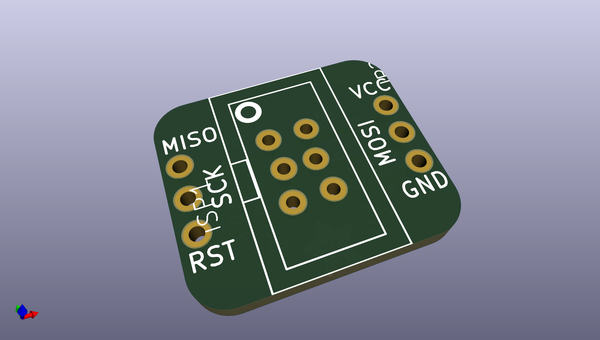

# adafruit_isp_swd_and_jtag_breakout_pcbs
 
## summary 
* id: adafruit_adafruit_isp_swd_and_jtag_breakout_pcbs_adafruit_6_isp_avr
* user: adafruit
* name: adafruit_isp_swd_and_jtag_breakout_pcbs
* board: adafruit_6_isp_avr
* repo: https://github.com/adafruit/Adafruit-ISP-SWD-and-JTAG-Breakout-PCBs

* src_file_repo_sch: 
* src_file_repo_sch_link: https://github.com/adafruit/Adafruit-ISP-SWD-and-JTAG-Breakout-PCBs/tree/master/
* full details link: https://github.com/oomlout/oomlout_oomp_project_bot_v_2/tree/main/projects/adafruit_adafruit_isp_swd_and_jtag_breakout_pcbs_adafruit_6_isp_avr/current_version/working  

## schematic  
  
[schematic (pdf)](working_schematic.pdf)  

## pcb  
 
  
  
  
[board (pdf)](working.pdf)  

## working_bom
| Id | Designator | Footprint | Quantity | Designation | Supplier and ref |  | None | 
| --- | --- | --- | --- | --- | --- | --- | --- | 
| 1 | JP1,JP2 | 1X03-CLEANBIG | 2 |  |  |  | [''] | 
| 2 | ISP1 | AVRISP-BOX | 1 | AVRISP-BOX |  |  | [''] | 
| 3 | U$1 | ADAFRUIT_3.5MM | 1 |  |  |  | [''] | 

## bom_schematic
| Ref | Qnty | Value | Cmp name | Footprint | Description | Vendor | DNP | 
| --- | --- | --- | --- | --- | --- | --- | --- | 
| ISP1 | 1 | AVRISP-BOX | AVRISP-BOX | working:AVRISP-BOX |  |  |  | 
| JP1, JP2 | 2 | PINHD-1X3CB | PINHD-1X3CB | working:1X03-CLEANBIG |  |  |  | 

