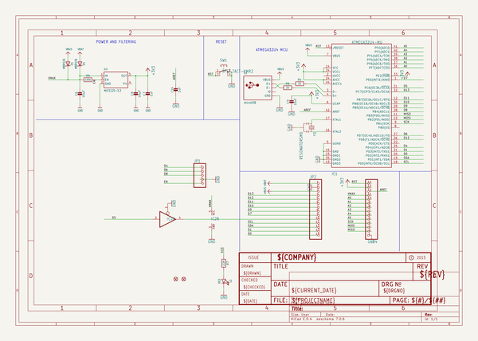
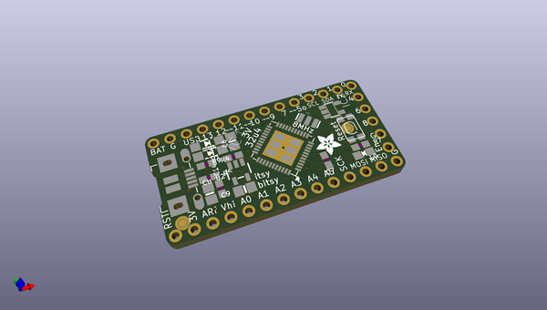
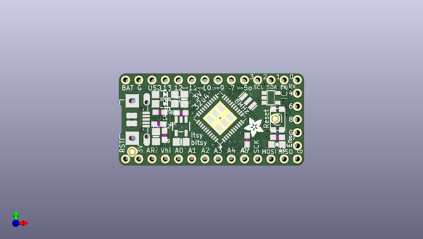
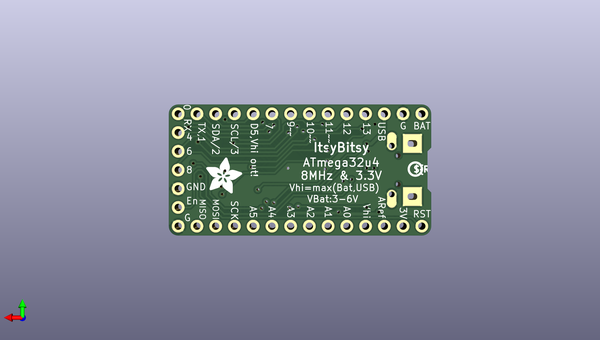

# adafruit_itsybitsy_32u4_pcb
 
## summary 
* id: adafruit_adafruit_itsybitsy_32u4_pcb_itsy_bitsy_32u4_5v
* user: adafruit
* name: adafruit_itsybitsy_32u4_pcb
* board: itsy_bitsy_32u4_5v
* repo: https://github.com/adafruit/Adafruit-ItsyBitsy-32u4-PCB

* src_file_repo_sch: 
* src_file_repo_sch_link: https://github.com/adafruit/Adafruit-ItsyBitsy-32u4-PCB/tree/master/
* full details link: https://github.com/oomlout/oomlout_oomp_project_bot_v_2/tree/main/projects/adafruit_adafruit_itsybitsy_32u4_pcb_itsy_bitsy_32u4_5v/current_version/working  

## schematic  
  
[schematic (pdf)](working_schematic.pdf) 

## pcb  
 
  
  
  
[board (pdf)](working.pdf)  

## working_bom
| Id | Designator | Footprint | Quantity | Designation | Supplier and ref |  | None | 
| --- | --- | --- | --- | --- | --- | --- | --- | 
| 1 | C6,C8 | 0805-NO | 2 | 10µF |  |  | [''] | 
| 2 | L0 | CHIPLED_0805_NOOUTLINE | 1 | RED |  |  | [''] | 
| 3 | SW1 | KMR2 | 1 | SPST_TACT-KMR2 |  |  | [''] | 
| 4 | JP1 | 1X05_ROUND | 1 |  |  |  | [''] | 
| 5 | U$7 | ADAFRUIT_3.5MM | 1 |  |  |  | [''] | 
| 6 | D4,D1 | SOD-123 | 2 | MBR120 |  |  | [''] | 
| 7 | R9 | 0603-NO | 1 | 100k |  |  | [''] | 
| 8 | C9 | 0805-NO | 1 | 10uF |  |  | [''] | 
| 9 | JP4,JP2 | 1X14_ROUND70 | 2 |  |  |  | [''] | 
| 10 | U$34,U$35 | FIDUCIAL_1MM | 2 | FIDUCIAL" |  |  | [''] | 
| 11 | C14,C7 | 0603-NO | 2 | 1uF |  |  | [''] | 
| 12 | R7 | 0603-NO | 1 | 2.2K |  |  | [''] | 
| 13 | IC2 | SOT23-5 | 1 | 74HCT1G125DBV |  |  | [''] | 
| 14 | X3 | 4UCONN_20329_V2 | 1 | microUSB |  |  | [''] | 
| 15 | Y1 | RESONATOR-SMD | 1 | 8MHz |  |  | [''] | 
| 16 | IC1 | TQFN44_7MM | 1 | ATMEGA32U4-MU |  |  | [''] | 
| 17 | R4,R5 | 0603-NO | 2 | 22 |  |  | [''] | 
| 18 | U2 | SOT23-5 | 1 | MIC5225-3.3 |  |  | [''] | 
| 19 | U$4 | ADAFRUIT_5MM | 1 |  |  |  | [''] | 
| 20 | U$2 | PCBFEAT-REV-040 | 1 |  |  |  | [''] | 

## bom_schematic
| Ref | Qnty | Value | Cmp name | Footprint | Description | Vendor | DNP | 
| --- | --- | --- | --- | --- | --- | --- | --- | 
| C6, C8 | 2 | 10µF | CAP_CERAMIC0805-NOOUTLINE | working:0805-NO |  |  |  | 
| C7, C14 | 2 | 1uF | CAP_CERAMIC0603_NO | working:0603-NO |  |  |  | 
| C9 | 1 | 10uF | CAP_CERAMIC0805-NOOUTLINE | working:0805-NO |  |  |  | 
| D1, D4 | 2 | MBR120 | DIODE-SCHOTTKYSOD-123 | working:SOD-123 |  |  |  | 
| IC1 | 1 | ATMEGA32U4-MU | ATMEGA32U4-MU | working:TQFN44_7MM |  |  |  | 
| IC2 | 1 | 741G125DBV | 741G125DBV | working:SOT23-5 |  |  |  | 
| JP1 | 1 | HEADER-1X5ROUND | HEADER-1X5ROUND | working:1X05_ROUND |  |  |  | 
| JP2, JP4 | 2 | HEADER-1X14 | HEADER-1X14 | working:1X14_ROUND70 |  |  |  | 
| L0 | 1 | RED | LED0805_NOOUTLINE | working:CHIPLED_0805_NOOUTLINE |  |  |  | 
| R4, R5 | 2 | 22 | RESISTOR_0603_NOOUT | working:0603-NO |  |  |  | 
| R7 | 1 | 2.2K | RESISTOR_0603_NOOUT | working:0603-NO |  |  |  | 
| R9 | 1 | 100k | RESISTOR_0603_NOOUT | working:0603-NO |  |  |  | 
| SW1 | 1 | SPST_TACT-KMR2 | SPST_TACT-KMR2 | working:KMR2 |  |  |  | 
| U2 | 1 | MIC5225-3.3 | VREG_SOT23-5 | working:SOT23-5 |  |  |  | 
| U$34, U$35 | 2 | FIDUCIAL"" | FIDUCIAL{dblquote}{dblquote} | working:FIDUCIAL_1MM |  |  |  | 
| X3 | 1 | microUSB | USB_MICRO_20329_V2 | working:4UCONN_20329_V2 |  |  |  | 
| Y1 | 1 | RESONATORSMD | RESONATORSMD | working:RESONATOR-SMD |  |  |  | 

