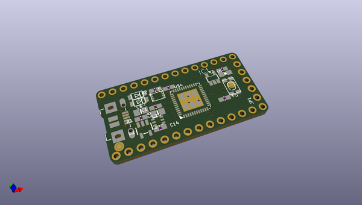

# adafruit_itsybitsy_m0_pcb
 
## summary 
* id: adafruit_adafruit_itsybitsy_m0_pcb_adafruit_itsybitsy_m0
* user: adafruit
* name: adafruit_itsybitsy_m0_pcb
* board: adafruit_itsybitsy_m0
* repo: https://github.com/adafruit/Adafruit-ItsyBitsy-M0-PCB

* src_file_repo_sch: 
* src_file_repo_sch_link: https://github.com/adafruit/Adafruit-ItsyBitsy-M0-PCB/tree/master/
* full details link: https://github.com/oomlout/oomlout_oomp_project_bot_v_2/tree/main/projects/adafruit_adafruit_itsybitsy_m0_pcb_adafruit_itsybitsy_m0/current_version/working  

## schematic  
  
[schematic (pdf)](working_schematic.pdf) 

## pcb  
 
  
  
  
[board (pdf)](working.pdf)  

## working_bom
| Id | Designator | Footprint | Quantity | Designation | Supplier and ref |  | None | 
| --- | --- | --- | --- | --- | --- | --- | --- | 
| 1 | X3 | 4UCONN_20329_V2 | 1 | microUSB |  |  | [''] | 
| 2 | R7 | 0603-NO | 1 | 2.2K |  |  | [''] | 
| 3 | C5,C7,C1,C14 | 0603-NO | 4 | 1uF |  |  | [''] | 
| 4 | D2,D1 | SOD-123FL | 2 | MBR120 |  |  | [''] | 
| 5 | L2 | APA102_2020 | 1 | AP102-2020 |  |  | [''] | 
| 6 | U$4 | TQFN48_7MM | 1 | ATSAMD21G18 |  |  | [''] | 
| 7 | C6,C8 | 0805-NO | 2 | 10µF |  |  | [''] | 
| 8 | R2,R1 | 0603-NO | 2 | 100k |  |  | [''] | 
| 9 | U2 | SOT23-5 | 1 | AP2112K-3.3 |  |  | [''] | 
| 10 | L0 | CHIPLED_0805_NOOUTLINE | 1 | RED |  |  | [''] | 
| 11 | SW1 | KMR2 | 1 | SPST_TACT-KMR2 |  |  | [''] | 
| 12 | JP1 | 1X05_ROUND_70 | 1 |  |  |  | [''] | 
| 13 | IC1 | SOT23-5 | 1 | 74HCT1G125 |  |  | [''] | 
| 14 | U1 | USON8 | 1 | flash |  |  | [''] | 
| 15 | JP2,JP4 | 1X14_ROUND70 | 2 |  |  |  | [''] | 
| 16 | U$34,U$35 | FIDUCIAL_1MM | 2 | FIDUCIAL_1MM |  |  | [''] | 
| 17 | U$14 | ITSYM0_TOP | 1 |  |  |  | [''] | 
| 18 | U$15 | ITSYM0_BOT | 1 |  |  |  | [''] | 
| 19 | X1 | JSTPH2 | 1 |  |  |  | [''] | 
| 20 | U$13 | PCBFEAT-REV-040 | 1 |  |  |  | [''] | 

## bom_schematic
| Ref | Qnty | Value | Cmp name | Footprint | Description | Vendor | DNP | 
| --- | --- | --- | --- | --- | --- | --- | --- | 
| C1, C5, C7, C14 | 4 | 1uF | CAP_CERAMIC0603_NO | working:0603-NO |  |  |  | 
| C6, C8 | 2 | 10µF | CAP_CERAMIC0805-NOOUTLINE | working:0805-NO |  |  |  | 
| D1, D2 | 2 | MBR120 | DIODE_SOD-123FL | working:SOD-123FL |  |  |  | 
| IC1 | 1 | 741G125DBV | 741G125DBV | working:SOT23-5 |  |  |  | 
| JP1 | 1 | HEADER-1X570MIL | HEADER-1X570MIL | working:1X05_ROUND_70 |  |  |  | 
| JP2, JP4 | 2 | HEADER-1X14 | HEADER-1X14 | working:1X14_ROUND70 |  |  |  | 
| L0 | 1 | RED | LED0805_NOOUTLINE | working:CHIPLED_0805_NOOUTLINE |  |  |  | 
| L2 | 1 | AP102-2020 | APA1022020 | working:APA102_2020 |  |  |  | 
| R1, R2 | 2 | 100k | RESISTOR_0603_NOOUT | working:0603-NO |  |  |  | 
| R7 | 1 | 2.2K | RESISTOR_0603_NOOUT | working:0603-NO |  |  |  | 
| SW1 | 1 | SPST_TACT-KMR2 | SPST_TACT-KMR2 | working:KMR2 |  |  |  | 
| U1 | 1 | flash | SPIFLASH_8PINUX | working:USON8 |  |  |  | 
| U2 | 1 | AP2112K-3.3 | VREG_SOT23-5 | working:SOT23-5 |  |  |  | 
| U$4 | 1 | ATSAMD21G_QFN | ATSAMD21G_QFN | working:TQFN48_7MM |  |  |  | 
| U$34, U$35 | 2 | FIDUCIAL_1MM | FIDUCIAL_1MM | working:FIDUCIAL_1MM |  |  |  | 
| X1 | 1 | CON_JST_PH_2PIN | CON_JST_PH_2PIN | working:JSTPH2 |  |  |  | 
| X3 | 1 | microUSB | USB_MICRO_20329_V2 | working:4UCONN_20329_V2 |  |  |  | 

