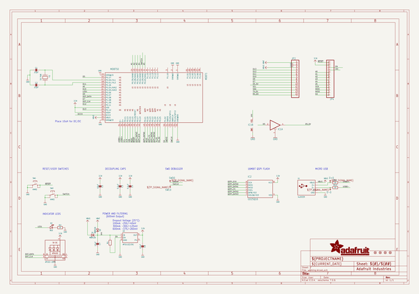
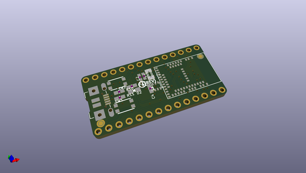
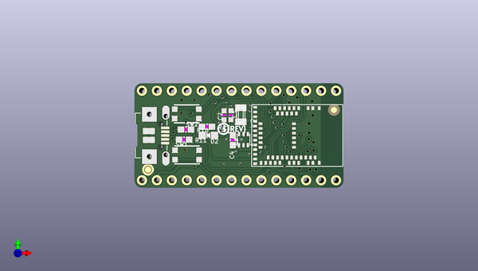
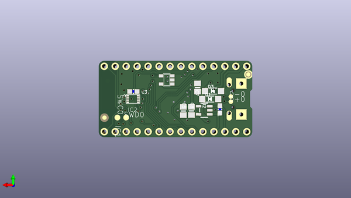

# adafruit_itsybitsy_nrf52840_express_pcb
 
## summary 
* id: adafruit_adafruit_itsybitsy_nrf52840_express_pcb_adafruit_itsybitsy_nrf52840_express
* user: adafruit
* name: adafruit_itsybitsy_nrf52840_express_pcb
* board: adafruit_itsybitsy_nrf52840_express
* repo: https://github.com/adafruit/Adafruit-ItsyBitsy-nRF52840-Express-PCB

* src_file_repo_sch: 
* src_file_repo_sch_link: https://github.com/adafruit/Adafruit-ItsyBitsy-nRF52840-Express-PCB/tree/master/
* full details link: https://github.com/oomlout/oomlout_oomp_project_bot_v_2/tree/main/projects/adafruit_adafruit_itsybitsy_nrf52840_express_pcb_adafruit_itsybitsy_nrf52840_express/current_version/working  

## schematic  
  
[schematic (pdf)](working_schematic.pdf) 

## pcb  
 
  
  
  
[board (pdf)](working.pdf)  

## working_bom
| Id | Designator | Footprint | Quantity | Designation | Supplier and ref |  | None | 
| --- | --- | --- | --- | --- | --- | --- | --- | 
| 1 | R2 | 0603-NO | 1 | 1K |  |  | [''] | 
| 2 | R11,R10 | 0603-NO | 2 | 22 |  |  | [''] | 
| 3 | FID2,FID1,FID3,FID4 | FIDUCIAL_1MM | 4 | FIDUCIAL_1MM |  |  | [''] | 
| 4 | L2 | APA102_2020 | 1 | AP102-2020 |  |  | [''] | 
| 5 | JP4,JP2 | 1X14_ROUND70 | 2 |  |  |  | [''] | 
| 6 | MDBT1 | MDBT50 | 1 | MDBT50 |  |  | [''] | 
| 7 | SW1,SW2 | BTN_KMR2_4.6X2.8 | 2 | KMR2 |  |  | [''] | 
| 8 | U$15 | PCBFEAT-REV-040 | 1 |  |  |  | [''] | 
| 9 | C2,C1 | _0603MP | 2 | 22pF |  |  | [''] | 
| 10 | D2 | CHIPLED_0805_NOOUTLINE | 1 | RED |  |  | [''] | 
| 11 | U$12 | ITSYNRF52840_TOP | 1 |  |  |  | [''] | 
| 12 | C4,C3 | 0603-NO | 2 | 0.1uF |  |  | [''] | 
| 13 | Y2 | XTAL3215 | 1 | 32.768 |  |  | [''] | 
| 14 | X1 | 4UCONN_20329_V2 | 1 | 4u20329 |  |  | [''] | 
| 15 | SWC0,SWD0 | TP13R | 2 | TPTP13R |  |  | [''] | 
| 16 | D+0,D-0 | TP10R | 2 | TPTP10R |  |  | [''] | 
| 17 | D1,D3 | SOD-123 | 2 | MBR120 |  |  | [''] | 
| 18 | U$14 | ITSYNRF52840_BOT | 1 |  |  |  | [''] | 
| 19 | C5,C8,C7 | 0805-NO | 3 | 10uF |  |  | [''] | 
| 20 | U2 | SOT23-5 | 1 | AP2112(3.3V) |  |  | [''] | 
| 21 | IC2 | USON8 | 1 | GD25Q16 |  |  | [''] | 
| 22 | IC1 | SOT23-5 | 1 | 74HCT1G125DBV |  |  | [''] | 
| 23 | R1 | 0603-NO | 1 | 10K |  |  | [''] | 

## bom_schematic
| Ref | Qnty | Value | Cmp name | Footprint | Description | Vendor | DNP | 
| --- | --- | --- | --- | --- | --- | --- | --- | 
| C1, C2 | 2 | 22pF | CAP_CERAMIC_0603MP | working:_0603MP |  |  |  | 
| C3, C4 | 2 | 0.1uF | CAP_CERAMIC0603_NO | working:0603-NO |  |  |  | 
| C5, C7, C8 | 3 | 10uF | CAP_CERAMIC0805-NOOUTLINE | working:0805-NO |  |  |  | 
| D1, D3 | 2 | MBR120 | DIODE-SCHOTTKYSOD-123 | working:SOD-123 |  |  |  | 
| D2 | 1 | RED | LED0805_NOOUTLINE | working:CHIPLED_0805_NOOUTLINE |  |  |  | 
| D+0 | 1 | TPTP10R | TPTP10R | working:TP10R |  |  |  | 
| D-0 | 1 | TPTP10R | TPTP10R | working:TP10R |  |  |  | 
| FID1, FID2, FID3, FID4 | 4 | FIDUCIAL_1MM | FIDUCIAL_1MM | working:FIDUCIAL_1MM |  |  |  | 
| IC1 | 1 | 741G125DBV | 741G125DBV | working:SOT23-5 |  |  |  | 
| IC2 | 1 | GD25Q16 | SPIFLASH_8PINUX | working:USON8 |  |  |  | 
| JP2, JP4 | 2 | HEADER-1X14 | HEADER-1X14 | working:1X14_ROUND70 |  |  |  | 
| L2 | 1 | AP102-2020 | APA1022020 | working:APA102_2020 |  |  |  | 
| MDBT1 | 1 | MDBT50 | MDBT50 | working:MDBT50 |  |  |  | 
| R1 | 1 | 10K | RESISTOR_0603_NOOUT | working:0603-NO |  |  |  | 
| R2 | 1 | 1K | RESISTOR_0603_NOOUT | working:0603-NO |  |  |  | 
| R10, R11 | 2 | 22 | RESISTOR_0603_NOOUT | working:0603-NO |  |  |  | 
| SW1, SW2 | 2 | KMR2 | SWITCH_TACT_SMT4.6X2.8 | working:BTN_KMR2_4.6X2.8 |  |  |  | 
| SWC0 | 1 | TPTP13R | TPTP13R | working:TP13R |  |  |  | 
| SWD0 | 1 | TPTP13R | TPTP13R | working:TP13R |  |  |  | 
| U2 | 1 | AP2112(3.3V) | VREG_SOT23-5 | working:SOT23-5 |  |  |  | 
| X1 | 1 | 4u20329 | USB_MICRO_20329_V2 | working:4UCONN_20329_V2 |  |  |  | 
| Y2 | 1 | 32.768 | XTAL-3.2X1.5 | working:XTAL3215 |  |  |  | 

