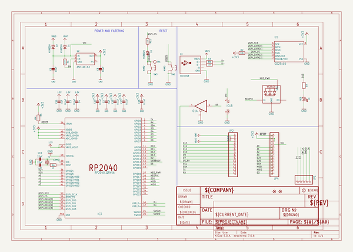
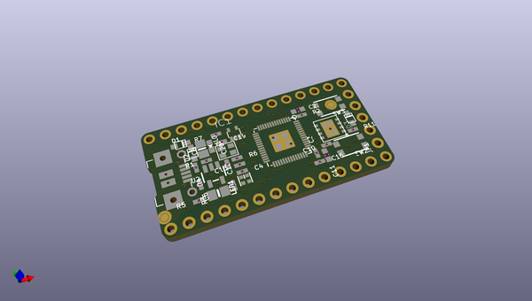
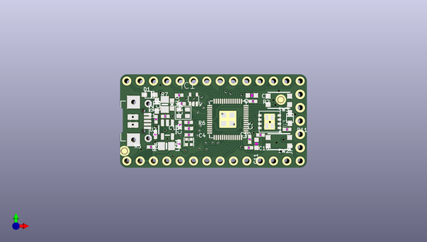
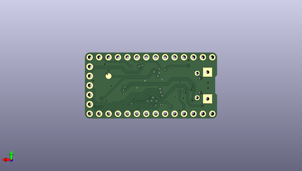

# adafruit_itsybitsy_rp2040_pcb
 
## summary 
* id: adafruit_adafruit_itsybitsy_rp2040_pcb_adafruit_itsybitsy_rp2040
* user: adafruit
* name: adafruit_itsybitsy_rp2040_pcb
* board: adafruit_itsybitsy_rp2040
* repo: https://github.com/adafruit/Adafruit-ItsyBitsy-RP2040-PCB

* src_file_repo_sch: 
* src_file_repo_sch_link: https://github.com/adafruit/Adafruit-ItsyBitsy-RP2040-PCB/tree/main/
* full details link: https://github.com/oomlout/oomlout_oomp_project_bot_v_2/tree/main/projects/adafruit_adafruit_itsybitsy_rp2040_pcb_adafruit_itsybitsy_rp2040/current_version/working  

## schematic  
  
[schematic (pdf)](working_schematic.pdf)  

## pcb  
 
  
  
  
[board (pdf)](working.pdf)  

## working_bom
| Id | Designator | Footprint | Quantity | Designation | Supplier and ref |  | None | 
| --- | --- | --- | --- | --- | --- | --- | --- | 
| 1 | C11,C2 | _0603MP | 2 | 1uF |  |  | [''] | 
| 2 | C10,C3,C4,C13,C16,C12 | _0402NO | 6 | 0.1uF |  |  | [''] | 
| 3 | IC3 | QFN56_7MM_REDUCEDEPAD | 1 | RP2040_QFN56 |  |  | [''] | 
| 4 | U$35,U$34 | FIDUCIAL_1MM | 2 | FIDUCIAL_1MM |  |  | [''] | 
| 5 | D3,D1,D2 | SOD-323F | 3 | NSR0320 |  |  | [''] | 
| 6 | R5,R1 | _0402NO | 2 | 10K |  |  | [''] | 
| 7 | R4,R3 | _0402NO | 2 | 22 |  |  | [''] | 
| 8 | C6,C8 | 0805-NO | 2 | 10µF |  |  | [''] | 
| 9 | L0 | CHIPLED_0603_NOOUTLINE | 1 | RED |  |  | [''] | 
| 10 | U1 | USON8_4X4 | 1 | GD25x16 |  |  | [''] | 
| 11 | JP4,JP2 | 1X14_ROUND70 | 2 |  |  |  | [''] | 
| 12 | R2 | _0402NO | 1 | 10k |  |  | [''] | 
| 13 | IC1 | SC70-5 | 1 | 74HCT1G125DBV |  |  | [''] | 
| 14 | C20,C19 | _0402NO | 2 | 22pF |  |  | [''] | 
| 15 | R11,R6,R7 | _0402NO | 3 | 1K |  |  | [''] | 
| 16 | U$4 | ITSY2040_TOP | 1 |  |  |  | [''] | 
| 17 | Y1 | CRYSTAL_2.5X2 | 1 | 12MHZ |  |  | [''] | 
| 18 | X3 | 4UCONN_20329_NARROW | 1 | microUSB |  |  | [''] | 
| 19 | SW3,SW2 | BTN_KMR2_4.6X2.8 | 2 | KMR2 |  |  | [''] | 
| 20 | U2 | SOT23-5 | 1 | AP2112K-3.3 |  |  | [''] | 
| 21 | JP1 | 1X05_ROUND_70 | 1 |  |  |  | [''] | 
| 22 | LED1 | SK6805_1515 | 1 | WS2812B_SK6805_1515 |  |  | [''] | 
| 23 | TP1 | TESTPOINT_ROUND_1.5MM_NO | 1 |  |  |  | [''] | 
| 24 | U$5 | ITSY2040_BOT | 1 |  |  |  | [''] | 

## bom_schematic
| Ref | Qnty | Value | Cmp name | Footprint | Description | Vendor | DNP | 
| --- | --- | --- | --- | --- | --- | --- | --- | 
| C2, C11 | 2 | 1uF | CAP_CERAMIC_0603MP | working:_0603MP |  |  |  | 
| C3, C4, C10, C12, C13, C16 | 6 | 0.1uF | CAP_CERAMIC_0402NO | working:_0402NO |  |  |  | 
| C6, C8 | 2 | 10µF | CAP_CERAMIC0805-NOOUTLINE | working:0805-NO |  |  |  | 
| C19, C20 | 2 | 22pF | CAP_CERAMIC_0402NO | working:_0402NO |  |  |  | 
| D1, D2, D3 | 3 | NSR0320 | DIODESOD-323F | working:SOD-323F |  |  |  | 
| IC1 | 1 | 741G125DCK | 741G125DCK | working:SC70-5 |  |  |  | 
| IC3 | 1 | RP2040_QFN56 | RP2040_QFN56 | working:QFN56_7MM_REDUCEDEPAD |  |  |  | 
| JP1 | 1 | HEADER-1X570MIL | HEADER-1X570MIL | working:1X05_ROUND_70 |  |  |  | 
| JP2, JP4 | 2 | HEADER-1X14 | HEADER-1X14 | working:1X14_ROUND70 |  |  |  | 
| L0 | 1 | RED | LED0603_NOOUTLINE | working:CHIPLED_0603_NOOUTLINE |  |  |  | 
| LED1 | 1 | WS2812B_SK6805_1515 | WS2812B_SK6805_1515 | working:SK6805_1515 |  |  |  | 
| R1, R5 | 2 | 10K | RESISTOR_0402NO | working:_0402NO |  |  |  | 
| R2 | 1 | 10k | RESISTOR_0402NO | working:_0402NO |  |  |  | 
| R3, R4 | 2 | 22 | RESISTOR_0402NO | working:_0402NO |  |  |  | 
| R6, R7, R11 | 3 | 1K | RESISTOR_0402NO | working:_0402NO |  |  |  | 
| SW2, SW3 | 2 | KMR2 | SWITCH_TACT_SMT4.6X2.8 | working:BTN_KMR2_4.6X2.8 |  |  |  | 
| TP1 | 1 | TESTPOINTROUND1.5MMNO | TESTPOINTROUND1.5MMNO | working:TESTPOINT_ROUND_1.5MM_NO |  |  |  | 
| U1 | 1 | GD25x16 | SPIFLASH_8PIN_4X4 | working:USON8_4X4 |  |  |  | 
| U2 | 1 | AP2112K-3.3 | VREG_SOT23-5 | working:SOT23-5 |  |  |  | 
| U$34, U$35 | 2 | FIDUCIAL_1MM | FIDUCIAL_1MM | working:FIDUCIAL_1MM |  |  |  | 
| X3 | 1 | microUSB | USB_MICRO_NARROW | working:4UCONN_20329_NARROW |  |  |  | 
| Y1 | 1 | 12MHZ | CRYSTAL2.5X2.0 | working:CRYSTAL_2.5X2 |  |  |  | 

